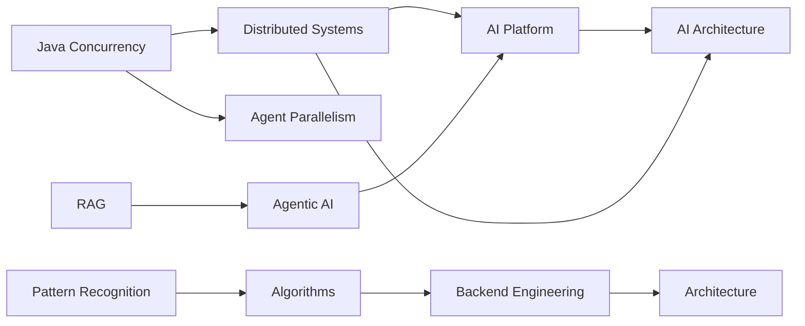

# Learning Graph

The vault is a graph, not a folder tree.

## Edge vocabulary

- **prerequisite** — must understand first.
- **builds-on** — extends a concept.
- **used-by** — implementation dependency.
- **cross-domain** — same engineering principle in another domain.
- **evidence-for** — evidence demonstrating a claim.
- **decision-for** — ADR that governs the choice.
- **failure-of** — failure experiment for the concept.
- **review-with** — concepts that should be recalled together.

## Example graph

## Graph discipline

Prefer a small number of meaningful edges over dense link spam. If two notes are related only because they share a keyword, do not link them.

Use the edge vocabulary in frontmatter where the relationship matters to navigation or review.
