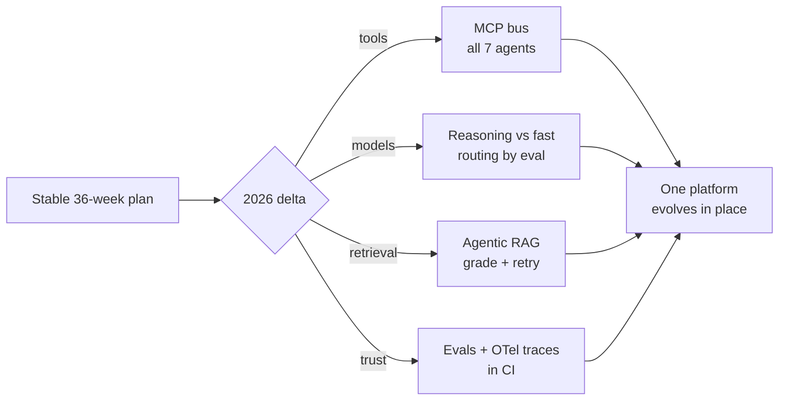

## Why it Matters

Interviewers in 2026 do not ask whether you have studied AI, they ask whether your knowledge is **current**. This note is the delta layer: it patches a stable 36-week plan with the shifts that changed build decisions (MCP as the default tool bus, reasoning models that need routing, agentic RAG over naive RAG), so a solid but dated foundation does not silently become wrong in an interview or an architecture review.

## Diagram



## Code

```python
from typing import Literal
from pydantic import BaseModel

## When to use / NOT

- **Use:** before starting any new phase, and as the source for the *"are you current?"* interview question.
- **NOT:** as a replacement for the roadmap — it is a patch on top of it, and none of these trends move a phase.

## Trade-offs

| Trend | Cost of adopting it |
|-------|----------------------|
| MCP everywhere | One more protocol to operate; server quality varies wildly |
| Reasoning models | Higher latency and cost per token; only worth it for hard reasoning |
| Agentic RAG | More moving parts to evaluate, retry and budget |
| Continuous evals | Golden sets must be maintained, or the gate rots |

## Vs

| Aspect | Pre-2026 approach | 2026 approach |
|--------|------------------|---------------|
| Tool integration | Hard-coded function schemas per app | MCP servers, discovered at runtime |
| Model selection | One model for everything | Route reasoning vs fast by eval'd faithfulness vs cost |
| RAG | Retrieve once, hope | Grade relevance, rewrite, retry |
| Quality | Manual spot checks | RAGAS-style evals gated in CI |

## Pitfalls

- Chasing every trend instead of building — adopt only what a phase already needs.
- Quoting benchmark figures you did not measure yourself; if asked, express gains as relationships.
- Treating MCP as a rewrite rather than a swap of the tool-discovery layer.
- Adding a reasoning model without a cost/faithfulness comparison to justify it.

## Interview Q&A

- **Q:** How do you decide between a reasoning model and a fast model? **A:** I route on evidence, not vibes — an eval'd faithfulness score against a cost ceiling. Fast model is the default; the reasoning model only wins where the measured quality gap justifies the token cost.
- **Q:** What did MCP actually change about your architecture? **A:** Tool definitions stopped being application code. Tools are discovered from servers at runtime, so swapping a search backend means swapping an MCP server, not editing schemas in every service.
- **Q:** How do you know your RAG upgrade was real? **A:** Because it went into a comparison table — precision@k and answer faithfulness on a golden set before and after. If it only felt better, it did not ship.

## Related

- [[Roadmap Overview]] • [[Weekly Tracker]] • [[Tech Stack]] • [[AI/07_Cross-Cutting/README|07 Cross-Cutting]] • [[Certification Guide]]

---
*Category: overview • 2026-trends*

# 2026 Trends Update — What Changed Since This Roadmap

> Part of [[README|00 Overview]] • `overview` • Delta on top of your 36-week plan — read before Phase 02. If an interviewer asks "are you current?" answer from here.

## Why this note

Your temporary roadmap (Weeks 1–36) is solid — this note patches it for **late-2025 / 2026** reality without breaking the sequence. Certifications reinforce building; these trends shape **how you build**.

## 6 Trends to Weave In (no phase move needed)

| # | Trend (2026) | What changed | Where to apply (no new phase) |
|---|---------------|--------------|-------------------------------|
| **1** | **MCP is standard** | Anthropic MCP (Nov 2024) → ecosystem: 1000+ servers, SSE transport, resources + prompts. No longer "additional topic" — it's **the** tool bus. | **Week 5** (`02_RAG`): use MCP `search_docs` instead of bare function schema. **Week 11**: all 7 agents via MCP. See [[AI/07_Cross-Cutting/01_MCP\|MCP]]. |
| **2** | **Reasoning models** | `o1`/`o3`, Claude Sonnet 4, Gemini 2.5 Flash — explicit reasoning, higher cost, need routing. 2026 interview Q: "when to use reasoning vs fast model?" | **Week 17** ([[AI/07_Cross-Cutting/06_Multi-Model Routing\|Multi-Model Routing]]): route hard/code → reasoning; fact lookup → Haiku/mini. Record cost delta. |
| **3** | **Agentic RAG + GraphRAG** | Vanilla RAG → **Agentic RAG** (planner decides retrieval strategy) + **GraphRAG** (entity graph + community detection for multi-hop). | **Week 8–9** ([[AI/02_RAG-Engineering/RAG Variants and Retrieval Strategies\|RAG Variants]]): add variant `graph_retrieve()` using graph store; compare precision@k vs hybrid. |
| **4** | **AI Evaluation is gating** | LLM-as-judge (RAGAS/Phoenix) now required in AI interviews — "how do you know it works?" | **Week 6** ([[AI/07_Cross-Cutting/02_AI Evaluation\|Evaluation]]): golden set + CI gate **before** Phase 03. No eval → no platform. |
| **5** | **LLM Observability = OTel** | Langfuse + Phoenix both export via OTel; traces include `retrieval.precision@k` + `faithfulness` | **Week 24** ([[AI/07_Cross-Cutting/03_LLM Observability\|Observability]]): OTel collector → Langfuse + Prometheus from Day 1 of prod. |
| **6** | **Cost as first-class** | Semantic cache (Redis + vector), batching, context compression (30–50%) now interview table stakes | **Week 10** ([[AI/07_Cross-Cutting/05_Cost Optimization\|Cost Optimization]]): build the `$/1k queries` table; revisit Week 34. |

## What NOT to add

- **Agent frameworks churn** — LangGraph vs AutoGen vs CrewAI: pick one in Week 11, don't chase weekly. NUS-ISS will force opinion — stick to it.
- **Training foundation models from scratch** — out of scope. This is **applied AI platform engineering** (backend + AI).
- **New cert** — no. Use these trends as **interview depth** on existing phases.

## Updated weekly deltas (patch your tracker)

- **Week 5:** Add `import from mcp import Client` — list your first MCP server.
- **Week 8:** Add column `GraphRAG precision@k` to variant table.
- **Week 10:** Add row `reasoning vs fast: cost $/1k = $8.20 vs $1.10, faithfulness +3%` — routing decision.
- **Week 14:** Add `indirect injection` test to `eval/golden_injection.jsonl`.
- **Week 24:** Add `semantic_cache_hit_rate` to Grafana.

## Interview line for "are you current?"

> "Since late 2024, MCP standardized tool integration — we run all 7 agents via MCP. We measure RAG with RAGAS on a golden set gated in CI, observe via OTel into Langfuse/Phoenix, and route reasoning vs fast models by eval'd faithfulness vs cost. GraphRAG is a variant we A/B'd in Week 8 with modest gains on multi-hop queries."

# Reasoning-vs-fast routing: the 2026 default decision, expressed as data

class RouteDecision(BaseModel):
 needs_reasoning: bool
 estimated_cost_usd: float

def choose_model(d: RouteDecision) -> str:
 """Prefer the cheap model unless reasoning buys eval'd faithfulness."""
 return "reasoning-model" if d.needs_reasoning else "fast-model"

# MCP: discover tools at runtime instead of hard-coding the schema

# async with ClientSession(...) as s:

# tools = await s.list_tools()

# openai_schema = [{"type": "function", "function": {

# "name": t.name, "description": t.description,

# "parameters": t.inputSchema}} for t in tools]

```