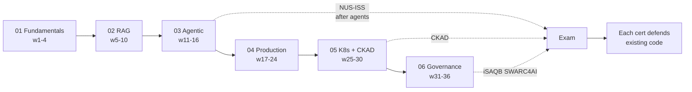

## Why it Matters

Certifications are the part of this plan that is easiest to do wrong: done cert-first they replace building, done last they validate nothing. This note fixes the sequencing so each credential lands **after** the corresponding platform phase exists, then the exam is a rehearsal of work already done, and an interview answer backed by a repo.

## Diagram



## Code

```python

## When to use / NOT

- **Use:** when scheduling exams and deciding what to build in a given week.
- **NOT:** as a reason to stop shipping — a cert without matching repo evidence fails a technical interview.

## Trade-offs

| Choice | Cost |
|--------|------|
| Build-first | Longer to the credential; each exam is easy because it is familiar |
| Cert-first | Fastest to list a cert, weakest in an interview — nothing to show |
| All four certs | Real time and money; two are enough for most roles |

## Vs

| Credential | Teaches | Proves to an interviewer |
|------------|---------|------------------------|
| Coursera microservices | Patterns | Coursework completed |
| NUS-ISS agentic | Architecture decisions | You can defend agent trade-offs |
| CKAD | K8s mechanics | You can actually deploy |
| iSAQB CPSA-A | QA-driven architecture | You think in quality attributes, not features |

## Pitfalls

- Collecting credentials with no platform artifact to point at.
- Sitting CKAD before deploying the platform once — it becomes memorisation.
- Treating the Coursera specialisation as equivalent to the grad cert; depth differs.
- Letting exam prep consume the build weeks that pay for it.

## Interview Q&A

- **Q:** Why do certifications at all after 13 years of experience? **A:** They are not for credibility, they are for coverage — SWARC4AI forces quality-attribute thinking I would otherwise skip, and CKAD forces me to deploy what I design rather than whiteboard it.
- **Q:** Which one would you drop if you had half the time? **A:** The Coursera specialisation. The NUS-ISS module and CKAD map directly onto platform phases, so their cost is mostly absorbed by work I am doing anyway.
- **Q:** How do I know you actually learned it? **A:** Each cert traces to a folder in the repo — the agents, the Helm charts, the ADRs. The credential is the receipt; the code is the answer.

## Related

- [[Roadmap Overview]] • [[AI/04_Production-Platform/README|04 Production]] • [[AI/06_Architecture-Governance/README|06 Governance]]

---
*Category: overview*

# Certification Guide

> Part of [[README|AI MOC]] • `overview` • All 4 certs in sequence — what, when, why.

## 1. Coursera — Microservices Architecture for AI Systems (7 courses)

| Course | Weeks | Theme | Platform Task |
|--------|-------|-------|---------------|
| **C1: LLM Engineering with RAG** | 5–6 | RAG, pgvector, 12-factor for AI | Enterprise Document Search v1 |
| **C2: Design, Compare & Analyze LLM Architectures** | 7–10 | Architecture trade-offs, cost vs. self-host, RAG variants | RAG variant experiments + cost comparison |
| **C3: Architect Resilient LLM Microservices** | 17–18 | 12-factor, fault tolerance | AI Gateway + resilience patterns |
| **C4: Refactor & Test LLM Microservices** | 19–20 | TDD, refactoring for AI services | AI TDD + evaluation harness |
| **C5: Analyze & Deploy Scalable LLM Architectures** | 21–22 | Perf diagnosis, Helm, K8s autoscaling, rollouts | Helm charts + autoscaling |
| **C6: Design Scalable AI Systems & Components** | 23 | Components, platform architecture | Platform architecture refinement |
| **C7: Integrate & Optimize AI Services** | 24 | gRPC/Protobuf, Prometheus | gRPC + monitoring integration |

> **Rule:** Don't create separate course projects — evolve the platform.

## 2. NUS-ISS — Architecting Agentic AI Solutions

- **When:** Weeks 11–16 (Phase 03) — after you know agents/tools/MCP/RAG/orchestration.
- **Format:** 4-day intensive (~32h), part of Graduate Certificate in Architecting AI Systems.
- **Audience:** Senior SWEs, Tech Leads, Enterprise Architects with solid backend experience.
- **Core topics:** Logical/physical architecture for agent systems; multi-agent collaboration; frameworks (LangChain, AutoGen, Assistants APIs); microservices/containers/serverless deployment; API gateway/service mesh/monitoring; model selection + RAG pipelines.
- **Quality attributes:** autonomy, scalability, security, fault tolerance, explainability.
- **Capstone:** [[AI/03_Agentic-AI/Enterprise AI Operations Platform|Enterprise AI Operations Platform]] (7 agents).

## 3. CKAD (or CKA) — Kubernetes

- **When:** Weeks 25–30 (Phase 05) — you already have a production-grade platform to deploy.
- **Why CKAD:** App-centric (deploy FastAPI, Spring Boot, PG, Redis, vector DB, Kafka, Prometheus, Grafana on K8s). Choose **CKA** if leaning platform/infra.
- **Validates:** manifests, Helm, autoscaling, config/secrets, networking, troubleshooting.

## 4. iSAQB CPSA-A — SWARC4AI (Software Architecture for AI)

- **When:** Weeks 31–36 (Phase 06) — after substantial building, to formalize.
- **Format:** 3-day (~24h), Advanced Level, 20 Tech + 10 Method points toward CPSA-A exam.
- **Syllabus:** AI/ML/GenAI classification & risks; compliance (GDPR, **EU AI Act**, copyright), security, ethics; ML lifecycle, requirements, non-determinism, drift, design patterns; data acquisition/labeling/pipelines; hardware, cost, **Green IT**, drift types, MLOps/CI/CD; GenAI patterns (RAG, prompt eng., agentic workflows), LLM cost management.
- **Capstone:** Same platform + governance, drift handling, enterprise integration, threat models.

## Sequencing Logic

```
Fundamentals → RAG (C1/C2) → Agentic (NUS-ISS) → Harden (C3-C7) → Deploy (CKAD) → Govern (iSAQB)
```
Each step assumes the previous. NUS-ISS *before* hardening so you design the ecosystem before productionizing it.

# Certification <-> Platform Trace (Fills this in as Phases Land)

# Cert: NUS-ISS "Architecting Agentic ai Solutions"

# Evidence: 03_Agentic-AI/Enterprise ai Operations Platform, 7 Agents, mcp Tools

# Cert: CKAD

# Evidence: 05_Kubernetes-Operations, Helm Charts for the Same Platform

# Cert: ISAQB CPSA-A / SWARC4AI

# Evidence: 06_Architecture-Governance, ADRs, Drift + eu ai act Checklist

CERTS = [
 {"cert": "NUS-ISS agentic", "after_week": 16, "evidence": "AI Operations Platform"},
 {"cert": "CKAD", "after_week": 30, "evidence": "Helm + probes + HPA deployed"},
 {"cert": "SWARC4AI", "after_week": 36, "evidence": "ADRs + governance checklist"},
]

def ready(c, week: int) -> bool:
 """Book the exam only when the platform evidence exists."""
 return week >= c["after_week"]
```