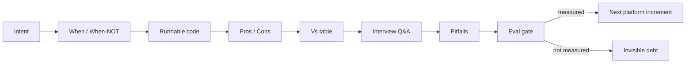

## Why it Matters

A 36-week plan fails for the same reason every time: consumption is mistaken for progress. This note is the rule set that keeps the plan honest, every week pairs study with a measurable platform increment, so knowledge lands as code and evals instead of as watched video hours.

## Diagram



## Code

```python

## When to use / NOT

- **Use:** for applied AI platform engineering — building production systems on top of foundation models.
- **NOT:** for pure ML research or learning to train foundation models from scratch; that needs a different, math-first curriculum.

## Trade-offs

| Choice | What it costs |
|--------|---------------|
| Every week must produce a measured increment | Weeks without a buildable deliverable (research-heavy weeks, exam prep) have no honest completion signal |
| One platform across all six phases | A greenfield project would let you pick clean tools; the platform forces you to solve the legacy integration version of every problem |
| Eval gate as the definition of done | Slower than watching lectures — measurement is roughly 15% of the week and produces nothing visible to non-engineers |

## Vs

| Approach | This philosophy | Alternative |
|----------|----------------|-------------|
| Unit of progress | Working + measured increment | Completed course module |
| Failure mode | A week with no eval gate is caught | Quietly accumulates as "watched content" |
| Artifact | One repo, 6 lenses | A certificate and scattered projects |

## Pitfalls

- Cert-first trap: watching videos without coding the platform delta that week.
- Skipping evaluation: shipping RAG without measuring retrieval quality creates invisible debt.

## Interview Q&A

- **Q:** How do you learn a new AI area quickly? **A:** I pair it with a build and an eval gate in the same week — the eval is what tells me whether I understood it or just consumed content about it.
- **Q:** Why keep one platform across all six phases? **A:** Because the hard problems — retrieval quality, agent failure modes, governance — only appear at the seams between layers. Throwaway projects never reach them.
- **Q:** What do you do when you fall behind the schedule? **A:** Keep the sequence, drop the pace. Phase 03 assumes RAG and tool-calling fluency; skipping ahead to agents is how plans collapse.

## Related

- [[Roadmap Overview]] • [[Weekly Tracker]]

---
*Category: overview*

# Learning Philosophy

> Part of [[README|AI MOC]] • `overview`

## How This Vault Teaches

Maintain the **Intent → When/When-NOT → Runnable Code → Pros/Cons → Vs Table → Q&A → Pitfalls** pattern from [[Java/README|Java vault]] — now applied to AI engineering.

## Principles

1. **Build then certify.** Every certification week has a paired platform task. If the course says "build a semantic search engine," you extend `Enterprise Document Search` instead.
2. **Interview-ready ≠ memorized.** Each note ends with 3–5 flashcards you can answer whiteboard-style.
3. **One platform, many lenses.** Phase 02 sees it as RAG; Phase 03 as multi-agent; Phase 04 as microservices; Phase 06 as governance artifact.
4. **Measure, don't guess.** From Phase 02: track retrieval precision, answer faithfulness, latency, cost per query.

## When This Approach Shines

- You have backend fundamentals (Java/Spring, SQL, K8s concepts) and want AI specialization without restarting as a beginner.
- You aim for Staff/Principal/Platform roles where architecture matters more than model training.

## When NOT to Use

- Pure ML research (training foundation models from scratch) — this is **applied AI platform engineering**.

# The weekly contract this philosophy enforces

from dataclasses import dataclass

@dataclass
class Week:
 number: int
 build: str # 60% — code that lands in the platform
 study: str # 25% — cert module aligned to that build
 evaluate: str # 15% — what you measured this week

def week_is_honest(w: Week) -> bool:
 """A week without measurement is study, not progress."""
 return bool(w.build) and bool(w.evaluate)

# Example — Phase 02 week:

# Week(8, "hybrid search + reranker in Enterprise Document Search",

# "C2 retrieval comparison", "precision@k 0.61 -> 0.77 on golden set")

```