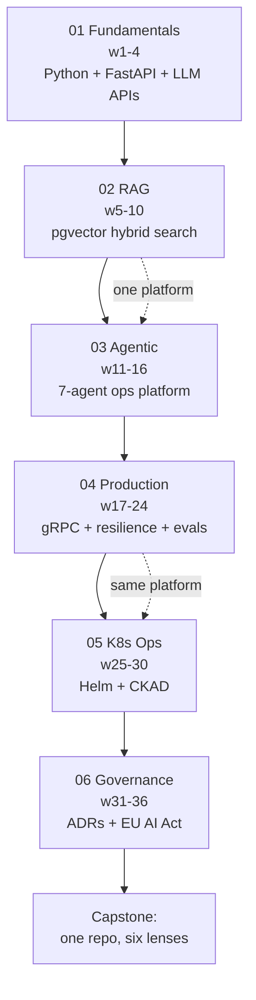

## Why it Matters

This is the map for the whole vault: one platform, six phases, 36 weeks, evolving in place. Every later note is a zoom-in on one phase here. Without it the folders look like unrelated courses; with it, each phase is the same system seen from a different architectural lens.

## Diagram



## Code

```python
```


## When to use / NOT

- **Use:** at the start of each week to know which phase owns it, and when sequencing any new topic.
- **NOT:** as a fixed deadline — the weeks are guardrails for order, not a pace commitment. Skipping phases is what breaks it.

## Trade-offs

| Choice | Cost |
|--------|------|
| One evolving platform | No portfolio of varied projects; breadth is traded for depth |
| 36 weeks | Slow to first "AI engineer" claim; fast to a defensible one |
| Cert after build | Exam timing is coupled to platform progress |

## Vs

| Path | Core belief | Ends with |
|------|------------|-----------|
| This roadmap | Build one system deeply, certify the layers | One repo + 3-4 certs |
| Course-collecting | Coverage equals readiness | A list of completions |
| Bootcamp | Speed to a job | A graded project, often throwaway |

## Pitfalls

- Reordering phases — Phase 03 assumes RAG fluency and Phase 04 assumes working agents.
- Reading the weeks as deadlines and racing ahead without the eval gate.
- Starting a second platform; every new project resets the compounding.

## Interview Q&A

- **Q:** Walk me through how you'd ramp into our AI platform work. **A:** The phases are the answer — fundamentals and LLM API contracts first, then retrieval quality, then agents, then production hardening. The order is not arbitrary: each layer exposes the failure modes the next one assumes.
- **Q:** Why six phases and not just "build AI features"? **A:** Because the risk profile changes per layer. Retrieval fails silently, agents fail expensively, governance fails legally. Treating them as one effort is why AI projects ship unmeasured.
- **Q:** What is the single biggest risk to the plan? **A:** Consumption without measurement — a week of study with no eval gate is invisible debt that surfaces in the interview, not the repo.

## Related

- [[Tech Stack]] • [[Learning Philosophy]] • [[Certification Guide]] • [[Weekly Tracker]]

---
*Category: overview*

# Roadmap Overview

> Part of [[README|AI MOC]] • `overview` • 36 weeks, 10-15h/week

## Summary

36-week, project-driven path from **Java backend veteran → AI Platform Engineer / Enterprise AI Architect**. One platform evolves across 6 phases — certifications reinforce building, not replace it. Designed for 13+ years Java/Spring experience.

## Phases at a Glance

| Phase | Weeks | Focus | Key Outcome |
| --- | --- | --- | --- |
| [[AI/01_Fundamentals/README\|01 Fundamentals]] | 1–4 | Python, FastAPI, LLM APIs, prompt eng., structured outputs, tool calling | AI Backend Template + 4 mini-projects |
| [[AI/02_RAG-Engineering/README\|02 RAG]] | 5–10 | Coursera C1 (RAG) + C2 (Architectures), pgvector, hybrid search | Enterprise Document Search |
| [[AI/03_Agentic-AI/README\|03 Agentic]] | 11–16 | NUS-ISS: multi-agent collaboration, orchestration, autonomy | AI Operations Platform (7 agents) |
| [[AI/04_Production-Platform/README\|04 Production]] | 17–24 | Coursera C3–C7: resilience, TDD, K8s, gRPC, observability | Production-hardened platform |
| [[AI/05_Kubernetes-Operations/README\|05 K8s Ops]] | 25–30 | CKAD/CKA: deploy full stack on K8s | Validated deployment & ops skills |
| [[AI/06_Architecture-Governance/README\|06 Governance]] | 31–36 | iSAQB SWARC4AI: quality, compliance, MLOps, drift | Governed enterprise platform |

Cross-cutting throughout ([[AI/07_Cross-Cutting/README|07]]): MCP, evaluation, observability, security, cost, multi-model routing.

## Guiding Principles

1. **One evolving platform** — no throwaway course projects. Each cert maps onto the same codebase.
2. **Cert = validation** — you build first, certify second. Course projects extend your platform.
3. **Backend leverage** — FastAPI/Spring, PG, Redis, Kafka, Prometheus, K8s are already your strengths; AI is the new layer.
4. **Weeks are guardrails** — adjust pace, but keep sequence. Phase 03 assumes RAG + tool-calling fluency.

## Weekly Cadence

- **Build** (60%) — code the platform increment for that week
- **Study** (25%) — certification module aligned to the build
- **Evaluate** (15%) — retrieval quality, latency, cost, hallucination checks

```python
# The roadmap as data — drives the tracker and the phase checklists

PHASES = [
 ("01 Fundamentals", (1, 4), "Python, FastAPI, LLM APIs, prompts, structured output, tool calling"),
 ("02 RAG", (5, 10), "Hybrid retrieval, pgvector, reranking, RAG variants"),
 ("03 Agentic", (11, 16), "LangGraph state machines, multi-agent patterns, HITL gates"),
 ("04 Production", (17, 24), "gRPC, circuit breakers, TDD + eval harness, observability"),
 ("05 K8s Ops", (25, 30), "Helm packaging, probes, HPA, CKAD"),
 ("06 Governance", (31, 36), "ADRs, EU AI Act checklist, drift detection, cost/energy"),
]

def phase_for_week(week: int) -> str:
 for name, (start, end), _ in PHASES:
 if start <= week <= end:
 return name
 raise ValueError(f"week {week} outside the 36-week plan")
```