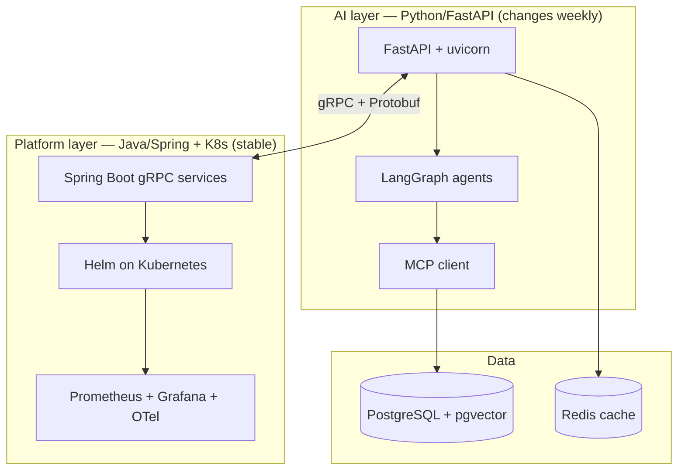

## Why it Matters

Every architectural conversation in this vault assumes the same stack, and this note is the assumption sheet. It also encodes the deliberate split that defines the platform: **Python/FastAPI for the AI layer**, **Java/Spring for the transactional estate**, glued by gRPC, because the AI layer changes weekly and the transactional layer must not.

## Diagram



## Code

```python

## When to use / NOT

- **Use:** as the default for a Java-heavy enterprise adding an AI layer — reuse the estate, add Python only where the AI ecosystem demands it.
- **NOT:** for a greenfield AI startup, where a second language buys nothing, or for performance-critical vector math without a library.

## Trade-offs

| Choice | Cost |
|--------|------|
| pgvector first | Simpler ops, one DB; will need a dedicated vector DB at scale |
| LangGraph | Explicit graphs are verbose; simple flows carry framework weight |
| Two languages | Two toolchains, two deploy pipelines, gRPC seam to maintain |
| Redis cache | Cache invalidation for changing source documents |

## Vs

| Concern | pgvector | Dedicated vector DB | Java/Spring | Python/FastAPI |
|---------|-----------|--------------------|-------------|-----------------|
| Ops cost | One Postgres to run | New cluster + backup story | Already owned | New pipeline |
| Strength | Hybrid SQL + vector | Scale + index tuning | Transactions, typing | AI libs, iteration speed |
| Here | Default, RAG | Scale comparison only | Platform layer | AI layer |

## Pitfalls

- Letting the AI layer write directly to the transactional database — that is what the gRPC seam exists to prevent.
- Choosing a vector DB before pgvector measurably fails; the comparison table belongs in Phase 02, not the architecture.
- Two languages with one deploy pipeline — the Python side ends up packaged by whoever was last on call.
- Forgetting Redis TTLs when source documents change, so the cache serves stale answers.

## Interview Q&A

- **Q:** Why two languages instead of doing it all in Java? **A:** Because the AI layer's constraint is iteration speed on LLM libraries, and the platform layer's constraint is transactional correctness and operational maturity. Forcing one language optimises the wrong half. The gRPC seam keeps the boundary honest.
- **Q:** Why pgvector rather than a dedicated vector database? **A:** It removes a distributed system from the critical path while SQL and vector queries stay in one transactional boundary. It is the default; a dedicated DB only wins when I can show the index failing at our scale.
- **Q:** What breaks first in this stack? **A:** The cache. Answers are cached, source documents change, and a missing invalidation policy silently serves wrong content — which is why cache freshness is a metric, not an assumption.

## Related

- [[Roadmap Overview]] • [[AI/01_Fundamentals/README|01_Fundamentals]] • [[AI/07_Cross-Cutting/README|Cross-Cutting]]

---
*Category: overview*

# Tech Stack

> Part of [[README|AI MOC]] • `overview` • The concrete stack behind the platform evolution.

## Core Stack (Phase 01)

| Layer | Choice | Notes |
|-------|--------|-------|
| Language | **Python 3.12+** | FastAPI, type hints, `uv` |
| API | **FastAPI** + Pydantic v2 | Mirrors Spring Boot mental model |
| LLM Access | OpenAI / Anthropic / Gemini APIs | Start with one, add routing in [[AI/07_Cross-Cutting/06_Multi-Model Routing\|07]] |
| Structured Outputs | Pydantic / JSON mode / tool schemas | |
| Tools | Function calling, [[AI/07_Cross-Cutting/01_MCP\|MCP]] (from Phase 2) | |

## Data & Retrieval (Phase 02)

| Layer | Choice |
|-------|--------|
| OLTP | **PostgreSQL** + **pgvector** |
| Cache | **Redis** |
| Vector DB | pgvector → (optional) Qdrant/Weaviate for scale comparison |
| Search | BM25 + vector (hybrid), reranking |
| Embeddings | `text-embedding-3-*` / open-weight via Ollama |

## Agentic (Phase 03)

| Layer | Choice |
|-------|--------|
| Framework | **LangChain / LangGraph** or **AutoGen** — compare both, commit to one |
| Orchestration | LangGraph state machines / AutoGen group chat |
| Memory | Postgres + vector store for long-term memory |
| Approval | Human-in-the-loop gates |

## Production (Phase 04–05)

| Layer | Choice |
|-------|--------|
| RPC | **gRPC + Protobuf** |
| Packaging | **Helm** charts |
| Orchestration | **Kubernetes** (CKAD target) |
| Observability | **Prometheus + Grafana + OpenTelemetry** |
| Streaming | **Kafka** (optional, for platform completeness) |
| LLM Observability | **Langfuse / Arize Phoenix** ([[AI/07_Cross-Cutting/03_LLM Observability\|07]]) |

## Governance (Phase 06)

- **iSAQB SWARC4AI** concerns: quality attributes, EU AI Act, drift, MLOps, Green IT.

# The one decision the whole stack rests on: where the AI layer ends

from fastapi import FastAPI
import grpc

app = FastAPI()

@app.get("/health")
async def health() -> dict[str, str]:
 """Same /health contract the Spring services expose."""
 return {"status": "ok"}

# AI layer talks to the Java/Spring estate over gRPC, never over shared DB.

# stub = user_pb2_grpc.UserServiceGrpcStub(grpc.aio.insecure_channel("user-svc:9090"))

# user = await stub.GetById(user_pb2.ByIdRequest(id=uid))

```