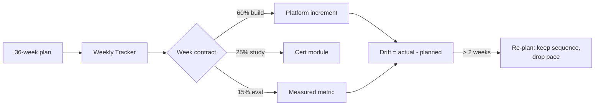

## Why it Matters

A 36-week plan without a tracker is a wish. This one makes the weekly contract visible, build, study, evaluate, and exposes the drift between planned and actual weeks so a slipped phase is seen in week 3, not week 30. It is also the evidence file an interviewer can be shown: what you said you would do, and what you measured.

## Diagram



## Code

```python

## When to use / NOT

- **Use:** weekly, to answer "am I on plan and did I measure anything?" before next week is planned.
- **NOT:** as a guilt ledger — the tracker's job is to surface drift early, not to log hours.

## Trade-offs

| Choice | Cost |
|--------|------|
| Track per-week | Weekly admin overhead (~15 min) |
| Drift threshold at 2 weeks | Sometimes a hard phase legitimately takes 3 |
| Dataview-driven | Only as honest as the checklist files feeding it |

## Vs

| Method | This tracker | Alternative |
|--------|--------------|------------|
| Unit tracked | Platform increment + measured metric | Hours studied |
| Signal | Drift triggers a pace change | Hours feel productive regardless of output |
| Failure mode | Stale checklists | Never |

## Pitfalls

- Tracking study hours instead of shipped, measured increments — it feels like progress and proves nothing.
- Letting the checklist fall behind so the dataview query renders empty.
- Rewriting history instead of logging drift; the drift column is the useful data.
- Re-planning by skipping a phase — that converts slippage into a knowledge gap.

## Interview Q&A

- **Q:** How do you manage a multi-month learning program without it stalling? **A:** A weekly contract of build, study and evaluate, with a drift check. The evaluate slice is what keeps it honest — if a week produced no measurement, it was consumption.
- **Q:** What do you do when you fall two weeks behind? **A:** Re-plan the pace, never the sequence. Dropping a phase creates the exact gap that shows up later as an architecture I cannot defend.
- **Q:** Why track at all? **A:** Because a 36-week effort has no feedback loop otherwise. The tracker is the loop — and it doubles as the evidence that the plan was actually executed.

## Related

- [[AI/00_Overview/Roadmap Overview|Roadmap Overview]] • [[AI/00_Overview/Learning Philosophy|Learning Philosophy]] • [[AI/00_Overview/Tech Stack|Tech Stack]] • [[AI/00_Overview/Certification Guide|Certification Guide]]

---
*Category: overview*

# Weekly Tracker

> Part of [[README|AI MOC]] • `overview` • Check off weeks as you go. Set `reviewed: YYYY-MM-DD` per note.

## How to Use

- Each week's **Build** task is mandatory; **Study** is the paired cert module; **Eval** is the metric to record.
- Mark notes `completed: true` when done — dashboards update automatically.

| Week | Phase | Build | Study | Eval |
|------|-------|-------|-------|------|
| 1 | 01 | Python refresh + FastAPI scaffold | — | API latency |
| 2 | 01 | LLM API integration (streaming, retries) | — | Error rate |
| 3 | 01 | Prompt Playground + structured outputs | — | Schema validity % |
| 4 | 01 | Tool calling + AI Backend Template | — | Tool success rate |
| 5 | 02 | Enterprise Document Search — ingest + pgvector | **Coursera C1** start | Ingest throughput |
| 6 | 02 | Hybrid search + metadata filtering | **C1** RAG | Retrieval precision@k |
| 7 | 02 | Citations + streaming responses | **C2** LLM Architectures | Citation accuracy |
| 8 | 02 | RAG variants (naive → advanced) | **C2** | Variant comparison table |
| 9 | 02 | Context compression + retrieval strategies | **C2** | Compression savings |
| 10 | 02 | Cost comparison + polish | **C2** wrap | Cost per query |
| 11 | 03 | Agent foundations + MCP | **NUS-ISS** start | Tool call latency |
| 12 | 03 | Planner + Researcher agents | NUS-ISS | Plan success rate |
| 13 | 03 | Database + Coding agents | NUS-ISS | Agent task accuracy |
| 14 | 03 | QA + Reviewer + Security agents | NUS-ISS | Gate pass rate |
| 15 | 03 | Orchestration + memory + human approval | NUS-ISS | Orchestration latency |
| 16 | 03 | Monitoring + audit logs + capstone | NUS-ISS wrap | Audit completeness |
| 17 | 04 | AI Gateway + 12-factor | **C3** Resilient Microservices | Gateway p95 |
| 18 | 04 | Retries, circuit breakers, rate limiting | C3 | Resilience test |
| 19 | 04 | AI TDD + evaluation harness | **C4** Refactor & Test | Test coverage |
| 20 | 04 | Refactor + regression testing | C4 | Regression delta |
| 21 | 04 | Helm + K8s deploy + autoscaling | **C5** Scalable Architectures | Scaling behavior |
| 22 | 04 | Perf bottleneck diagnosis + rollouts | C5 | Throughput |
| 23 | 04 | Platform architecture + components | **C6** Scalable Components | Component latency |
| 24 | 04 | gRPC + Protobuf + Prometheus | **C7** Integrate & Optimize | gRPC latency + metrics |
| 25 | 05 | K8s manifests + Helm charts | **CKAD** prep | — |
| 26 | 05 | Deploy FastAPI + Spring Boot + PG | CKAD | Pod health |
| 27 | 05 | Redis + vector DB + Kafka | CKAD | Data plane health |
| 28 | 05 | Prometheus + Grafana dashboards | CKAD | Dashboard completeness |
| 29 | 05 | Mock exams + troubleshooting | CKAD | Mock score |
| 30 | 05 | **CKAD exam** + hardening | CKAD | Pass |
| 31 | 06 | Quality attributes + governance | **iSAQB** start | Quality scenario coverage |
| 32 | 06 | Compliance (GDPR, EU AI Act) + ethics | iSAQB | Compliance checklist |
| 33 | 06 | Data pipelines + MLOps + drift | iSAQB | Drift detection |
| 34 | 06 | GenAI patterns + cost + Green IT | iSAQB | Cost model |
| 35 | 06 | Enterprise integration + threat model | iSAQB | Threat coverage |
| 36 | 06 | **Final capstone** + iSAQB assessment | iSAQB wrap | Capstone review |

## Progress Query

```
dataviewTABLE WITHOUT ID weeks as "Weeks", file.link as "Note", choice(completed, "", "⬜") as "Done", reviewed as "Last Reviewed"FROM "AI"
WHERE category AND file.name != "README"
SORT file.path ASC
```

[[README|← Back to AI MOC]]

# Drift Check the Tracker Answers Every Week

from datetime import date

def weeks_elapsed(start: date, today: date) -> int:
 return (today - start).days // 7

# Planned Week from the Roadmap; Actual Week from the Checklist you are on

def drift(planned: int, actual: int) -> int:
 """Positive = behind plan. Two weeks is the re-plan trigger."""
 return actual - planned

def action(d: int) -> str:
 if d <= 0: return "on plan"
 if d <= 2: return "catch up this week, keep sequence"
 return "re-plan pace, never skip a phase to catch up"
```