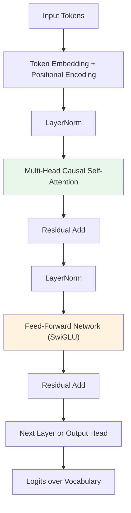

## 🎯 Intent
Understand the core architecture of Large Language Models — transformer blocks, attention mechanisms, tokenization, and scaling laws — to reason about model behavior, limitations, and engineering trade-offs in production.

## 💡 Why It Matters
- **Interview signal**: "Explain how attention works" and "Why do LLMs hallucinate?" are top-tier screening questions
- **Production impact**: Tokenization choices affect cost/latency by 2-4×; context window limits drive RAG vs. long-context decisions
- **Debugging**: Understanding residual streams and attention heads enables targeted interventions (steering, ablation, mechanistic interpretability)

## 🧩 Diagram: Transformer Block (Decoder-Only)


**Key dimensions**: `d_model` (residual stream width), `n_heads`, `d_head = d_model / n_heads`, `d_ff ≈ 4×d_model` (SwiGLU: 2/3×8/3 ≈ 2.67×)

## 💻 Code: Minimal Causal Attention (Java 25)
```java
record AttentionConfig(int dModel, int nHeads, int maxSeqLen) {}
record AttentionOutput(float[][] output, float[][] attnWeights) {}

AttentionOutput causalAttention(float[][] x, AttentionConfig cfg) {
    int seqLen = x.length, dHead = cfg.dModel() / cfg.nHeads();
    // Q, K, V projections (fused in practice)
    float[][] q = project(x, cfg.dModel(), cfg.dModel());
    float[][] k = project(x, cfg.dModel(), cfg.dModel());
    float[][] v = project(x, cfg.dModel(), cfg.dModel());

    // Reshape to [seqLen, nHeads, dHead]
    var qHeads = reshape(q, seqLen, cfg.nHeads(), dHead);
    var kHeads = reshape(k, seqLen, cfg.nHeads(), dHead);
    var vHeads = reshape(v, seqLen, cfg.nHeads(), dHead);

    float[][] out = new float[seqLen][cfg.dModel()];
    float[][] weights = new float[seqLen][seqLen];

    for (int h = 0; h < cfg.nHeads(); h++) {
        // QK^T / sqrt(dHead) + causal mask
        float[][] scores = matmul(qHeads[h], transpose(kHeads[h]));
        scaleInPlace(scores, 1.0f / (float) Math.sqrt(dHead));
        causalMask(scores); // upper-triangular = -inf

        float[][] attn = softmaxRows(scores);
        weights = add(weights, attn); // aggregate for visualization
        float[][] headOut = matmul(attn, vHeads[h]);
        out = concatHeads(out, headOut, h, dHead);
    }
    return new AttentionOutput(project(out, cfg.dModel(), cfg.dModel()), weights);
}
```

## ✅ When to Use / ❌ When NOT to Use
| Scenario | Use? | Reason |
|---|---|---|
| Building/finetuning LLMs from scratch | ✅ | Core architecture knowledge required |
| Debugging generation quality (repetition, hallucination) | ✅ | Attention patterns reveal failure modes |
| Choosing between model sizes (7B vs 70B) | ✅ | Scaling laws predict capability/cost |
| Using only closed APIs (OpenAI, Anthropic) | ❌ | Treat as black box; focus on prompting/RAG |
| Latency-critical inference (<50ms) | ⚠️ | Consider distillation, quantization, speculative decoding instead |

## ⚖️ Trade-offs
| Dimension | Small Model (1-7B) | Large Model (70B+) |
|---|---|---|
| **Params / VRAM** | 2-14 GB (BF16) | 140+ GB (needs multi-GPU) |
| **Throughput (tokens/s)** | 100-500 | 10-50 |
| **Reasoning / Coding** | Weak | Strong |
| **In-context learning** | Limited | Robust |
| **Fine-tuning cost** | Low (LoRA on 1×A100) | High (needs FSDP/DeepSpeed) |
| **Deployment** | Single GPU, edge possible | Multi-node, tensor parallelism |

**Decision rule**: Start with 7B-13B + RAG for domain tasks; scale up only when evals prove necessity.

## 🆚 Vs. Alternatives
| Alternative | When to Choose It | Decision Rule |
|---|---|---|
| **Encoder-only (BERT, DeBERTa)** | Classification, NER, embedding | Task is discriminative, not generative |
| **Encoder-decoder (T5, BART, FLAN-T5)** | Summarization, translation, controllable gen | Need explicit encoder representation |
| **SSM / RWKV / Mamba** | Very long context (>100k), linear scaling | Context > 32k and latency critical |
| **Mixture of Experts (Mixtral, DeepSeekMoE)** | High throughput, sparse activation | Budget allows 2-4× params for 1× active compute |

## ⚠️ Pitfalls
1. **Ignoring tokenization** — GPT-4o's 200k vocab vs. Llama-3's 128k changes token/char ratio (1.3 vs 1.6), directly impacting cost
2. **Assuming attention is O(n²) bottleneck** — FlashAttention makes it memory-bound, not compute-bound; real bottleneck is often KV cache at long context
3. **Treating all layers equally** — Early layers = syntax, middle = semantics, late = task-specific; interventions should target correctly
4. **Overlooking positional encoding limits** — RoPE extrapolation fails beyond trained length; use YaRN/PI/LongRoPE for extension
5. **Confusing "parameters" with "capability"** — Architecture, data quality, and training recipe matter more than raw count (e.g., Phi-3-mini 3.8B > Llama-2 7B)

## 🎤 Interview Q&A (Senior Depth)

**Q1: "Walk me through what happens in a single transformer forward pass, from tokens to logits."**
> **Answer**: Tokens → embedding + positional encoding → repeated blocks of (LN → causal self-attention → residual → LN → FFN/SwiGLU → residual) → final LN → unembedding → logits. Key: residual stream is the "information highway"; attention writes to it, FFN reads/writes. **Killer follow-up**: "Where would you inject a steering vector to change model behavior?" → Residual stream after attention, before FFN (empirically most effective).

**Q2: "Why does causal attention use a triangular mask, and what breaks if you remove it?"**
> **Answer**: Mask prevents tokens from attending to future positions, preserving autoregressive property. Without it: model sees "answer" during training → memorizes instead of learning next-token prediction → generation fails (exposure bias). **Metric**: Train loss drops to near-zero but eval perplexity explodes. **Rejected alternative**: Bidirectional attention (BERT-style) — requires encoder-decoder or masked LM objective, not causal LM.

**Q3: "Explain RoPE (Rotary Positional Encoding). Why not learned absolute positions?"**
> **Answer**: RoPE rotates Q/K vectors by position-dependent angles in complex space, making attention relative: `attn(i,j) = f(q_i, k_j, i-j)`. Learned absolute positions don't extrapolate beyond max trained length; RoPE generalizes to longer sequences (with degradation). **Trade-off**: RoPE couples position with content — can't easily separate them for retrieval tasks. **Rejected alternative**: ALiBi (linear bias) — simpler but hurts performance on code/structured data.

**Q4: "What are scaling laws (Kaplan/Chinchilla), and how do they guide model training?"**
> **Answer**: Loss ≈ `A / N^α + B / D^β + C` where N=params, D=tokens. Chinchilla: optimal compute allocation is `N ∝ C^0.5`, `D ∝ C^0.5` (train 1.4× longer for same compute vs. Kaplan). **Practical**: For 1T tokens, optimal is ~7B params, not 70B. **Rejected**: "Bigger is always better" — overtrained small models beat undertrained large ones.

**Q5: "How does KV caching work, and what's the memory cost for 32k context on Llama-3-70B?"**
> **Answer**: Store K,V for each layer/head at each generation step. Memory = `2 × n_layers × n_heads × d_head × seqLen × bytes`. Llama-3-70B: 80 layers × 64 heads × 128 d_head × 32k × 2B (BF16) ≈ **42 GB just for KV cache**. **Optimization**: GQA (grouped-query attention) reduces heads for K/V (Llama-3: 8 KV heads vs 64 Q heads → 5.2 GB). **Rejected**: Full attention recomputation — too slow for inference.

## Flashcards (Spaced Repetition)

#flashcard
**Q:** What is the trigger keyword for LLM Fundamentals? :: **A:** Not specified #flashcard

#flashcard
**Q:** Key hyperparameter for LLM Fundamentals? :: **A:** Not specified #flashcard

#flashcard
**Q:** When do you NOT use LLM Fundamentals? :: **A:** [anti-pattern scenarios] #flashcard

#flashcard
**Q:** Cost order of magnitude for LLM Fundamentals? :: **A:** Not specified #flashcard

## Practice Tasks (Tasks Plugin)
- [ ] Restate the intent from memory 📅 2026-09-30
- [ ] Code the config without looking 📅 2026-10-02
- [ ] Answer all Interview Q&A aloud 📅 2026-10-06
- [ ] Review flashcards (Spaced Repetition) 📅 2026-09-30

```tasks
not done
path includes 01_Fundamentals
sort by due
limit 10
```

## Related
- [[README|AI MOC]]
- 01_Fundamentals Folder

---

*Category: AI/01_Fundamentals • Part of [[README|AI MOC]]*