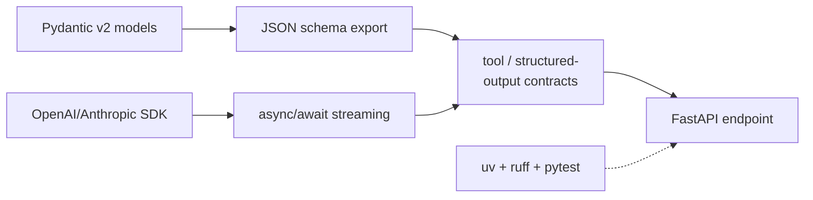

## Why it Matters

Refresh Python for AI engineering: async, type hints, Pydantic, env/tooling, not leetcode Python.

- `uv` for env + deps, `ruff` for lint, `pytest` for tests.
- `async/await` for LLM streaming; `Pydantic v2` for structured outputs.
- Type hints (`str | None`, `TypedDict`, `Annotated`) enable tool schemas.

## Diagram



## Code

```python

## When to use / NOT

- **Use:** FastAPI services, LLM orchestration, data pipelines.
- **NOT:** Performance-critical vector math (use libraries) or enterprise transactions (use Java/Spring where it fits — see [[AI/00_Overview/Tech Stack|Tech Stack]]).

## Trade-offs

| Pros | Cons |
|------|------|
| Fast iteration, huge AI ecosystem | Runtime type errors if hints ignored |
| Async streaming out of the box | GIL limits true parallelism |

## Vs

| Aspect | Python AI layer | Java/Spring | Go |
|--------|-----------------|-------------|----|
| Why here | First-class LLM SDKs, Pydantic schema export | Transactional strength, static typing | Concurrency, single binary |
| Cost | Runtime type errors if hints ignored | More code for LLM orchestration | Thin AI ecosystem |
| Deploy | uvicorn + K8s | Spring Boot + K8s | Scratch image + K8s |

## Pitfalls

- Forgetting `await` on streamed chunks → hangs. Always async-iterate.
- Mutable defaults in Pydantic models.

## Interview Q&A

- **Q:** Why Pydantic v2 for LLM outputs? **A:** Validation + JSON schema generation for tool/structured-output contracts.
- **Q:** uv vs pip? **A:** 10-100x faster resolver; reproducible locks.

## Related

- [[02_FastAPI Backend]] • [[AI/00_Overview/Tech Stack|Tech Stack]]

---
*Category: fundamentals*

# Python for AI

> Part of [[README|01_Fundamentals]] • `fundamentals` • Week 1

# python 3.12 — async LLM call sketch

import asyncio
from pydantic import BaseModel

class Answer(BaseModel):
 content: str
 citations: list[str] = []

async def stream_answer(prompt: str):
 # placeholder for openai.AsyncOpenAI().chat.completions.create(stream=True)
 for token in ["Hello", " from", " LLM"]:
 await asyncio.sleep(0.01)
 yield token
```

## Vs Table

| Aspect | Python (AI layer) | Java/Spring (platform layer) |
|--------|-------------------|------------------------------|
| Strength | LLM libs, rapid prototyping | Transactions, strong typing, ops maturity |
| Deploy | FastAPI + uvicorn | Spring Boot + K8s (Phase 05) |
