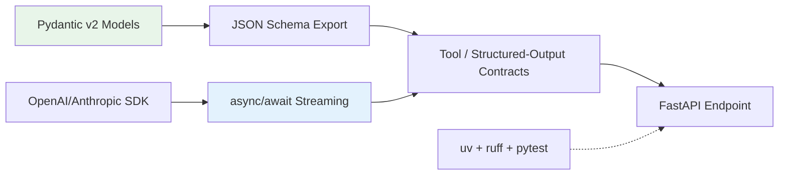

## 🎯 Intent
Refresh Python for AI engineering: async, type hints, Pydantic, env/tooling — not leetcode Python. This is the language foundation for the entire AI platform.

## 💡 Why It Matters
- **Interview signal**: "Why Pydantic v2 for LLM outputs?" and "uv vs pip?" are standard AI engineering screening questions
- **Production reality**: `uv` (10-100× faster resolver), `ruff` (Rust linter), `pytest` replace pip/venv/black/flake8 — modern toolchain is table stakes
- **Async is non-negotiable**: Blocking calls collapse LLM streaming throughput; `asyncio.gather` enables parallel provider calls

## 🧩 Diagram: Python AI Toolchain


## 💻 Code: Modern Python AI Stack (Python 3.12+)
```python
# uv: single binary for Python + deps + lockfile
# uv init ai-backend
# uv add openai pydantic fastapi httpx
# uv add --dev pytest ruff
# ruff check . && pytest

# async LLM streaming — NEVER blocking
import asyncio
from pydantic import BaseModel, Field

class Answer(BaseModel):
    content: str
    citations: list[str] = Field(default_factory=list)

async def stream_answer(prompt: str):
    client = openai.AsyncOpenAI()
    stream = await client.chat.completions.create(
        model="gpt-4o-mini",
        messages=[{"role": "user", "content": prompt}],
        stream=True
    )
    async for chunk in stream:
        if chunk.choices[0].delta.content:
            yield chunk.choices[0].delta.content

# Pydantic v2 structured output — validation + JSON Schema
class MeetingNotes(BaseModel):
    summary: str = Field(description="3-4 sentences, decisions only")
    decisions: list[str] = Field(default_factory=list)
    action_items: list[dict] = Field(default_factory=list)  # {owner, task, due}

# Type hints enable tool schemas + catch bugs pre-runtime
# str | None forces null checks
# TypedDict validates dict shapes
# Annotated carries constraints for tool schemas
```

## ✅ When to Use / ❌ When NOT to Use
| Scenario | Use? | Reason |
|---|---|---|
| FastAPI services, LLM orchestration, data pipelines | ✅ | First-class LLM SDKs, Pydantic schema export |
| Performance-critical vector math | ❌ | Use numpy, faiss, ONNX Runtime |
| Enterprise transactions | ❌ | Use Java/Spring (see [[Tech Stack]]) |

## ⚖️ Trade-offs: Python AI Layer vs Java/Spring Platform
| Dimension | Python AI Layer | Java/Spring Platform | Go |
|---|---|---|---|
| **Why Here** | LLM libs, Pydantic schema export, rapid prototyping | Transactional strength, static typing, ops maturity | Concurrency, single binary |
| **Cost** | Runtime type errors if hints ignored | More code for LLM orchestration | Thin AI ecosystem |
| **Deploy** | uvicorn + K8s | Spring Boot + K8s | Scratch image + K8s |
| **Async** | Native event loop | Virtual threads / WebFlux | Goroutines |

**Decision rule**: Python for AI orchestration (weekly changes); Java for transactional services (stable).

## 🆚 Vs. Alternatives
| Aspect | Python (AI Layer) | Java/Spring (Platform) | Decision Rule |
|---|---|---|---|
| **Strength** | LLM libs, rapid prototyping | Transactions, strong typing, ops maturity | Python for AI orchestration; Java for transactional services |
| **Deploy** | FastAPI + uvicorn | Spring Boot + K8s | Coexist in final stack |
| **Tooling** | uv/ruff/pytest | Maven/Gradle | Both first-class |

## ⚠️ Pitfalls
1. **Forgetting `await` on streamed chunks** → hangs. Always async-iterate.
2. **Mutable defaults in Pydantic** → `Field(default_factory=list)` not `default=[]`.
3. **Blocking `time.sleep` in async routes** → use `asyncio.sleep`.
4. **No timeout on LLM calls** → hanging requests. Add `httpx.Timeout` + retries.

## 🎤 Interview Q&A (Senior Depth)

**Q1: "Why Pydantic v2 for LLM outputs?"**
> **Answer**: Validation + JSON Schema generation for tool/structured-output contracts. `model_json_schema()` produces the schema the LLM sees; `model_validate()` enforces it on return. Without it, you parse JSON by hand and hope. **Rejected**: Manual JSON parsing — fragile, no schema contract.

**Q2: "uv vs pip?"**
> **Answer**: 10-100× faster resolver; reproducible locks (`uv.lock`); single binary installs Python + deps. `uv sync` is the new `pip install -r requirements.txt`. **Rejected**: pip + venv — slow, no lockfile, environment drift.

**Q3: "How do you handle 429 from an LLM provider?"**
> **Answer**: Exponential backoff + jitter (`tenacity.wait_exponential`), plus client-side token bucket rate limiting. Circuit breaker in AI Gateway fails over to fallback model. **Metric**: p99 latency < 10s, error rate < 0.1%.

**Q4: "async/await vs threads for LLM calls?"**
> **Answer**: `async/await` — one event loop handles thousands of concurrent streams. Threads need pool per request, collapse under load. GIL irrelevant: work is I/O-bound (network wait). **Rejected**: Thread pool — doesn't scale to 10k concurrent streams.

**Q5: "Type hints — do they actually catch bugs?"**
> **Answer**: Yes, with `ruff`/`mypy` in CI. `str | None` forces null checks; `TypedDict` validates dict shapes; `Annotated` carries constraints for tool schemas. Cost = CI time; payoff = catching `AttributeError: 'NoneType'` before prod.

## 🔗 Related
- [[02_FastAPI Backend]] • [[03_LLM APIs]] • [[Tech Stack]] • [[AI Backend Template]]