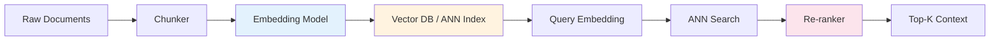

## 🎯 Intent
Master embedding models, vector similarity, and ANN indexes — the retrieval backbone of every RAG system. Understand dimensionality, quantization, and index trade-offs to pick the right stack for latency/recall/cost targets.

## 💡 Why It Matters
- **Interview signal**: "How does HNSW work?" and "When does cosine similarity fail?" separate practitioners from tourists
- **Production impact**: Embedding model choice dominates retrieval quality; index choice dominates p99 latency and memory
- **Cost driver**: Re-embedding 10M docs at $0.0001/1k tokens = $1000 + compute; get it right first time

## 🧩 Diagram: Embedding → ANN Pipeline


## 💻 Code: HNSW Insert + Search (Java 25, using Lucene's HNSW)
```java
record EmbeddingConfig(int dim, int m, int efConstruction, int efSearch) {}

class HnswIndex {
    private final org.apache.lucene.search.knn.HnswGraphIndex index;
    private final int dim;

    HnswIndex(EmbeddingConfig cfg) {
        this.dim = cfg.dim();
        this.index = new org.apache.lucene.search.knn.HnswGraphIndex(
            cfg.dim(), cfg.m(), cfg.efConstruction(), new Random());
    }

    void add(int docId, float[] vec) {
        if (vec.length != dim) throw new IllegalArgumentException("dim mismatch");
        index.addPoint(docId, vec);
    }

    List<int[]> search(float[] query, int k) {
        var collector = new org.apache.lucene.search.knn.TopDocsCollector(k, cfg.efSearch());
        index.search(query, collector);
        return collector.topDocs().scoreDocs.stream()
            .map(sd -> new int[]{sd.doc, (int)(sd.score * 1000)}) // score ≈ 1 - distance
            .toList();
    }
}

// Usage: OpenAI text-embedding-3-large (3072 dim) → M=16, efC=200, efS=128
var cfg = new EmbeddingConfig(3072, 16, 200, 128);
var index = new HnswIndex(cfg);
IntStream.range(0, docs.size()).forEach(i -> index.add(i, embed(docs.get(i))));
var results = index.search(embed(query), 10);
```

## ✅ When to Use / ❌ When NOT to Use
| Scenario | Use? | Reason |
|---|---|---|
| Semantic search over unstructured text | ✅ | Core use case |
| Exact match / keyword lookup | ❌ | Use BM25 / inverted index |
| Structured filter + vector (e.g., "category=finance AND similar") | ⚠️ | Need hybrid index (HNSW + inverted) or post-filter |
| Ultra-low latency (<5ms p99) on 10M+ vectors | ⚠️ | Consider quantization (PQ/SQ) or disk-based (DiskANN) |
| Multilingual / cross-lingual retrieval | ✅ | Use multilingual embeddings (e5, bge-m3, jina-v3) |

## ⚖️ Trade-offs: Embedding Models (2024-25 SOTA)
| Model | Dim | Max Tokens | MTEB Avg | Cost/1M Tokens | Best For |
|---|---|---|---|---|---|
| **text-embedding-3-large** | 3072 | 8192 | 64.6 | $0.13 | General purpose, highest quality |
| **text-embedding-3-small** | 1536 | 8192 | 62.3 | $0.02 | Cost-sensitive, low latency |
| **bge-large-en-v1.5** | 1024 | 512 | 63.9 | Free (self-host) | Open-source, strong EN |
| **e5-mistral-7b-instruct** | 4096 | 4096 | 65.2 | Free (self-host) | Instruction-tuned, long context |
| **jina-embeddings-v3** | 1024 | 8192 | 64.1 | Free (self-host) | Multilingual (89 langs), LoRA adapters |
| **voyage-3-large** | 1024 | 32k | 65.8 | $0.12 | Code, long context, reranking built-in |

**Decision rule**: Start with `text-embedding-3-small` (1536-d) + HNSW; upgrade to `large` or `voyage-3` only if recall@10 < 0.85 on eval set.

## ⚖️ Trade-offs: ANN Indexes
| Index | Build Time | Memory | p99 Latency | Recall@10 | Best For |
|---|---|---|---|---|---|
| **HNSW** | Slow | High (graph) | 1-5ms | 0.95-0.99 | Default choice, in-memory |
| **IVF + PQ** | Fast | Low (quantized) | 2-10ms | 0.85-0.95 | 100M+ vectors, disk-friendly |
| **DiskANN** | Medium | Low (SSD) | 5-20ms | 0.90-0.98 | Billion-scale, cost-sensitive |
| **Flat (brute force)** | None | Highest | O(N) | 1.0 | <100k vectors, exact recall needed |
| **ScaNN** | Medium | Medium | 1-3ms | 0.95+ | Google-scale, anisotropic quantization |

**Decision rule**: HNSW for <10M vectors in RAM; IVF-PQ or DiskANN beyond that.

## 🆚 Vs. Alternatives
| Alternative | When to Choose | Decision Rule |
|---|---|---|
| **BM25 / Tantivy / Lucene** | Keyword-heavy, exact terminology, legal/medical | Query has rare terms; lexical precision > semantic |
| **SPLADE / uniCOIL** | Sparse learned embeddings | Need interpretability + BM25 compatibility |
| **ColBERT / Late Interaction** | Max recall, complex queries | Can afford 10-50× storage (per-token vectors) |
| **Hybrid (BM25 + Vector + RRF)** | Production RAG default | Always beats single modality; fuse with RRF (k=60) |

## ⚠️ Pitfalls
1. **Using default chunk size (512/1024) without tuning** — Optimal chunk depends on embedding model's training context (e.g., bge: 512, e5: 512, voyage: 1024, jina: 8192)
2. **Ignoring normalization** — Cosine similarity requires L2-normalized vectors; dot product ≠ cosine if not normalized
3. **Single embedding for all query types** — Questions vs. keywords vs. code need different encoders (or instruction-tuned: "Represent this query for retrieval: ")
4. **No re-ranker** — ANN recall@10 = 0.95 still misses 5%; cross-encoder re-ranker adds 5-15ms but boosts nDCG@10 by 0.1-0.2
5. **Forgetting to version embeddings** — Model upgrade = re-embed entire corpus; plan for backward compatibility (store model_id + version in metadata)

## 🎤 Interview Q&A (Senior Depth)

**Q1: "How does HNSW achieve sub-linear search? What are the key parameters?"**
> **Answer**: Hierarchical Navigable Small World — multi-layer graph where top layers are sparse (long-range hops), bottom layer dense (local search). Search starts at top layer, greedily descends. **Key params**: `M` (max connections per node, 16-48), `efConstruction` (build-time search width, 100-400), `efSearch` (query-time width, 50-200). **Trade-off**: Higher M/ef = better recall, more memory, slower build. **Rejected alternative**: NSW (single layer) — gets stuck in local minima.

**Q2: "When does cosine similarity fail as a relevance signal?"**
> **Answer**: 1) **Anisotropy** — embeddings concentrate in cone (low intrinsic dim), cosine saturates → use whitening (BERT-whitening) or ScaNN's anisotropic quantization. 2) **Length bias** — longer docs have higher norm, dominate dot product → always L2-normalize. 3) **Domain mismatch** — general embeddings confuse "Apple" (fruit vs company) → fine-tune or use domain-adapted (e.g., `bge-legal`, `voyage-code`). **Metric**: Measure intrinsic dimensionality (PCA eigenvalues); if top 10% dims explain >90% variance, anisotropy is severe.

**Q3: "Explain Product Quantization (PQ). How does it reduce memory?"**
> **Answer**: Split vector into `m` subvectors (e.g., 1024-d → 16×64), quantize each subspace to `k` centroids (typically 256 = 1 byte). Store only centroid IDs: 1024-d float32 (4 KB) → 16 bytes (16×1B). Search via asymmetric distance: precompute query-to-centroid distances, sum at query time. **Trade-off**: 4-8% recall drop for 256× compression. **Rejected**: Scalar quantization (1 bit/dim) — too lossy for high-dim.

**Q4: "How do you evaluate retrieval quality offline?"**
> **Answer**: 1) **Recall@k** — fraction of gold docs in top-k. 2) **nDCG@k** — graded relevance (essential for multi-relevant). 3) **MRR** — rank of first relevant. 4) **Latency/recall curve** — sweep `efSearch`. **Must**: Use held-out query set with human-annotated relevance (not synthetic). **Rejected**: "Just check if answer is correct" — confounds retrieval + generation.

**Q5: "Design a hybrid retrieval system for enterprise RAG (10M docs, p99 < 100ms)."**
> **Answer**: **Architecture**: BM25 (Tantivy) + HNSW (text-embedding-3-small, 1536-d, M=32, efS=128) + Cross-encoder re-ranker (bge-reranker-v2-m3). **Fusion**: RRF(k=60) on top-50 from each. **Optimization**: 1) Pre-filter by metadata (tenant, date) before ANN. 2) Quantize HNSW to SQ8 (1 byte/dim) → 4× memory reduction. 3) Async re-ranking for non-critical paths. **Cost**: ~$200/month for 10M on 1×r6g.4xlarge (128GB RAM). **Rejected**: Pure vector — fails on exact IDs, codes, acronyms.

## Flashcards (Spaced Repetition)

#flashcard
**Q:** What is the trigger keyword for Embeddings and Vector Search? :: **A:** [trigger keywords] #flashcard

#flashcard
**Q:** Key hyperparameter for Embeddings and Vector Search? :: **A:** [hyperparameter + typical range] #flashcard

#flashcard
**Q:** When do you NOT use Embeddings and Vector Search? :: **A:** [anti-pattern scenarios] #flashcard

#flashcard
**Q:** Cost order of magnitude for Embeddings and Vector Search? :: **A:** [GPU hours / $ per 1M tokens] #flashcard

## Practice Tasks (Tasks Plugin)
- [ ] Restate the intent from memory 📅 2026-09-30
- [ ] Code the config without looking 📅 2026-10-02
- [ ] Answer all Interview Q&A aloud 📅 2026-10-06
- [ ] Review flashcards (Spaced Repetition) 📅 2026-09-30

```tasks
not done
path includes 01_Fundamentals
sort by due
limit 10
```

## Related
- [[README|AI MOC]]
- [[01_Fundamentals/README|01_Fundamentals Folder]]

---

*Category: AI/01_Fundamentals • Part of [[README|AI MOC]]*