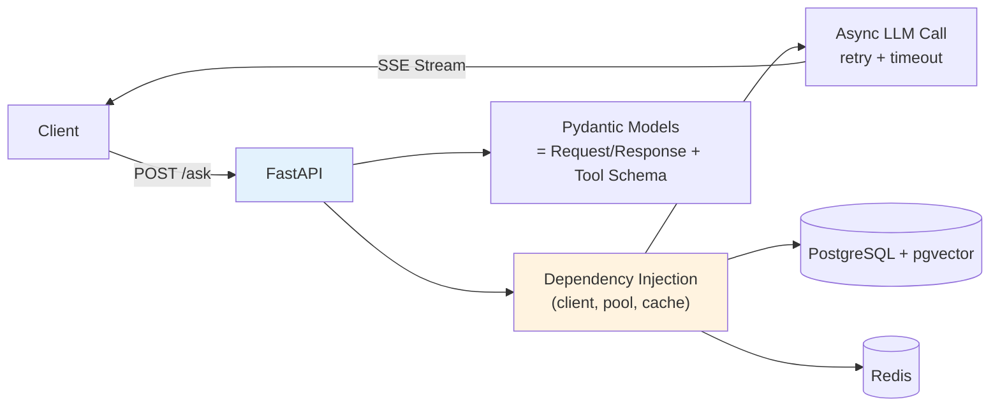

## 🎯 Intent
Build an AI-ready API layer: streaming, validation, dependency injection, middleware — the backend template for the entire platform.

## 💡 Why It Matters
- **Interview signal**: "How do you stream LLM tokens via FastAPI?" and "FastAPI vs Spring for AI services?" are common system design questions
- **Production reality**: Native async + Pydantic + auto OpenAPI = fastest iteration for AI orchestration layer
- **Polyglot architecture**: FastAPI for AI layer (weekly changes) + Spring for transactional platform services (stable)

## 🧩 Diagram: FastAPI AI Backend Architecture


## 💻 Code: Production-Ready FastAPI Template (Python — FastAPI is Python-native)
```python
from fastapi import FastAPI, Depends, HTTPException
from fastapi.responses import StreamingResponse
from pydantic import BaseModel, Field
from typing import AsyncIterator, Annotated
import httpx
import uuid

app = FastAPI(title="AI Backend Template")

class ChatRequest(BaseModel):
    message: str = Field(min_length=1, max_length=8000)
    stream: bool = True
    temperature: float = Field(default=0.2, ge=0, le=1)

class ChatResponse(BaseModel):
    answer: str
    citations: list[str] = []

# Dependency injection for LLM client (swappable, testable)
class LlmClient:
    def __init__(self):
        self.client = httpx.AsyncClient(
            timeout=httpx.Timeout(30.0, connect=5.0),
            limits=httpx.Limits(max_connections=100)
        )
    async def chat(self, messages: list[dict], stream: bool) -> AsyncIterator[str]:
        # ... actual OpenAI/Anthropic call with retries
        yield "token"

async def get_llm() -> LlmClient:
    # In real app: singleton with connection pooling
    return LlmClient()

@app.post("/chat", response_model=ChatResponse)
async def chat(
    req: ChatRequest,
    llm: Annotated[LlmClient, Depends(get_llm)]
) -> ChatResponse:
    if req.stream:
        async def gen() -> AsyncIterator[str]:
            async for chunk in llm.chat(
                [{"role": "user", "content": req.message}],
                stream=True
            ):
                yield f"data: {chunk}\n\n"
        return StreamingResponse(gen(), media_type="text/event-stream")

    # Non-streaming: structured output
    resp = await llm.chat([{"role": "user", "content": req.message}], stream=False)
    return ChatResponse(answer=resp, citations=[])

@app.get("/health")
async def health() -> dict[str, str]:
    return {"status": "ok"}

# Middleware: request ID, logging, rate limiting
@app.middleware("http")
async def add_request_id(request, call_next):
    request.state.request_id = uuid.uuid4().hex[:8]
    response = await call_next(request)
    response.headers["X-Request-ID"] = request.state.request_id
    return response
```

## ✅ When to Use / ❌ When NOT to Use
| Scenario | Use? | Reason |
|---|---|---|
| LLM gateway, RAG endpoints, agent orchestration | ✅ | Native async, Pydantic, rapid iteration |
| Distributed transactions, enterprise integration | ❌ | Use Spring Boot (Phase 05) |
| High-throughput internal services | ⚠️ | Consider gRPC + Spring; FastAPI for edge |

## ⚖️ Trade-offs: FastAPI vs Spring Boot
| Aspect | FastAPI | Spring Boot (Platform) | Decision Rule |
|---|---|---|---|
| **Async** | Native event loop | Virtual threads / WebFlux | Python for AI orchestration speed |
| **Schema** | Pydantic → JSON Schema + OpenAPI auto | Jakarta validation, verbose | FastAPI wins for rapid iteration |
| **Role** | AI layer, changes weekly | Transactional services over gRPC | Polyglot: both coexist |
| **Scaling** | Uvicorn workers (1 per core) | Multi-threaded | Offload CPU-bound to process pool |

## 🆚 Vs. Alternatives
| Aspect | FastAPI | Spring Boot | Flask |
|---|---|---|---|
| **Async** | Native | Virtual threads | Needs wrappers |
| **OpenAPI** | Auto-generated | Manual/Annotation | Manual |
| **AI Ecosystem** | Native (LangChain, LlamaIndex, MCP) | Growing | Limited |

## ⚠️ Pitfalls
1. **Blocking `time.sleep` in async routes** → use `asyncio.sleep`
2. **No timeout on LLM calls** → hanging requests. Add `httpx.Timeout` + retries
3. **Blocking calls in dependency injection** → use `async` deps or `run_in_threadpool`
4. **Missing request ID middleware** → add for tracing correlation
5. **Streaming without backpressure** → bounded queues, Nginx `proxy_buffering off`

## 🎤 Interview Q&A (Senior Depth)

**Q1: "How to stream LLM tokens via FastAPI?"**
> **Answer**: `StreamingResponse` + async generator from `openai.AsyncOpenAI(stream=True)`. Generator yields tokens as they arrive; `media_type="text/event-stream"` enables SSE. **Critical**: Set per-chunk timeout (5s) and total timeout.

**Q2: "FastAPI vs Spring for AI services?"**
> **Answer**: FastAPI for AI orchestration (native async, Pydantic, weekly changes); Spring for transactional platform services (distributed transactions, enterprise integration). Both coexist — FastAPI calls Spring via gRPC. **Rejected**: "One framework for everything" — wrong tool for AI layer.

**Q3: "Dependency injection — why does it matter for LLM clients?"**
> **Answer**: Swappable providers (OpenAI ↔ Anthropic ↔ local), testable with mocks, shared connection pools, retry/timeout config in one place. `Depends(get_llm_client)` makes endpoint independent of concrete client.

**Q4: "How do you handle backpressure when streaming to slow clients?"**
> **Answer**: `StreamingResponse` buffers in memory; for high-throughput, use `asyncio.Queue` with maxsize + `asyncio.wait_for` on generator. Nginx `proxy_buffering off` also helps.

**Q5: "What's the scaling model for FastAPI in production?"**
> **Answer**: Multiple uvicorn workers (one per CPU core) behind load balancer. Each worker = single-threaded event loop. For CPU-bound work, offload to process pool or separate service. Not multi-threaded like Spring.

## Flashcards (Spaced Repetition)

#flashcard
**Q:** What is the trigger keyword for FastAPI Backend? :: **A:** [trigger keywords] #flashcard

#flashcard
**Q:** Key hyperparameter for FastAPI Backend? :: **A:** [hyperparameter + typical range] #flashcard

#flashcard
**Q:** When do you NOT use FastAPI Backend? :: **A:** [anti-pattern scenarios] #flashcard

#flashcard
**Q:** Cost order of magnitude for FastAPI Backend? :: **A:** [GPU hours / $ per 1M tokens] #flashcard

## Practice Tasks (Tasks Plugin)
- [ ] Restate the intent from memory 📅 2026-09-30
- [ ] Code the config without looking 📅 2026-10-02
- [ ] Answer all Interview Q&A aloud 📅 2026-10-06
- [ ] Review flashcards (Spaced Repetition) 📅 2026-09-30

```tasks
not done
path includes 01_Fundamentals
sort by due
limit 10
```

## Related
- [[README|AI MOC]]
- [[01_Fundamentals/README|01_Fundamentals Folder]]

---

*Category: AI/01_Fundamentals • Part of [[README|AI MOC]]*