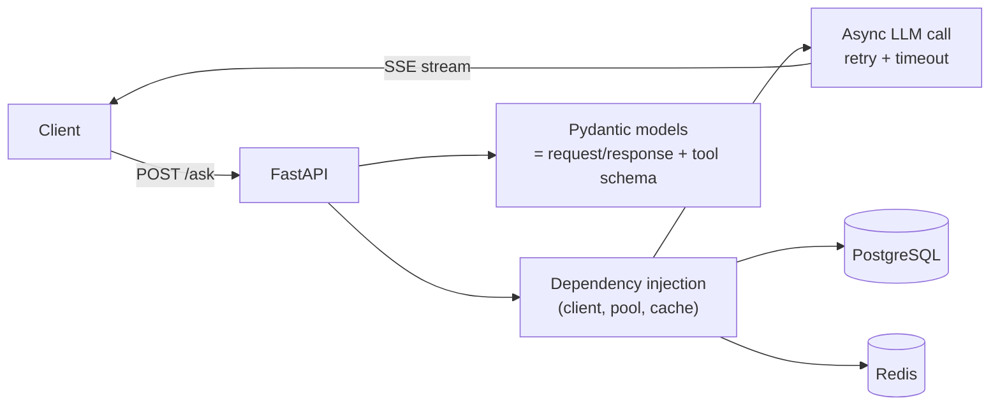

## Why it Matters

Build an AI-ready API layer: streaming, validation, dependency injection, middleware, your backend template for the entire platform.

- `StreamingResponse` for token streaming (SSE).
- Dependency injection for LLM clients, vector stores.
- Middleware: rate limiting, logging, request IDs, foundation for Phase 04 resilience.

## Diagram



## Code

```python
from fastapi import FastAPI
from fastapi.responses import StreamingResponse
from pydantic import BaseModel

app = FastAPI(title="AI Backend Template")

class ChatRequest(BaseModel):
 message: str
 stream: bool = True

@app.post("/chat")
async def chat(req: ChatRequest):
 async def gen():
 for tok in ["Thinking", "... ", req.message[:20]]:
 yield tok
 return StreamingResponse(gen(), media_type="text/event-stream")

@app.get("/health")
async def health(): return {"status": "ok"}
```

## When to use / not

- **Use:** LLM gateway, RAG endpoints, agent orchestration APIs.
- **Use Java/Spring when:** You need distributed transactions, existing enterprise integration, both coexist in Phase 05.

## Trade-offs

| Pros | Cons |
|------|------|
| Auto OpenAPI docs, Pydantic validation | Less mature enterprise ecosystem than Spring |
| Native async + streaming | Python single-process scaling needs consideration |

## Vs

| Aspect | FastAPI | Spring Boot (platform layer) | Flask |
|--------|---------|------------------------------|-------|
| Async | Native event loop | Virtual threads / WebFlux | Needs wrappers |
| Schema | Pydantic → JSON schema + OpenAPI | Jakarta validation, more verbose | Manual |
| Role here | AI layer, changes weekly | Transactional services over gRPC | Not chosen |

## Pitfalls

- Blocking `time.sleep` in async routes, use `asyncio.sleep`.
- No timeout on LLM calls → hanging requests. Add `httpx.Timeout` + retries.

## Interview q&a

- **Q:** How to stream LLM tokens via FastAPI? **A:** `StreamingResponse` + async generator from `openai.AsyncOpenAI(..., stream=True)`.
- **Q:** FastAPI vs Spring for AI services? **A:** FastAPI for AI orchestration speed; Spring for transactional platform services, both in final stack.

## Related

- [[01_Python for AI]] • [[03_LLM APIs]] • [[AI Backend Template]]

---
*Category: fundamentals*

# FastAPI Backend

> Part of [[README|01_Fundamentals]] • `fundamentals` • Weeks 1–2
