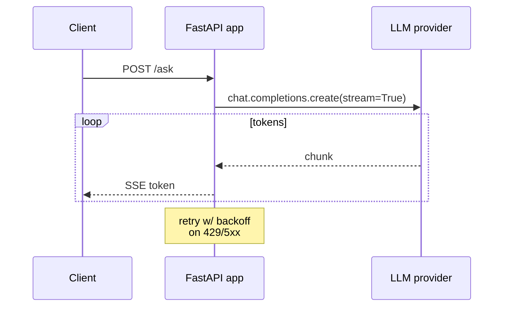

## Why it Matters

Call managed LLM APIs reliably: retries, streaming, fallback, cost tracking.

- Providers: OpenAI, Anthropic (Claude), Gemini, unified via thin adapter (see [[AI/07_Cross-Cutting/06_Multi-Model Routing|Multi-Model Routing]]).
- Must handle: rate limits (429), timeouts, streaming partials, token counting.
- Track usage per request for cost optimization.

## Diagram



## Code

```python
import openai, tenacity

client = openai.AsyncOpenAI()

@tenacity.retry(stop=tenacity.stop_after_attempt(3), wait=tenacity.wait_exponential())
async def chat_with_retry(messages: list[dict]) -> str:
 resp = await client.chat.completions.create(
 model="gpt-4o-mini", messages=messages, temperature=0.2
 )
 return resp.choices[0].message.content
```

## When to use / not

- **Use:** for any request that leaves the process, provider calls, embedding batches, tool execution, and for anything an end user waits on.
- **NOT:** for in-process computation; wrapping local work in retries adds failure modes without a benefit.

## Trade-offs

| Pros | Cons |
|------|------|
| No infra, fast iteration | Vendor lock-in, per-token cost |
| Always latest models | Rate limits, data governance concerns |

## Vs

| Aspect | Direct SDK calls | AI Gateway | Self-hosted gateway |
|--------|------------------|-------------|----------------------|
| Failover | Manual per call | Policy at one point | You operate it |
| Cost control | None | Routing + caching | Same, plus infra cost |
| Vendor lock | Hard per service | Abstraction seam | Highest |
| Phase | 01 | 04 ([[AI/04_Production-Platform/01_AI Gateway\|AI Gateway]]) | later, if needed |

## Pitfalls

- Logging raw prompts with PII. Redact before observability.

## Interview q&a

- **Q:** How to handle 429? **A:** Exponential backoff + jitter, plus token bucket rate limiting client-side.
- **Q:** How to estimate cost? **A:** Count input/output tokens per call; dashboard in [[AI/07_Cross-Cutting/05_Cost Optimization|Cost Optimization]].

## Related

- [[04_Prompt Engineering]] • [[05_Structured Outputs]] • [[AI/07_Cross-Cutting/05_Cost Optimization|Cost Optimization]]

---
*Category: fundamentals*

# LLM APIs

> Part of [[README|01_Fundamentals]] • `fundamentals` • Week 2

## Vs Table

| Aspect | Managed API | Self-hosted (open-weight) |
|--------|-------------|---------------------------|
| Cost | Pay per token | GPU infra + ops |
| Latency | Network bound | Colocation possible |
| Control | Limited | Full (fine-tuning, privacy) |

Trade-off analysis deepens in [[AI/02_RAG-Engineering/02_Design LLM Architectures|02_Design LLM Architectures]].
