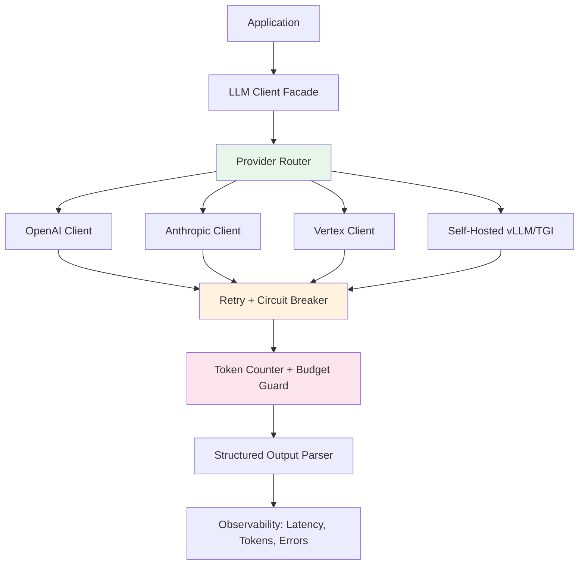

## 🎯 Intent
Master production-grade LLM API integration: client patterns, error handling, streaming, function calling, structured outputs, and cost/latency optimization across providers (OpenAI, Anthropic, Vertex, Bedrock, self-hosted).

## 💡 Why It Matters
- **Interview signal**: "How do you handle rate limits gracefully?" and "Design a multi-provider fallback" are common system design follow-ups
- **Production reality**: 90% of "LLM engineering" is API plumbing — retries, timeouts, token counting, budget enforcement
- **Vendor lock-in risk**: Abstracting provider differences enables switching when pricing/capability shifts

## 🧩 Diagram: Resilient LLM Client Architecture


## 💻 Code: Multi-Provider Client with Retry + Budget (Java 25)
```java
sealed interface LlmProvider permits OpenAiClient, AnthropicClient, VertexClient {
    CompletionResponse complete(CompletionRequest req);
    Stream<CompletionChunk> stream(CompletionRequest req);
    int countTokens(String text);
}

record CompletionRequest(
    List<Message> messages,
    double temperature,
    int maxTokens,
    List<Tool> tools,
    ResponseFormat responseFormat
) {}

record CompletionResponse(String content, Usage usage, String model) {}
record Usage(int promptTokens, int completionTokens, int totalTokens) {}

class ResilientLlmClient {
    private final List<LlmProvider> providers; // ordered by preference
    private final TokenBudget budget;
    private final CircuitBreaker breaker = CircuitBreaker.ofDefaults("llm");

    ResilientLlmClient(List<LlmProvider> providers, TokenBudget budget) {
        this.providers = providers;
        this.budget = budget;
    }

    CompletionResponse completeWithFallback(CompletionRequest req) {
        budget.reserve(estimateTokens(req)); // fail fast if over budget
        var lastErr = new AtomicReference<Exception>();
        for (var provider : providers) {
            if (!breaker.getState().isClosed()) continue;
            try {
                var resp = breaker.executeSupplier(() -> provider.complete(req));
                budget.consume(resp.usage().totalTokens());
                return resp;
            } catch (Exception e) {
                lastErr.set(e);
                budget.release(estimateTokens(req)); // refund on failure
            }
        }
        throw new LlmUnavailableException("All providers failed", lastErr.get());
    }

    private int estimateTokens(CompletionRequest req) {
        return req.messages().stream().mapToInt(m -> providers.getFirst().countTokens(m.content())).sum()
            + req.maxTokens();
    }
}

// Circuit breaker config: 50% failure rate in 10s → open for 30s → half-open probe
```

## ✅ When to Use / ❌ When NOT to Use
| Scenario | Use? | Reason |
|---|---|---|
| Building any LLM-powered feature | ✅ | Baseline infrastructure |
| Need provider-agnostic code | ✅ | Avoid lock-in |
| Ultra-low latency (<100ms) | ⚠️ | Self-hosted (vLLM/TGI) + speculative decoding |
| Strict data residency (no cloud) | ✅ | Self-hosted only |
| Prototyping / one-off scripts | ❌ | Direct SDK calls fine |

## ⚖️ Trade-offs: Provider Comparison (2024-25)
| Dimension | OpenAI | Anthropic | Vertex (Gemini) | Bedrock | Self-Hosted (vLLM) |
|---|---|---|---|---|---|
| **Best Model** | GPT-4o, o1 | Claude 3.5 Sonnet | Gemini 1.5 Pro | Llama 3.1 405B | Llama 3.1, Qwen 2.5 |
| **Context Window** | 128k | 200k | 2M | 128k | Model-dependent |
| **Structured Output** | JSON Schema (strict) | Tool use + JSON | Function calling | Tool use | JSON Schema / outlines |
| **Streaming** | SSE | SSE | SSE | SSE | SSE / WebSocket |
| **Latency (p50)** | 500-1500ms | 800-2000ms | 1000-3000ms | 1000-4000ms | 100-500ms (local) |
| **Cost / 1M tokens (in/out)** | $2.50/$10 (4o) | $3/$15 (Sonnet) | $1.25/$5 (1.5 Pro) | $0.80/$2.40 (405B) | GPU hours only |
| **Rate Limits** | Tier-based | Tier-based | Quota-based | Quota-based | None (your GPU) |
| **Data Retention** | 30 days (opt-out) | 30 days (opt-out) | 180 days (config) | 30 days | Zero |

**Decision rule**: Default to OpenAI (best DX, structured output). Add Anthropic for long-context/reasoning. Self-host for latency/cost/control at scale.

## 🆚 Vs. Alternatives
| Alternative | When to Choose | Decision Rule |
|---|---|---|
| **Direct SDK calls** | Scripts, notebooks, low traffic | No retry/budget/observability needed |
| **LangChain / LlamaIndex wrappers** | Rapid prototyping, chain composition | Accept abstraction leak; swap later |
| **LiteLLM / Portkey / Helicone** | Gateway: logging, routing, fallbacks | Need multi-team governance, not just code |
| **Custom gateway (Envoy + Lua)** | Enterprise: auth, rate limit, PII scrub | Full control, high ops burden |

## ⚠️ Pitfalls
1. **No token budget** → runaway costs (seen $50k/day surprises). Enforce per-request + daily caps.
2. **Ignoring streaming backpressure** — consumer slower than producer → OOM. Use bounded buffers.
3. **Assuming same prompt works across providers** — system prompt format differs (Anthropic: `system` param vs OpenAI: `role=system`); normalize in facade.
4. **No idempotency keys** — retries create duplicate charges. Use `user` field or custom header for deduplication.
5. **Hardcoding model names** — models deprecate (gpt-3.5-turbo-0613 → 1106 → 0125). Config-driven with fallback chain.

## 🎤 Interview Q&A (Senior Depth)

**Q1: "Design a resilient LLM client that handles rate limits, timeouts, and provider failures."**
> **Answer**: Facade pattern with provider chain. Each request: 1) token budget check, 2) circuit breaker per provider, 3) exponential backoff + jitter (max 3 retries), 4) fallback to next provider on 429/5xx. **Key**: Idempotency keys for deduplication. **Metric**: p99 latency < 10s, error rate < 0.1%. **Rejected**: Single provider with long timeout — cascades failures.

**Q2: "How do you implement structured output reliably across providers?"**
> **Answer**: **OpenAI**: `response_format: {type: "json_schema", json_schema: {...}, strict: true}` — guaranteed valid. **Anthropic**: Tool use with `{"name": "output", "input_schema": {...}}` — model calls tool, parse args. **Vertex**: Function calling similar. **Self-hosted**: `outlines` / `guidance` / JSON Schema constrained decoding. **Unified**: Define schema once (JSON Schema), translate per provider in facade. **Rejected**: Prompting "output JSON only" — 5-15% invalid rate.

**Q3: "Explain the cost model for LLM APIs. How do you optimize?"**
> **Answer**: Cost = `prompt_tokens × $in + completion_tokens × $out`. Optimization: 1) **Prompt compression** (llmlingua, selective context) — 30-60% reduction. 2) **Model cascade** — route easy queries to small/cheap model (haiku, 3.5-turbo), hard to large. 3) **Caching** — exact match (Redis) + semantic match (embedding) for repeated queries. 4) **Batching** — async batch API (50% discount). **Metric**: Cost per successful task completion, not per token.

**Q4: "How do you handle streaming responses in a synchronous API?"**
> **Answer**: Two patterns: 1) **WebFlux/Reactor** — return `Flux<String>`, caller subscribes. 2) **CompletableFuture + callback** — accumulate chunks, deliver final. **Critical**: Set per-chunk timeout (e.g., 5s) and total timeout. Handle partial responses on cancel. **Rejected**: Buffer entire stream in memory — OOM on long generations.

**Q5: "What's your strategy for provider deprecation / model sunset?"**
> **Answer**: 1) **Abstraction layer** — model name in config, not code. 2) **Canary routing** — 5% traffic to new model, compare eval metrics. 3) **Regression suite** — golden prompts with expected outputs, run on every model change. 4) **Fallback chain** — config-driven priority list. **Timeline**: 90-day notice typical; migrate in 30. **Rejected**: "Wait for email" — proactive eval catches regressions before users do.

## Flashcards (Spaced Repetition)

#flashcard
**Q:** What is the trigger keyword for LLM APIs? :: **A:** Not specified #flashcard

#flashcard
**Q:** Key hyperparameter for LLM APIs? :: **A:** Not specified #flashcard

#flashcard
**Q:** When do you NOT use LLM APIs? :: **A:** [anti-pattern scenarios] #flashcard

#flashcard
**Q:** Cost order of magnitude for LLM APIs? :: **A:** Not specified #flashcard

## Practice Tasks (Tasks Plugin)
- [ ] Restate the intent from memory 📅 2026-09-30
- [ ] Code the config without looking 📅 2026-10-02
- [ ] Answer all Interview Q&A aloud 📅 2026-10-06
- [ ] Review flashcards (Spaced Repetition) 📅 2026-09-30

```tasks
not done
path includes 01_Fundamentals
sort by due
limit 10
```

## Related
- [[README|AI MOC]]
- 01_Fundamentals Folder

---

*Category: AI/01_Fundamentals • Part of [[README|AI MOC]]*