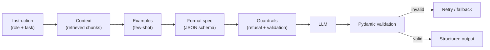

## Why it Matters

Systematically design prompts that are testable, versioned, and evaluable, not vibes.

- Patterns: role + context + task + constraints + output format; few-shot; chain-of-thought (with caution); instruction hierarchy.
- **Tokens and context window:** budget before you write. A 128k window is not 128k of usable attention, retrieval quality degrades past ~30-40% fill. Keep prompts lean and push bulk data to retrieval, not context.
- **Temperature:** 0 to 0.3 for factual, deterministic work (extraction, classification, code). 0.7 to 1.0 for brainstorming and varied copy. Pin a seed when you need reproducibility at non-zero temperature.
- Version prompts like code, store in repo, test with eval set (see [[AI/07_Cross-Cutting/02_AI Evaluation|AI Evaluation]]).
- [[Prompt Playground]] is your lab for this.

## Diagram



## Code

```python
SYSTEM = """You are a meeting-notes assistant.
Rules: Be concise. Use bullet points. Cite decisions as [D1], [D2].
Output JSON matching the MeetingNotes schema."""

FEW_SHOT = {"user": "Summarize: ...", "assistant": '{"summary": "..."}'}
```

## When to use / not

- **Use:** before reaching for fine-tuning, prompt structure, few-shot examples and output schemas solve the majority of quality problems at a fraction of the cost.
- **NOT:** as the fix for retrieval quality; a better prompt cannot rescue wrong context, and it is not a substitute for evals.

## Trade-offs

| Pros | Cons |
|------|------|
| No model retraining | Brittle across model versions |
| Fast to iterate | Non-deterministic, needs eval |

## Vs

| Aspect | Prompt engineering | Fine-tuning | RAG |
|--------|-------------------|-------------|-----|
| Fixes | Format, tone, instruction-following | Style, domain behaviour | Knowledge, freshness |
| Cost | Low, minutes | High, needs data + GPU | Medium, retrieval pipeline |
| Feedback loop | Minutes | Days to weeks | Hours |
| Try in order | 1st | 3rd | 2nd |

## Pitfalls

- Prompt injection via user input, sanitize and use delimiters. See [[AI/07_Cross-Cutting/04_AI Security|Security]].

## Interview q&a

- **Q:** System vs user prompt? **A:** System sets role/constraints; user provides task data. System has higher priority in instruction hierarchy.
- **Q:** How to test prompts? **A:** Golden set + LLM-as-judge + regression suite, [[AI/07_Cross-Cutting/02_AI Evaluation|Evaluation]].

## Related

- [[03_LLM APIs]] • [[05_Structured Outputs]] • [[Prompt Playground]]

---
*Category: fundamentals*

# Prompt Engineering

> Part of [[README|01_Fundamentals]] • `fundamentals` • Week 3
> Watch: [Master Prompt Engineering in 1 Hour](https://www.youtube.com/watch?v=l6JHUln2llg)
