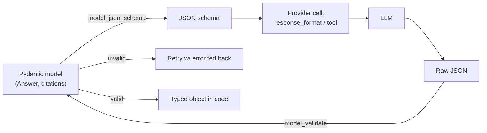

## Why it Matters

Force LLM to emit validated schemas (JSON/Pydantic) instead of free text, enables tool chaining and reliable parsing.

- Methods: JSON mode, function calling with schema, provider structured-output APIs.
- Always validate with Pydantic; retry with error feedback on parse failure.
- Foundation for [[06_Tool Calling|Tool Calling]].

## Diagram



## Code

```python
from pydantic import BaseModel, Field

class MeetingNotes(BaseModel):
 summary: str = Field(description="2-3 sentence summary")
 decisions: list[str]
 action_items: list[dict] # {owner, task, due}

## When to use / NOT

- **Use:** any output consumed by code downstream — tool arguments, API responses, eval harness inputs, config generation; the schema is the contract between the LLM and the rest of the system.
- **NOT:** open-ended creative or exploratory output (drafting prose, brainstorming, summarisation for a human reader); the constraint costs tokens and steerability for no benefit. **NOT** as a correctness guarantee on its own either — a model can satisfy a schema and still be wrong, so schema validity never substitutes for answer-level eval.

## Trade-offs

| Pros | Cons |
|------|------|
| Deterministic parsing | Extra tokens, latency |
| Composable with tools | Schema drift across models |

## Vs

| Aspect | response_format json_schema | Tool/function calling | Free-form parsing |
|--------|------------------------------|----------------------|---------------|
| Guarantee | Enforced by provider | Model may omit args | None |
| Best for | Single structured answer | Side effects, multi-step | Prototypes only |
| Retry path | Re-ask on validation fail | Return tool error to model | Regex + hope |

## Pitfalls

- Declaring a schema the model cannot satisfy (too many required fields, deep nesting) — guarantees become refusals.
- Trusting provider guarantees without a client-side `model_validate`; a schema change in your model can drift from the provider's.
- Using `additionalProperties: false` carelessly — some providers reject strict schemas they cannot represent.
- Retrying on validation failure without feeding the validation error back to the model; it repeats itself.

## Interview Q&A

- **Q:** What if LLM returns invalid JSON? **A:** Validate → on error, reprompt with validation message; cap retries.
- **Q:** JSON mode vs tool calling? **A:** JSON mode for single schema; tools when LLM must *choose* between schemas/actions.

## Related

- [[04_Prompt Engineering]] • [[06_Tool Calling]] • [[AI Backend Template]]

---
*Category: fundamentals*

# Structured Outputs

> Part of [[README|01_Fundamentals]] • `fundamentals` • Week 3
> Watch: [OpenAI DevDay 2024 — Structured Outputs](https://www.youtube.com/watch?v=kE4BkATIl9c)

# openai: response_format={"type": "json_schema", "json_schema": {...}}

# anthropic: tool with input_schema = MeetingNotes.model_json_schema()

```