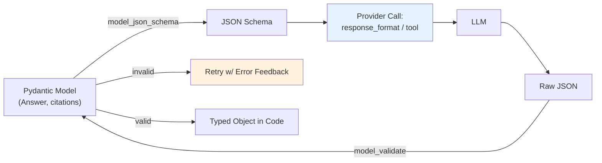

## 🎯 Intent
Force LLM to emit validated schemas (JSON/Pydantic) instead of free text — enables tool chaining, reliable parsing, and type-safe downstream code.

## 💡 Why It Matters
- **Interview signal**: "How do you handle invalid JSON from an LLM?" and "JSON mode vs tool calling?" are standard senior questions
- **Production reality**: Schema validity ≠ answer correctness — you need both format validation AND answer-level eval
- **Contract-first design**: The schema is the contract between LLM and your code; version it like an API

## 🧩 Diagram: Structured Output Loop


## 💻 Code: Unified Structured Output with Retry (Java 25)
```java
record SchemaDefinition(String name, String jsonSchema) {}

sealed interface StructuredOutputProvider permits OpenAiStructured, AnthropicToolStructured {
    String completeStructured(CompletionRequest req, SchemaDefinition schema);
}

class StructuredOutputEngine {
    private final StructuredOutputProvider provider;
    private final ObjectMapper mapper = new ObjectMapper();

    <T> T extract(CompletionRequest req, SchemaDefinition schema, Class<T> clazz) {
        for (int attempt = 0; attempt < 3; attempt++) {
            String json = provider.completeStructured(req, schema);
            try {
                return mapper.readValue(json, clazz);
            } catch (JsonProcessingException e) {
                // Feed validation error back to model
                req = req.withMessages(List.of(
                    req.messages().getFirst(),
                    new Message("user", req.messages().getLast().content() +
                        "\n\nPrevious output failed validation: " + e.getMessage() + ". Fix and retry.")
                ));
            }
        }
        throw new StructuredOutputException("Failed after 3 retries");
    }
}

// OpenAI: response_format = {type: "json_schema", json_schema: {...}, strict: true}
// Anthropic: tool use with input_schema = JSON Schema
// Self-hosted: outlines/guidance constrained decoding
```

## ✅ When to Use / ❌ When NOT to Use
| Scenario | Use? | Reason |
|---|---|---|
| Output consumed by code (tools, APIs, eval) | ✅ | Schema = contract |
| Multi-step tool chains | ✅ | Each step needs validated input |
| Open-ended creative writing | ❌ | Constraint costs tokens, reduces steerability |
| Human-readable summaries | ❌ | No parsing needed; free text fine |
| Correctness guarantee alone | ❌ | Schema validity ≠ factual correctness — need eval |

## ⚖️ Trade-offs: Methods
| Method | Pros | Cons | Best For |
|---|---|---|---|
| **OpenAI `response_format` (json_schema, strict)** | Provider-enforced; single schema | Extra tokens/latency; OpenAI only | Single structured answer |
| **Anthropic Tool Calling** | Model chooses between schemas | May omit args; more complex | Side effects, multi-step |
| **Free-form + Pydantic Validation** | Works everywhere | Regex + hope; fragile | Prototypes only |

## 🆚 Vs. Alternatives
| Aspect | `response_format` json_schema | Tool/Function Calling | Free-form Parsing |
|---|---|---|---|
| **Guarantee** | Enforced by provider | Model may omit args | None |
| **Best For** | Single structured answer | Side effects, multi-step | Prototypes only |
| **Retry Path** | Re-ask on validation fail | Return tool error to model | Regex + hope |

## ⚠️ Pitfalls
1. **Declaring unsatisfiable schema** — too many required fields, deep nesting → guarantees become refusals
2. **Trusting provider guarantees without client-side validation** — your model can drift from provider's
3. **Using `additionalProperties: false` carelessly** — some providers reject strict schemas they can't represent
4. **Retrying without feeding validation error back** — model repeats same mistake
5. **Confusing schema validity with answer correctness** — model can satisfy schema and still hallucinate

## 🎤 Interview Q&A (Senior Depth)

**Q1: "What if LLM returns invalid JSON?"**
> **Answer**: Validate → on error, reprompt with validation message (`e.errors()`); cap retries at 2-3. Feeding error back is critical — without it, model has no signal to correct. **Metric**: Structured output success rate > 99% after retries.

**Q2: "JSON mode vs tool calling — when to use which?"**
> **Answer**: JSON mode for single schema (one output type). Tools when LLM must *choose* between schemas/actions (e.g., `search` vs `calculate` vs `answer`). Tools enable multi-step: tool result → next LLM call. **Rejected**: Using tools for single output — adds complexity.

**Q3: "How do you handle schema drift across model versions?"**
> **Answer**: Version Pydantic models (`MeetingNotesV1`, `MeetingNotesV2`). Provider schema generated from your model at call time. CI test: `model_validate_json` on golden outputs. **Rejected**: Single schema forever — breaks on model upgrade.

**Q4: "`additionalProperties: false` — when to use?"**
> **Answer**: Use when strict enforcement needed (security, compliance). Skip when provider rejects it or you want forward compatibility. **Trade-off**: Strict = safer but breaks on model upgrades; loose = flexible but allows hallucinated fields.

**Q5: "Structured output vs answer-level eval — which catches what?"**
> **Answer**: Structured output catches *format* errors (missing field, wrong type). Answer-level eval (faithfulness, relevance) catches *semantic* errors (hallucination, wrong facts). **Both needed** — schema validity never substitutes for answer-level eval.

## Flashcards (Spaced Repetition)

#flashcard
**Q:** What is the trigger keyword for Structured Outputs? :: **A:** [trigger keywords] #flashcard

#flashcard
**Q:** Key hyperparameter for Structured Outputs? :: **A:** [hyperparameter + typical range] #flashcard

#flashcard
**Q:** When do you NOT use Structured Outputs? :: **A:** [anti-pattern scenarios] #flashcard

#flashcard
**Q:** Cost order of magnitude for Structured Outputs? :: **A:** [GPU hours / $ per 1M tokens] #flashcard

## Practice Tasks (Tasks Plugin)
- [ ] Restate the intent from memory 📅 2026-09-30
- [ ] Code the config without looking 📅 2026-10-02
- [ ] Answer all Interview Q&A aloud 📅 2026-10-06
- [ ] Review flashcards (Spaced Repetition) 📅 2026-09-30

```tasks
not done
path includes 01_Fundamentals
sort by due
limit 10
```

## Related
- [[README|AI MOC]]
- [[01_Fundamentals/README|01_Fundamentals Folder]]

---

*Category: AI/01_Fundamentals • Part of [[README|AI MOC]]*