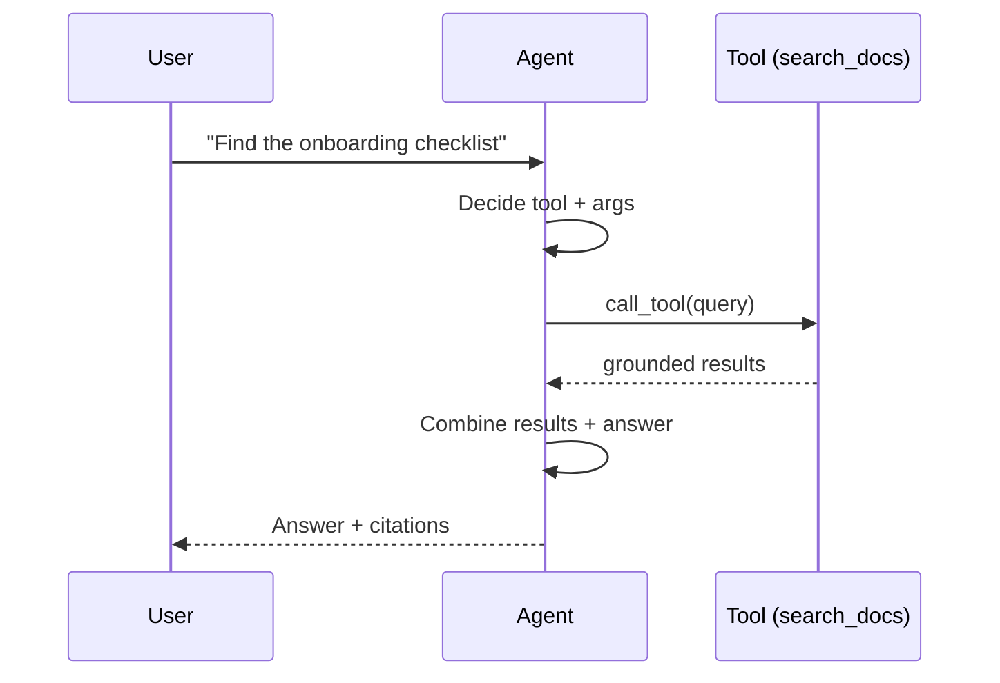

## Why it Matters

Let LLM decide *when* and *how* to call your functions, bridge between reasoning and action.

- Define tools as JSON schemas (name, description, parameters). LLM returns tool call → you execute → feed result back.
- Patterns: single tool, parallel tools, sequential chaining, tool-choice forcing.
- [[AI/07_Cross-Cutting/01_MCP|MCP]] standardizes this in Phase 02+.

## Diagram



## Code

```python
tools = [{
 "type": "function",
 "function": {
 "name": "search_docs",
 "description": "Search enterprise docs by query",
 "parameters": {"type": "object", "properties": {"query": {"type": "string"}}, "required": ["query"]}
 }
}]

## When to use / NOT

- **Use:** whenever the answer depends on data the model does not have — current docs, a database, an API — or an action must be taken on the user's behalf.
- **NOT:** for deterministic transforms (math, formatting, sorting); a tool there adds latency and a hallucination risk for nothing.

## Trade-offs

| Pros | Cons |
|------|------|
| LLM orchestrates workflow | Latency per tool round-trip |
| Extensible (add tools without retraining) | Hallucinated arguments — validate |

## Vs

| Aspect | Provider tool calling | MCP server | Hard-coded functions |
|--------|----------------------|------------|---------------------|
| Discovery | Schema per request | list_tools() at runtime | Compiled in |
| Swap backend | Edit every caller | Swap the server | Rewrite |
| Versioning | Manual | Server version + schema | Manual |
| See | 01_Fundamentals | [[AI/07_Cross-Cutting/01_MCP\|MCP]] | Phase 01 starting point |

## Pitfalls

- Not validating tool arguments — LLM can hallucinate params.

## Interview Q&A

- **Q:** Tool calling vs RAG? **A:** RAG is retrieval-augmented generation; tool calling is general function dispatch. RAG often *uses* a search tool.
- **Q:** How to prevent infinite tool loops? **A:** Max iterations + explicit finish tool.

## Related

- [[05_Structured Outputs]] • [[AI/07_Cross-Cutting/01_MCP|MCP]] • [[AI/03_Agentic-AI/README|Agentic AI]]

---
*Category: fundamentals*

# Tool Calling

> Part of [[README|01_Fundamentals]] • `fundamentals` • Week 4
> Watch: [IBM Technology — What is Tool Calling?](https://www.youtube.com/watch?v=h8gMhXYAv1k)

# LLM returns: {"tool_calls": [{"function": {"name": "search_docs", "arguments": '{"query":"..."}'}}]}

# You: results = await search_docs(**json.loads(args)); feed back as tool message

```