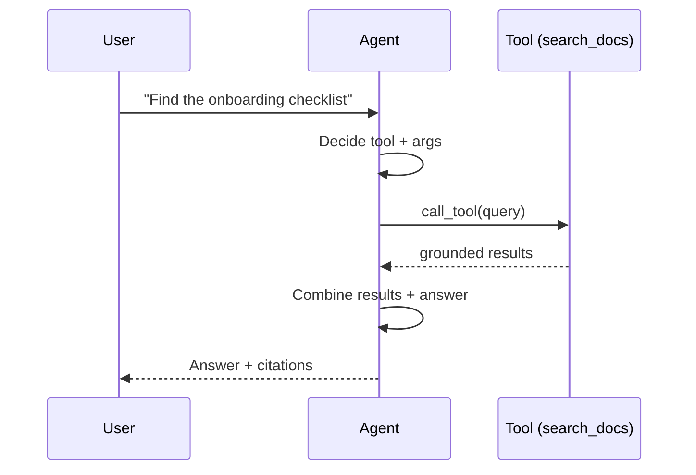

## 🎯 Intent
Let LLM decide *when* and *how* to call your functions — bridge between reasoning and action. The LLM orchestrates; you execute.

## 💡 Why It Matters
- **Interview signal**: "How do you prevent infinite tool loops?" and "Parallel vs sequential tool calls?" are senior discriminators
- **Production reality**: Tool calling = RAG + actions + code execution — the universal interface for LLM agency
- **MCP evolution**: Provider tool calling (Phase 01) → MCP servers (Phase 02+) for discoverable, versioned, typed tools

## 🧩 Diagram: Tool Calling Loop


## 💻 Code: Validated Tool Executor (Java 25)
```java
record ToolDefinition(String name, String description, String inputSchema) {}
record ToolCall(String id, String name, String arguments) {}
record ToolResult(String callId, String content, boolean error) {}

class ToolExecutor {
    private final Map<String, ToolHandler> handlers = new HashMap<>();

    void register(ToolDefinition def, ToolHandler handler) {
        handlers.put(def.name(), handler);
    }

    List<ToolResult> execute(List<ToolCall> calls) {
        return calls.parallelStream().map(call -> {
            var handler = handlers.get(call.name());
            if (handler == null) return new ToolResult(call.id(), "Unknown tool: " + call.name(), true);
            try {
                // Validate args against schema BEFORE execution
                var validated = handler.validate(call.arguments());
                var result = handler.execute(validated);
                return new ToolResult(call.id(), result, false);
            } catch (Exception e) {
                return new ToolResult(call.id(), "Error: " + e.getMessage(), true);
            }
        }).toList();
    }
}

@FunctionalInterface
interface ToolHandler {
    String validate(String jsonArgs) throws Exception; // throws if invalid
    String execute(String validatedArgs) throws Exception;
}

// Usage: Search tool with Pydantic-style validation
var searchTool = new ToolDefinition(
    "search_docs", "Search enterprise docs by query",
    """
    {"type": "object", "properties": {"query": {"type": "string"}, "filters": {"type": "object"}}, "required": ["query"]}
    """);
executor.register(searchTool, new ToolHandler() {
    public String validate(String args) {
        var obj = mapper.readTree(args);
        if (!obj.has("query") || obj.get("query").asText().isBlank())
            throw new IllegalArgumentException("query required");
        return args;
    }
    public String execute(String args) {
        var q = mapper.readTree(args).get("query").asText();
        return searchDocs(q); // your retrieval
    }
});
```

## ✅ When to Use / ❌ When NOT to Use
| Scenario | Use? | Reason |
|---|---|---|
| Answer needs external data (docs, DB, API) | ✅ | Core use case |
| Action on user's behalf (email, ticket, deploy) | ✅ | LLM orchestrates, you execute |
| Deterministic transforms (math, formatting) | ❌ | Adds latency + hallucination risk for nothing |
| Simple lookup (static config) | ❌ | Inject directly in prompt/context |

## ⚖️ Trade-offs: Patterns
| Pattern | Pros | Cons | Use When |
|---|---|---|---|
| **Single tool** | Simple, low latency | Limited scope | One clear action |
| **Parallel tools** | One round-trip for multiple lookups | All args must be valid; more tokens | Independent calls (search + DB) |
| **Sequential chaining** | Each step sees previous results | Latency accumulates | Step 2 depends on Step 1 |
| **Tool-choice forcing** | Deterministic routing | Less flexible | Known workflow |

## 🆚 Vs. Alternatives
| Aspect | Provider Tool Calling | MCP Server | Hard-coded Functions |
|---|---|---|---|
| **Discovery** | Schema per request | `list_tools()` at runtime | Compiled in |
| **Swap Backend** | Edit every caller | Swap the server | Rewrite |
| **Versioning** | Manual | Server version + schema | Manual |
| **Phase** | 01 | 02+ ([[MCP]]) | Starting point |

## ⚠️ Pitfalls
1. **Not validating tool arguments** — LLM hallucinates params. Always validate before exec.
2. **No max iterations** — infinite loops burn budget. Cap at 5-10 rounds.
3. **Missing `finish` tool** — LLM must have explicit way to end loop.
4. **Tool result too large** — truncate/summarize before feeding back (token budget).
5. **Granting shell/write access early** — first failure mode becomes security incident.

## 🎤 Interview Q&A (Senior Depth)

**Q1: "Tool calling vs RAG — what's the difference?"**
> **Answer**: RAG = retrieval-augmented generation (subset of tool calling). Tool calling = general function dispatch (search, DB, API, code exec, email). RAG often *uses* a search tool. **Rejected**: Treating them as alternatives — they're layers.

**Q2: "How to prevent infinite tool loops?"**
> **Answer**: Max iterations (5-10) + explicit `finish` tool + step budget per run. LLM must call `finish` to exit; if not, loop cap forces exit. **Metric**: Avg tool rounds per query < 3.

**Q3: "Parallel vs sequential tool calls — when to use which?"**
> **Answer**: Parallel when independent (search docs + query DB). Sequential when second depends on first (search → read specific doc). Parallel saves latency; sequential enables reasoning. **Decision rule**: Default parallel, sequential only when dependency exists.

**Q4: "MCP vs provider tool calling — what changes?"**
> **Answer**: Provider: static schemas hardcoded per request. MCP: `list_tools()` discovers schemas at runtime; servers version independently; supports resources (`mcp://...`) and prompts. MCP = Phase 02+, provider = Phase 01.

**Q5: "How do you validate tool arguments without slowing down?"**
> **Answer**: Pydantic/Jackson validation is ~microseconds. Validate *before* execution. Cache compiled schemas. Cost of bad tool call (side effect, hallucinated API) far exceeds validation cost.

## 🔗 Related
- [[05_Structured Outputs]] • [[MCP]] • [[Agentic AI]] • [[AI Backend Template]]