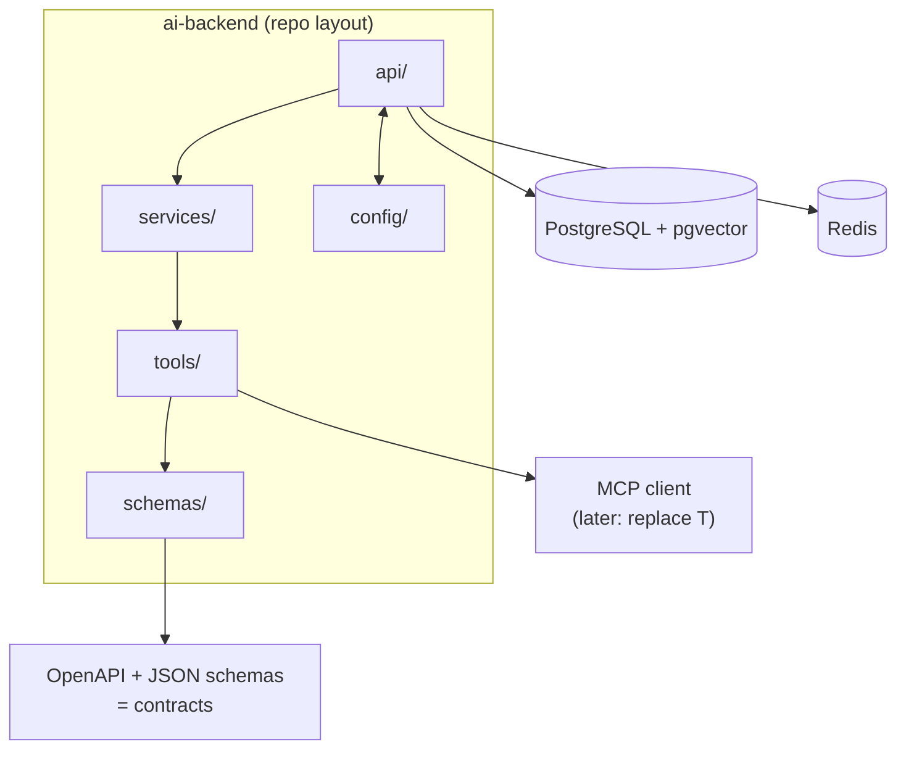

## Why it Matters

Reusable FastAPI service that wraps LLM APIs with streaming, structured outputs, tool calling, and observability hooks. Not a demo, a template you'll evolve through Week 36.

## Diagram



## Code

```python

## When to use / NOT

- **Use:** at the start of every Phase 01 mini-project so schema-first design is a habit, not a decision.
- **NOT:** as a fixed framework — it is scaffolding to outgrow; replace pieces as the platform hardens in Phase 04.

## Trade-offs

- Streams tokens via SSE, validates structured outputs, executes 2+ tools.
- `pytest` passes; `docker build` succeeds.

## Vs

| Aspect | This template | LangChain full stack | Spring Boot backend |
|--------|--------------|----------------------|---------------------|
| Surface | Routes + schemas + tools | Framework abstractions | Enterprise contracts |
| Lock-in | Minimal | Medium to high | None for AI, but no AI ecosystem |
| Use | Phase 01 projects | Later, if the abstraction pays | Platform/transactional layer |

## Pitfalls

- Letting services call tools directly instead of through a schema — the contract layer stops matching reality.
- Skipping `tests/` in the template, so the first real project has no harness to inherit.
- Copying the template per project and diverging; fix upstream, not downstream.
- Putting provider credentials in config without a local secret manager convention.

## Interview Q&A

- **Q:** Why start every AI project from a schema-first template? **A:** Because the failure mode in LLM apps is unvalidated output, and a template that forces Pydantic models for requests, responses and tools makes that the default instead of a discipline. It also means every mini-project inherits the test harness.
- **Q:** What would you remove from this template for a real service? **A:** Anything a specific project does not need — but only after it proves unused. The `tools/` layer is what MCP replaces later, and I keep the seam clean so that swap is local.
- **Q:** How do you keep four mini-projects from forking four templates? **A:** By treating the template as upstream: a fix lands in the template and is cherry-picked, so divergence stays shallow.

## Related

- [[02_FastAPI Backend]] • [[AI/02_RAG-Engineering/Enterprise Document Search|Enterprise Document Search]] (next evolution)

---
*Category: fundamentals*

# AI Backend Template — Project (Weeks 1–4)

> Part of [[README|01_Fundamentals]] • `project` • The scaffold everything else extends.

## Features

- [ ] `POST /chat` — streaming + non-streaming, Pydantic validation
- [ ] LLM adapter (OpenAI/Anthropic/Gemini) with retries + fallback
- [ ] Structured output endpoint (`POST /extract`)
- [ ] Tool registry + executor
- [ ] `/health`, `/metrics` (Prometheus stub), request ID middleware
- [ ] Dockerfile + `uv` lockfile + `pytest` suite

## Repo Layout

```
ai-backend-template/ app/
 main.py # FastAPI app
 llm/ # adapters, retry, streaming
 tools/ # registry, executor
 schemas/ # Pydantic models
 tests/
 Dockerfile
 pyproject.toml
```

# Template Contract: Every Endpoint has a Schema, Every Tool has a Schema

from fastapi import FastAPI
from pydantic import BaseModel
from typing import AsyncIterator

app = FastAPI(title="ai-backend")

class AskRequest(BaseModel):
 query: str
 filters: dict[str, str] = {}

class AskResponse(BaseModel):
 answer: str
 citations: list[str] = []

@app.post("/ask", response_model=AskResponse)
async def ask(req: AskRequest) -> AskResponse:
 # services/search.py → tools/ → LLM → validate → respond
 raise NotImplementedError # per project

@app.get("/health")
async def health() -> dict[str, str]:
 return {"status": "ok"}

# Layout this Template Enforces:

# Api/ Routes | Services/ Orchestration | Tools/ External Calls

# Schemas/ Pydantic Models | Tests/ Pytest (see Tests/test_backend.py)
```