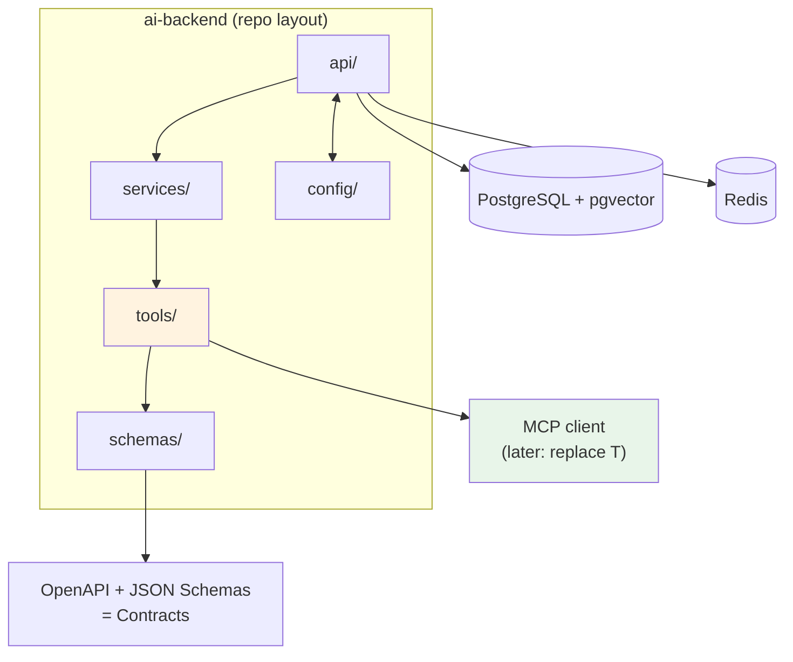

## 🎯 Intent
Reusable FastAPI service that wraps LLM APIs with streaming, structured outputs, tool calling, and observability hooks. Not a demo — a template you'll evolve through Week 36.

## 💡 Why It Matters
- **Interview signal**: "Why schema-first?" and "How do you keep mini-projects from forking?" show engineering maturity
- **Production reality**: Every LLM project needs health, streaming, structured output, tools, tests — this template bakes them in
- **Evolution path**: `tools/` layer → MCP servers (Phase 02); `llm/` adapter → multi-provider router (Phase 04)

## 🧩 Diagram: Template Architecture & Evolution


## 💻 Code: Template Contract (Python — FastAPI)
```python
# Template Contract: Every Endpoint has a Schema, Every Tool has a Schema
from fastapi import FastAPI
from pydantic import BaseModel
from typing import AsyncIterator

app = FastAPI(title="ai-backend")

class AskRequest(BaseModel):
    query: str
    filters: dict[str, str] = {}

class AskResponse(BaseModel):
    answer: str
    citations: list[str] = []

@app.post("/ask", response_model=AskResponse)
async def ask(req: AskRequest) -> AskResponse:
    # services/search.py → tools/ → LLM → validate → respond
    raise NotImplementedError  # per project

@app.get("/health")
async def health() -> dict[str, str]:
    return {"status": "ok"}

# Layout this Template Enforces:
# api/ Routes | services/ Orchestration | tools/ External Calls
# schemas/ Pydantic Models | tests/ Pytest (see tests/test_backend.py)
# config/ Settings (pydantic-settings)
```

## ✅ When to Use / ❌ When NOT to Use
| Scenario | Use? | Reason |
|---|---|---|
| Start of every Phase 01 mini-project | ✅ | Schema-first becomes habit, not decision |
| Real service after proving template pieces unused | ⚠️ | Remove only after proving unused |
| Fixed framework | ❌ | Scaffolding to outgrow; replace as platform hardens |

## ⚖️ Trade-offs
| Aspect | This Template | LangChain Full Stack | Spring Boot Backend |
|---|---|---|---|
| **Surface** | Routes + schemas + tools | Framework abstractions | Enterprise contracts |
| **Lock-in** | Minimal | Medium to high | None for AI, but no AI ecosystem |
| **Phase** | 01 projects | 02+ if abstraction pays | Platform/transactional layer |

## 🆚 Vs. Alternatives
| Aspect | This Template | LangChain | Spring Boot |
|---|---|---|---|
| **Surface** | Routes + schemas + tools | Framework abstractions | Enterprise contracts |
| **Lock-in** | Minimal | Medium to high | None for AI |
| **Phase** | 01 projects | 02+ if abstraction pays | Platform layer |

## ⚠️ Pitfalls
1. **Services calling tools directly instead of through schema** — contract layer stops matching reality
2. **Skipping `tests/` in template** — first real project has no harness to inherit
3. **Copying template per project and diverging** — fix upstream, not downstream
4. **Provider credentials in config without local secret manager convention**

## 🎤 Interview Q&A (Senior Depth)

**Q1: "Why start every AI project from a schema-first template?"**
> **Answer**: Failure mode in LLM apps = unvalidated output. Template forcing Pydantic for requests, responses, tools makes that default, not discipline. Also: every mini-project inherits test harness.

**Q2: "What would you remove from this template for a real service?"**
> **Answer**: Anything a specific project does not need — but only after it proves unused. The `tools/` layer is what MCP replaces later; keep the seam clean so swap is local.

**Q3: "How do you keep four mini-projects from forking four templates?"**
> **Answer**: Treat template as upstream: fix lands in template and is cherry-picked, so divergence stays shallow.

**Q4: "What's the minimum viable feature set for this template?"**
> **Answer**: `POST /chat` (streaming + non-streaming), LLM adapter with retries/fallback, structured output endpoint (`POST /extract`), tool registry + executor, `/health` + `/metrics` (Prometheus stub), request ID middleware, Dockerfile + `uv` lockfile + `pytest` suite.

**Q5: "How does this template evolve into Enterprise Document Search (Phase 02)?"**
> **Answer**: `tools/search_docs` becomes MCP server; `schemas/` gets document metadata; `services/` adds hybrid search + reranker; eval harness (`tests/eval/`) gates CI. Template is the seed; Phase 02 is the growth.

## 🔗 Related
- [[02_FastAPI Backend]] • [[Enterprise Document Search]] (next evolution) • [[MCP]]