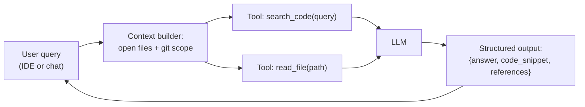

## Why it Matters

CLI/chat assistant that answers coding questions using LLM APIs + tool calling (file search, execution).

## Diagram



## Code

```python
from pydantic import BaseModel

class CodeAnswer(BaseModel):
 answer: str
 code_snippet: str | None = None
 references: list[str] = []

## When to use / NOT

- **Use:** for repo-scoped code Q&A, explain-this-file requests, and boilerplate generation where the answer is verifiable by reading the code.
- **NOT:** for blind code generation pasted without review, or anything touching secrets or production access.

## Trade-offs

- Answers questions about your own codebase via tools.

## Vs

| Aspect | Scoped coding assistant | General chat LLM | IDE copilot integration |
|--------|--------------------------|------------------|------------------------|
| Grounding | Repo tools, citations | Model memory only | Editor context |
| Failure mode | Reads wrong file | Fabricates APIs | Suggests out-of-context code |
| Build cost | Hours (Phase 01 project) | None | None |

## Pitfalls

- Granting shell or write access early — the first failure mode becomes irreversible.
- Letting the assistant answer without `references`; ungrounded answers look correct and are not.
- Ignoring token budgets — dumping whole repositories into context costs money and degrades quality.
- Trusting generated API calls; models invent signatures. Every snippet is read before use.

## Interview Q&A

- **Q:** How did you scope what the coding assistant was allowed to do? **A:** Read-only, repo-relative tools with a path jail — `search_code` and `read_file` — and structured output that must carry references. No shell, no writes, no network. The constraint is the feature.
- **Q:** How do you know its answers are grounded? **A:** Because every answer carries references to files it actually read, and the structured schema makes an ungrounded answer visible instead of plausible prose.
- **Q:** What is the real cost of an unscoped coding assistant? **A:** Fabricated APIs that compile in review and fail in CI — plus, with write or shell access, a single bad tool call is a security incident, not a bad answer.

## Related

- [[03_LLM APIs]] • [[06_Tool Calling]]

---
*Category: fundamentals*

# AI Coding Assistant — Project

> Part of [[README|01_Fundamentals]] • `project` • Weeks 2–3

## Features

- Prompt with repo context, tool `search_code(query)`, `read_file(path)`.
- Structured output: `{answer, code_snippet, references}`.

# Tools the assistant is granted — scoped to the repo, never the shell

TOOLS = [
 {"name": "search_code", "description": "Search the repo for matching symbols/strings",
 "params": {"query": "str"}},
 {"name": "read_file", "description": "Read one file within the repo root",
 "params": {"path": "str"}},
]

# Guardrail: read_file must refuse paths outside the workspace root

# def read_file(path: str) -> str:

# root = Path(WORKSPACE_ROOT).resolve()

# if not (root / path).resolve().is_relative_to(root): raise PermissionError(path)

```