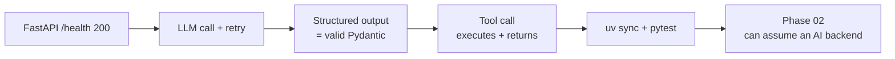

## Why it Matters

Phase 01 is the only phase where the risk is entirely about fundamentals: does the AI layer actually work as a service, and can it be trusted to produce typed output and execute tools safely? The checklist is short on purpose, five gates that prove the platform's foundation is real before 30 more weeks are built on it.

## Diagram



## Code

```python

## When to use / NOT

- **Use:** as the exit gate for Phase 01 — do not start Phase 02 retrieval work until all five are green.
- **NOT:** as a one-time checklist; it is the regression suite the AI Backend Template inherits.

## Trade-offs

| Choice | Cost |
|--------|------|
| Five gates only | Does not cover prompt quality or evals — that arrives in Phase 02 |
| Dataview-driven | Renders nothing until checklist items are written as rows |
| Gates before RAG | Delays retrieval work by the time taken to fix a failing gate |

## Vs

| Gate style | This checklist | Alternative |
|------------|---------------|------------|
| Unit | "App boots, outputs are typed, tools execute" | "Course module completed" |
| Failure signal | Red test before Phase 02 | Self-reported confidence |
| Reuse | Becomes the template's test suite | None |

## Pitfalls

- Checking boxes by hand instead of as tests — the gate cannot regress.
- Passing the gates with a mocked LLM and never running one integration call against a real provider.
- Moving to Phase 02 with a flaky retry; retrieval quality work inherits that noise.
- Forgetting to re-run the suite when the template changes upstream.

## Interview Q&A

- **Q:** How do you know your AI backend is production-shaped rather than a notebook? **A:** It has a health endpoint, typed request/response contracts, a retry path that is actually tested, tool calls that round-trip, and a one-command test suite. Those five gates are the difference.
- **Q:** Why gate tool calling separately from structured output? **A:** Because they fail differently — structured output fails on validation, tool calling fails on arguments, permissions and side effects. One gate would let a broken tool path hide behind a clean schema.
- **Q:** What would you add to this checklist after Phase 02? **A:** A retrieval quality gate — precision@k on a golden set — because that is the first metric that can silently decay while every other gate stays green.

## Related

- [[AI/01_Fundamentals/AI Backend Template|AI Backend Template]] • [[AI/01_Fundamentals/01_Python for AI|01_Python for AI]] • [[AI/01_Fundamentals/02_FastAPI Backend|02_FastAPI Backend]]

# Phase 01 — Fundamentals Checklist

```
dataviewTABLE WITHOUT ID item as "Done"FROM "AI/01_Fundamentals/Checklist.md"
WHERE file.name = "Checklist.md"
SORT item ASC
```

- FastAPI app starts and /health returns 200
- LLM API call succeeds (single retry)
- Prompt + structured output yields valid Pydantic model
- Tool call executes without error
- `uv sync` and `pytest` suite pass

# The Five Gates as an Executable Contract (Pytest-style)

import pytest
from fastapi.testclient import TestClient
from app.main import app

client = TestClient(app)

def test_health_is_200():
 assert client.get("/health").status_code == 200

def test_llm_call_retries_then_succeeds(monkeypatch):
 # gate 2: a transient provider error must not reach the caller
 calls = {"n": 0}
 def flaky():
 calls["n"] += 1
 if calls["n"] < 2: raise ConnectionError("provider 503")
 return {"answer": "ok"}
 monkeypatch.setattr("app.services.llm.chat", flaky)
 assert client.post("/ask", json={"query": "ping"}).status_code == 200

# Gate 3: Response Validates Against the Pydantic Contract

# Gate 4: Tool Call Round-trips (Tool Message Back to the Model)

# Gate 5:`uv sync`Clean + Full Pytest Suite Green
```