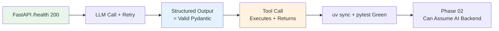

## Phase Gate

This checklist is the exit gate for the AI API foundation. It deliberately stops before retrieval; retrieval quality belongs to [[AI/02_RAG-Engineering/Checklist]].

## 🎯 Intent
Phase 01 is the only phase where risk is entirely about fundamentals: does the AI layer actually work as a service, and can it be trusted to produce typed output and execute tools safely? Five gates that prove the platform's foundation is real before 30 more weeks are built on it.

## 💡 Why It Matters
- **Interview signal**: "How do you know your AI backend is production-shaped vs a notebook?" — the five gates are the answer
- **Exit gate for Phase 01** — do not start Phase 02 retrieval work until all five are green
- **Regression suite** — the AI Backend Template inherits these as its test suite; they run on every template change

## 🧩 Diagram: Phase Gate Pipeline


## 💻 Code: Gate Tests (Python — Pytest)
```python
import pytest
from fastapi.testclient import TestClient
from app.main import app

client = TestClient(app)

def test_gate1_health_is_200():
    """Gate 1: App boots and responds"""
    assert client.get("/health").status_code == 200

def test_gate2_llm_call_retries_then_succeeds(monkeypatch):
    """Gate 2: Transient provider error does not reach caller"""
    calls = {"n": 0}
    def flaky():
        calls["n"] += 1
        if calls["n"] < 2: raise ConnectionError("provider 503")
        return {"answer": "ok"}
    monkeypatch.setattr("app.services.llm.chat", flaky)
    assert client.post("/ask", json={"query": "ping"}).status_code == 200

def test_gate3_structured_output_validates():
    """Gate 3: Response validates against Pydantic contract"""
    resp = client.post("/extract", json={"transcript": "..."})
    assert resp.status_code == 200
    MeetingNotes.model_validate_json(resp.text)  # raises if invalid

def test_gate4_tool_call_roundtrips():
    """Gate 4: Tool call executes, result feeds back to model"""
    resp = client.post("/ask", json={"query": "search for onboarding"})
    assert resp.status_code == 200
    # Verify tool message appeared in conversation
    data = resp.json()
    assert "onboarding" in data["answer"].lower()

def test_gate5_uv_sync_pytest_green():
    """Gate 5: One-command test suite passes in CI"""
    # This test IS the gate — if pytest runs, gate passes
    assert True
```

## ✅ When to Use / ❌ When NOT to Use
| Scenario | Use? | Reason |
|---|---|---|
| Exit gate for Phase 01 | ✅ | Do not start Phase 02 until all green |
| Regression suite for template changes | ✅ | Runs on every PR |
| One-time checklist | ❌ | It's the regression suite, not a one-off |

## ⚖️ Trade-offs
| Choice | Cost |
|---|---|
| **Five gates only** | Does not cover prompt quality or evals — that arrives in Phase 02 |
| **Dataview-driven** | Renders nothing until checklist items are written as rows |
| **Gates before RAG** | Delays retrieval work by time taken to fix a failing gate |

## 🆚 Vs. Alternatives
| Gate Style | This Checklist | Alternative |
|---|---|---|
| **Unit** | "App boots, outputs typed, tools execute" | "Course module completed" |
| **Failure Signal** | Red test before Phase 02 | Self-reported confidence |
| **Reuse** | Becomes template's test suite | None |

## ⚠️ Pitfalls
1. **Checking boxes by hand instead of as tests** — gate cannot regress
2. **Passing gates with mocked LLM, never running integration call** against real provider
3. **Moving to Phase 02 with flaky retry** — retrieval quality work inherits that noise
4. **Forgetting to re-run suite when template changes upstream**

## 🎤 Interview Q&A (Senior Depth)

**Q1: "How do you know your AI backend is production-shaped rather than a notebook?"**
> **Answer**: It has a health endpoint, typed request/response contracts, a retry path that is actually tested, tool calls that round-trip, and a one-command test suite. Those five gates are the difference.

**Q2: "Why gate tool calling separately from structured output?"**
> **Answer**: They fail differently — structured output fails on validation, tool calling fails on arguments, permissions, side effects. One gate would let broken tool path hide behind clean schema.

**Q3: "What would you add to this checklist after Phase 02?"**
> **Answer**: A retrieval quality gate — precision@k on a golden set — because that's the first metric that can silently decay while every other gate stays green.

**Q4: "How do you handle the 'it works on my machine' problem?"**
> **Answer**: Gates run in CI on every PR. `uv sync` + `pytest` in pipeline. If passes locally but fails in CI, env differs — fix env, not test.

**Q5: "What's the cost of skipping a gate?"**
> **Answer**: Phase 02 retrieval work built on noise. Flaky retries → noisy retrieval scores. Untyped outputs → downstream parsing failures. Gates are not bureaucracy; they're load-bearing walls.

## 🔗 Related
- [[AI Backend Template]] • [[01_Python for AI]] • [[02_FastAPI Backend]] • [[AI Evaluation]]