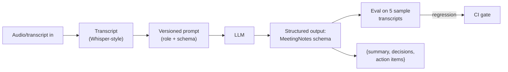

## Why it Matters

Transcribe/summarize meetings into structured notes, validates prompt engineering + structured outputs.

## Diagram



## Code

```python
from pydantic import BaseModel, Field

class ActionItem(BaseModel):
 owner: str
 task: str
 due: str | None = None

class MeetingNotes(BaseModel):
 summary: str = Field(description="3-4 sentences, decisions only")
 decisions: list[str] = []
 action_items: list[ActionItem] = []

## When to use / NOT

- **Use:** for recurring, schema-shaped documents — meeting notes, tickets, summaries — where the value is consistency and searchability, not creativity.
- **NOT:** for high-stakes or contested decisions; a model can smooth over disagreement into a clean-looking summary nobody agreed to.

## Trade-offs

| Choice | Cost |
|--------|------|
| Structured output over prose | Loses nuance; an action item reads cleaner than the argument behind it |
| Eval on 5 transcripts | Small golden set, weak signal until it grows |
| Versioned prompts | Every version needs its own eval baseline |

## Vs

| Approach | Meeting Notes Generator | Manual notes | Off-the-shelf AI notetaker |
|----------|-------------------------|---------------|---------------------------|
| Consistency | Schema-enforced | Varies by notetaker | Vendor-defined |
| Ownership | Your schema, your vault | Best | Data leaves your estate |
| Eval | Golden-set regression | None | None visible |

## Pitfalls

- Inventing owners or dates for action items — the model prefers a complete-looking list over an honest one.
- Treating summary quality as subjective; without the 5-transcript eval, drift is invisible.
- Storing transcripts containing secrets next to the notes.
- Letting the schema force decisions where there were none; empty arrays are valid output.

## Interview Q&A

- **Q:** Why structured output for meeting notes specifically? **A:** Because the downstream consumer is a system, not a reader — action items need an owner and a due date to become reminders, and prose notes never become that. The schema is the integration contract.
- **Q:** How do you know the summaries are any good? **A:** A golden set of five transcripts with a regression gate in CI. Subjective review catches a bad summary once; the eval catches the fifth one that drifts.
- **Q:** What is the real risk of AI meeting notes? **A:** Manufactured consensus. A model under pressure to fill the schema will produce a confident decision list from an unresolved argument, and that becomes the record.

## Related

- [[04_Prompt Engineering]] • [[05_Structured Outputs]]

---
*Category: fundamentals*

# Meeting Notes Generator — Project

> Part of [[README|01_Fundamentals]] • `project` • Week 3

## Features

- Input: transcript text (mock or Whisper later).
- Output: `MeetingNotes` schema (summary, decisions, action items).
- Prompt versioning + eval on 5 sample transcripts.

# Anthropic-style call: the schema IS the format spec, no free-form parsing

# response = client.messages.create(

# model=MODEL, tools=[{"name": "meeting_notes",

# "input_schema": MeetingNotes.model_json_schema()}])

# notes = MeetingNotes.model_validate_json(tool_result_payload)

```