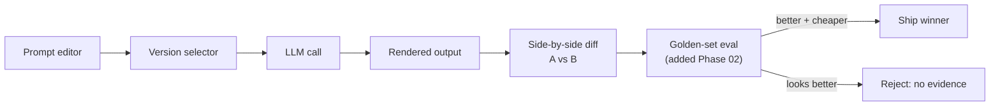

## Why it Matters

Interactive UI to iterate on prompts with versioning, A/B diff, and eval scores, your prompt engineering lab.

## Diagram



## Code

```python

## When to use / NOT

- **Use:** for iterating on prompts with a side-by-side diff and, from Phase 02 on, a golden-set score attached to each version.
- **NOT:** as evidence that a change is better — rendering output proves nothing without the eval. That is what Phase 02 adds.

## Trade-offs

| Choice | Cost |
|--------|------|
| Diff-based comparison | Only as good as the reviewer's discipline |
| No eval in Phase 01 | Playground proves "it renders", not "it is better" |
| FastAPI + thin frontend | Another small service to maintain |

## Vs

| Tool | Prompt Playground | Provider web console | Eval harness (Phase 02/04) |
|-----|-------------------|------------------------|---------------------------|
| Shows | Rendered diff | Single render | Measured score |
| Decides | Nothing on its own | Nothing | Whether it ships |
| Reuse | Owns the prompt versions | Versions live with the vendor | Gates CI |

## Pitfalls

- Shipping a prompt because the new output reads better — without a score it is an aesthetic call.
- Versions living only in the UI; export them into the repo or they are lost with the service.
- Mixing temperature changes with prompt changes in one comparison — you cannot attribute the difference.
- No cost column: a better-looking prompt that costs 5x per call is usually the wrong answer.

## Interview Q&A

- **Q:** What is the difference between a prompt playground and an eval harness? **A:** A playground renders candidate prompts side by side; an eval harness scores them against a golden set. The playground tells you what a change looks like, the harness tells you whether to ship it. Without the harness the playground is a comfort tool.
- **Q:** How do you stop prompt changes being made on taste? **A:** By refusing to ship a version without a paired eval score and cost reading, and by isolating variables — one change per version, so the difference is attributable.
- **Q:** Why build one at all when providers offer consoles? **A:** Because prompt versions are production configuration, and production configuration belongs in the repo, not in a vendor console that leaves when the seat does.

## Related

- [[04_Prompt Engineering]] • [[AI/07_Cross-Cutting/02_AI Evaluation|AI Evaluation]]

---
*Category: fundamentals*

# Prompt Playground — Project

> Part of [[README|01_Fundamentals]] • `project` • Weeks 3–4

## Features

- Editor for system/user prompts, variable injection, model selector.
- Run + diff outputs side-by-side; save versions.
- Hook for [[AI/07_Cross-Cutting/02_AI Evaluation|evaluation]] (add golden set in Phase 02).

## Stack

- FastAPI backend + simple frontend (or Streamlit for speed).

# A playground that is worth anything must be able to compare, not just render

from pydantic import BaseModel

class PromptVersion(BaseModel):
 name: str
 template: str
 model: str
 temperature: float = 0.0

def render(v: PromptVersion, context: dict[str, str]) -> str:
 """Deterministic render — same version + context = same prompt."""
 return v.template.format(**context)

# Comparison contract: never ship a prompt change on aesthetics alone

# def ab(old: PromptVersion, new: PromptVersion, golden: list) -> dict:

# return {"old": eval_score(old, golden), "new": eval_score(new, golden)}

```