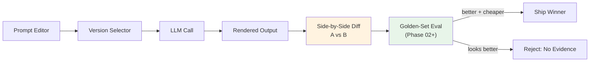

## 🎯 Intent
Interactive UI to iterate on prompts with versioning, A/B diff, and eval scores — your prompt engineering lab. A playground that compares, not just renders.

## 💡 Why It Matters
- **Interview signal**: "What's the difference between a prompt playground and an eval harness?" — senior engineers know playground shows *looks*, harness proves *ships*
- **Production reality**: Prompt versions = production config; config belongs in repo, not vendor console
- **Phase 02 integration**: Golden-set eval added in Phase 02 turns playground into decision tool

## 🧩 Diagram: Prompt Playground → Eval Pipeline


## 💻 Code: Prompt Versioning + Comparison Contract (Python)
```python
from pydantic import BaseModel
from dataclasses import dataclass

@dataclass(frozen=True)
class PromptVersion:
    name: str
    template: str
    model: str
    temperature: float = 0.0

def render(v: PromptVersion, context: dict[str, str]) -> str:
    """Deterministic render — same version + context = same prompt."""
    return v.template.format(**context)

# Comparison contract: NEVER ship a prompt change on aesthetics alone
def ab_test(old: PromptVersion, new: PromptVersion, golden: list[GoldenCase]) -> dict:
    return {
        "old": eval_score(old, golden),
        "new": eval_score(new, golden),
        "decision": "SHIP" if eval_score(new, golden) > eval_score(old, golden) else "REJECT"
    }

# Phase 02 adds: eval_score() runs golden set, returns (score, cost, latency)
```

## ✅ When to Use / ❌ When NOT to Use
| Scenario | Use? | Reason |
|---|---|---|
| Iterating on prompts with side-by-side diff | ✅ | See what changes *look like* |
| Phase 02+: golden-set score per version | ✅ | Decide whether to ship |
| Evidence that a change is better | ❌ | Rendering proves nothing without eval |

## ⚖️ Trade-offs
| Aspect | Prompt Playground | Provider Web Console | Eval Harness (Phase 02/04) |
|---|---|---|---|
| **Shows** | Rendered diff | Single render | Measured score |
| **Decides** | Nothing on its own | Nothing | Whether it ships |
| **Reuse** | Owns prompt versions | Versions live with vendor | Gates CI |
| **Cost Column** | Yes (tokens × price) | Hidden | Yes |

## 🆚 Vs. Alternatives
| Tool | Prompt Playground | Provider Web Console | Eval Harness |
|---|---|---|---|
| **Shows** | Rendered diff | Single render | Measured score |
| **Decides** | Nothing | Nothing | Whether it ships |
| **Reuse** | Owns versions | Vendor-owned | Gates CI |

## ⚠️ Pitfalls
1. **Shipping a prompt because new output reads better** — without score it's an aesthetic call
2. **Versions living only in UI** — export to repo (git) or lost when service expires
3. **Mixing temperature + prompt changes in one comparison** — cannot attribute difference
4. **No cost column** — better-looking prompt costing 5×/call is usually wrong

## 🎤 Interview Q&A (Senior Depth)

**Q1: "What is the difference between a prompt playground and an eval harness?"**
> **Answer**: Playground renders candidate prompts side-by-side; harness scores them against a golden set. Playground tells you what a change *looks like*, harness tells you whether to *ship it*. Without harness, playground is a comfort tool.

**Q2: "How do you stop prompt changes being made on taste?"**
> **Answer**: Refuse to ship a version without paired eval score and cost reading. Isolate variables — one change per version, so difference is attributable.

**Q3: "Why build one when providers offer consoles?"**
> **Answer**: Prompt versions are production configuration, and production config belongs in repo, not vendor console that leaves when the seat does.

**Q4: "What's the minimal feature set for a useful playground?"**
> **Answer**: Prompt editor (system/user), variable injection, model selector, side-by-side diff, version history (git-backed), cost/token display, "run against golden set" button (Phase 02+).

**Q5: "How do you handle prompt versioning across model upgrades?"**
> **Answer**: Prompt version = (template, model, temperature). When model upgrades, re-run golden set; if score drops, bisect: model or prompt? Store results in eval harness, not playground.

## 🔗 Related
- [[04_Prompt Engineering]] • [[AI Evaluation]] • [[AI Backend Template]]