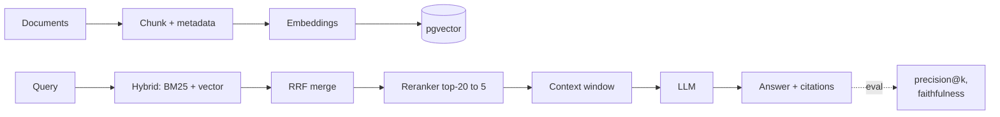

## Why it Matters

Build a production-aware RAG pipeline: ingest → chunk → embed → store (pgvector) → retrieve → generate, with 12-factor discipline.

## Diagram



## Code

```sql
-- pgvector setup
CREATE EXTENSION IF NOT EXISTS vector;
CREATE TABLE docs (
 id SERIAL PRIMARY KEY,
 content TEXT,
 metadata JSONB,
 embedding vector(1536)
);
CREATE INDEX ON docs USING hnsw (embedding vector_cosine_ops);

-- hybrid: vector + metadata filter
SELECT content FROM docs
WHERE metadata->>'department' = 'engineering'
ORDER BY embedding <=> :query_embedding LIMIT 5;
```
```python
## When to use / not

- **Use:** Enterprise doc search, knowledge assistants, any domain where LLM needs private context.
- **NOT:** When data fits in context window trivially or when freshness requires live tool calls over indexed retrieval.

## Trade-offs

| Pros | Cons |
|------|------|
| Grounds LLM in private data | Chunking/embedding quality is critical |
| Postgres-native (no new infra) | Vector search tuning (index, distance) |

## Vs

| Aspect | Naive RAG | Hybrid + rerank | Agentic RAG |
|--------|-----------|-------------------|-------------|
| Retrieval | One vector pass | BM25 + vector + cross-encoder | Model decides per step |
| Cost | Lowest | Reranker adds latency/tokens | Highest, most steps |
| Handles ambiguity | Poorly | Better (multi-query) | Best, can re-ask |
| See | baseline | this note + variants | [[AI/02_RAG-Engineering/Agentic-Adaptive-Corrective-RAG\|Agentic RAG]] |

## Pitfalls

- Not normalizing embeddings before cosine distance.
- Missing citations → hallucination risk (addressed in [[Enterprise Document Search]]).

## Interview q&a

- **Q:** pgvector vs dedicated vector DB? **A:** pgvector reuses PG ops/joins/transactions; dedicated DBs scale vectors further, compare in [[02_Design LLM Architectures]].
- **Q:** Chunk size trade-off? **A:** Small → precise but fragmented; large → context-rich but noisy. Evaluate retrieval precision@k.

## Flashcards (Spaced Repetition)

#flashcard
**Q:** What is the trigger keyword for LLM Engineering with RAG (Coursera C1)? :: **A:** [trigger keywords] #flashcard

#flashcard
**Q:** Key hyperparameter for LLM Engineering with RAG (Coursera C1)? :: **A:** [hyperparameter + typical range] #flashcard

#flashcard
**Q:** When do you NOT use LLM Engineering with RAG (Coursera C1)? :: **A:** [anti-pattern scenarios] #flashcard

#flashcard
**Q:** Cost order of magnitude for LLM Engineering with RAG (Coursera C1)? :: **A:** [GPU hours / $ per 1M tokens] #flashcard

## Practice Tasks (Tasks Plugin)
- [ ] Restate the intent from memory 📅 2026-09-30
- [ ] Code the config without looking 📅 2026-10-02
- [ ] Answer all Interview Q&A aloud 📅 2026-10-06
- [ ] Review flashcards (Spaced Repetition) 📅 2026-09-30

```tasks
not done
path includes 02_RAG-Engineering
sort by due
limit 10
```

## Related
- [[README|AI MOC]]
- [[02_RAG-Engineering/README|02_RAG-Engineering Folder]]

---

*Category: AI/02_RAG-Engineering • Part of [[README|AI MOC]]*