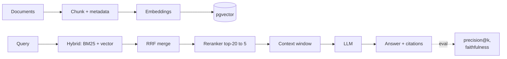

## Why it Matters

Build a production-aware RAG pipeline: ingest → chunk → embed → store (pgvector) → retrieve → generate, with 12-factor discipline.

## Diagram



## Code

```sql
-- pgvector setup
CREATE EXTENSION IF NOT EXISTS vector;
CREATE TABLE docs (
 id SERIAL PRIMARY KEY,
 content TEXT,
 metadata JSONB,
 embedding vector(1536)
);
CREATE INDEX ON docs USING hnsw (embedding vector_cosine_ops);

-- hybrid: vector + metadata filter
SELECT content FROM docs
WHERE metadata->>'department' = 'engineering'
ORDER BY embedding <=> :query_embedding LIMIT 5;
```
```python
## When to use / not

- **Use:** Enterprise doc search, knowledge assistants, any domain where LLM needs private context.
- **NOT:** When data fits in context window trivially or when freshness requires live tool calls over indexed retrieval.

## Trade-offs

| Pros | Cons |
|------|------|
| Grounds LLM in private data | Chunking/embedding quality is critical |
| Postgres-native (no new infra) | Vector search tuning (index, distance) |

## Vs

| Aspect | Naive RAG | Hybrid + rerank | Agentic RAG |
|--------|-----------|-------------------|-------------|
| Retrieval | One vector pass | BM25 + vector + cross-encoder | Model decides per step |
| Cost | Lowest | Reranker adds latency/tokens | Highest, most steps |
| Handles ambiguity | Poorly | Better (multi-query) | Best, can re-ask |
| See | baseline | this note + variants | [[AI/02_RAG-Engineering/Agentic-Adaptive-Corrective-RAG\|Agentic RAG]] |

## Pitfalls

- Not normalizing embeddings before cosine distance.
- Missing citations → hallucination risk (addressed in [[Enterprise Document Search]]).

## Interview q&a

- **Q:** pgvector vs dedicated vector DB? **A:** pgvector reuses PG ops/joins/transactions; dedicated DBs scale vectors further, compare in [[02_Design LLM Architectures]].
- **Q:** Chunk size trade-off? **A:** Small → precise but fragmented; large → context-rich but noisy. Evaluate retrieval precision@k.

## Related

- [[02_Design LLM Architectures]] • [[Enterprise Document Search]] • [[AI/07_Cross-Cutting/02_AI Evaluation|Evaluation]]

---
*Category: rag*

# LLM Engineering with RAG, Coursera Course 1

> Part of [[README|02_RAG-Engineering]] • `rag` • Weeks 5–6
> Watch: [Complete RAG Crash Course with LangChain](https://www.youtube.com/watch?v=o126p1QN_RI)

## Key Topics (c1)

- RAG architecture (naive → advanced), chunking strategies, embedding choice.
- **pgvector** on PostgreSQL: `vector` type, HNSW/IVFFlat indexes, metadata filtering.
- 12-factor for LLM apps (config, dependencies, disposability, logs).

## Start-simple Ladder

Do not start on pgvector. Start local, zero infra, then graduate when the eval set says the simple stack is the bottleneck.

1. **Loaders:** PDF, directory, CSV/JSON, web page. One function per source returning the same `Document(content, metadata)` shape.
2. **Splitting:** `RecursiveCharacterTextSplitter`, 512 tokens with 50 overlap. Overlap exists so a sentence straddling a boundary stays retrievable from both chunks. Tune only after measuring precision@k.
3. **Embeddings:** local first (HuggingFace `all-MiniLM`, Ollama) for dev; API embeddings when quality-per-dollar wins on your eval set. Compare on cost, latency, and retrieval precision, not vibes.
4. **Store:** Chroma or FAISS locally. Move to pgvector (see below) when you need metadata filtering, concurrent writers, or one database for vectors plus app data.

# Ingest Sketch

from pgvector.psycopg import register_vector
chunks = chunk_text(doc, size=512, overlap=50)
embeddings = await embed_batch(chunks)
await insert_many([(c, m, e) for c,m,e in zip(chunks, metas, embeddings)])
```