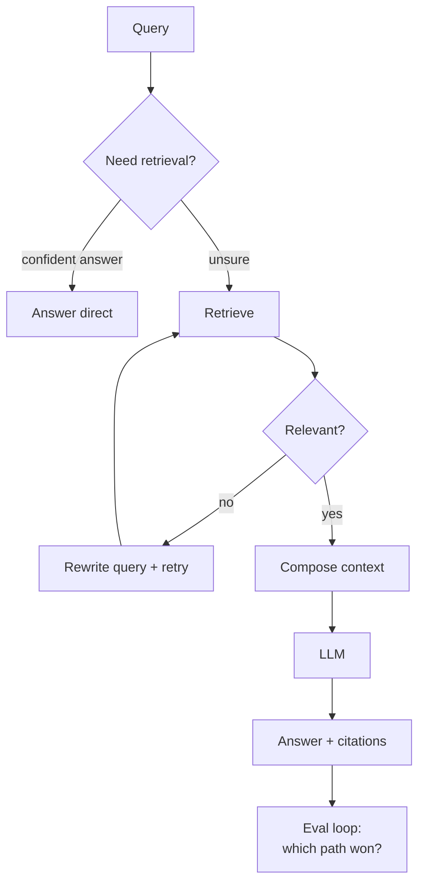

## Why it Matters

Go beyond "it works", compare architectures on quality, latency, and **cost**; run variant experiments on your own platform.

## Diagram



## Code

```python

## When to use / NOT

- **Use:** whenever the same content must serve different query types — factual, exploratory, multi-hop — and one static retrieval path cannot cover all of them.
- **NOT:** for a small, stable corpus with uniform questions; the routing logic costs more to build and debug than the accuracy it returns.

## Trade-offs

| Choice | Cost |
|--------|------|
| Route per query type | More paths to evaluate, latency varies by path |
| Rewrite + retry | Extra LLM calls; wrong turns compound cost |
| Compose context manually | Full control, full responsibility for context ordering and token budget |

## Vs

| Aspect | Static pipeline | Adaptive (route) | Corrective (grade + retry) | Agentic |
|--------|---------------|------------------|----------------------------|---------|
| Complexity | Lowest | Routing rules | Grading + rewrite loop | Model plans steps |
| Failure mode | Silently wrong context | Mis-route | Retry storm | Budget blowup |
| Eval burden | One path | Per path | Per path + retry depth | Per trace |

## Pitfalls

- Optimizing for retrieval precision while ignoring answer faithfulness — measure both.

## Interview Q&A

- **Q:** When does hybrid beat pure vector? **A:** Keyword-heavy queries (IDs, error codes) where BM25 catches exact terms vectors miss.
- **Q:** How to compare self-host vs managed cost? **A:** Model cost per 1k tokens vs GPU hourly + throughput; include ops overhead.

## Related

- [[01_LLM Engineering with RAG]] • [[Enterprise Document Search]] • [[AI/07_Cross-Cutting/05_Cost Optimization|Cost Optimization]]

---
*Category: rag*

# Design, Compare and Analyze LLM Architectures — Coursera Course 2

> Part of [[README|02_RAG-Engineering]] • `rag` • Weeks 7–10

## Key Topics (C2)

- System flow analysis: self-host vs managed API cost models.
- **RAG variants:** naive, hybrid (BM25+vector), reranking, query expansion, HyDE.
- **Context compression** (LLMLingua-style), retrieval strategies, caching.
- Cost comparisons: tokens, embeddings, vector storage, reranker calls.

## Experiments to Run (on [[Enterprise Document Search]])

| Variant | Change | Metric |
|---------|--------|--------|
| Naive RAG | top-k vector only | precision@5, faithfulness |
| Hybrid | BM25 + vector (RRF) | + recall |
| + Reranker | cross-encoder rerank top-20→5 | + precision, + latency |
| + Compression | compress context 50% | tokens saved vs quality delta |
| + Query expansion | multi-query / HyDE | recall on ambiguous queries |

# hybrid search — Reciprocal Rank Fusion

def rrf(rank_lists, k=60):
 scores = {}
 for lst in rank_lists:
 for rank, doc_id in enumerate(lst, 1):
 scores[doc_id] = scores.get(doc_id, 0) + 1/(k+rank)
 return sorted(scores, key=scores.get, reverse=True)
```