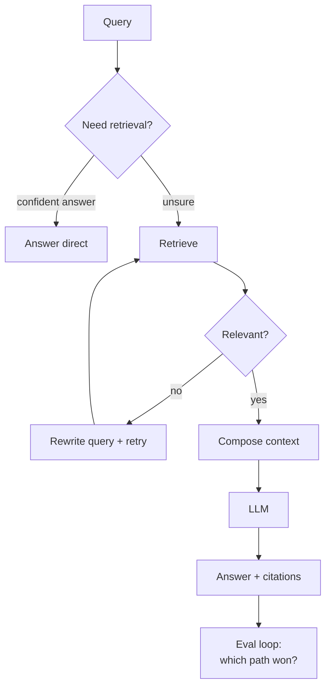

## Why it Matters

Go beyond "it works", compare architectures on quality, latency, and **cost**; run variant experiments on your own platform.

## Diagram



## Code

```python

## When to use / NOT

- **Use:** whenever the same content must serve different query types — factual, exploratory, multi-hop — and one static retrieval path cannot cover all of them.
- **NOT:** for a small, stable corpus with uniform questions; the routing logic costs more to build and debug than the accuracy it returns.

## Trade-offs

| Choice | Cost |
|--------|------|
| Route per query type | More paths to evaluate, latency varies by path |
| Rewrite + retry | Extra LLM calls; wrong turns compound cost |
| Compose context manually | Full control, full responsibility for context ordering and token budget |

## Vs

| Aspect | Static pipeline | Adaptive (route) | Corrective (grade + retry) | Agentic |
|--------|---------------|------------------|----------------------------|---------|
| Complexity | Lowest | Routing rules | Grading + rewrite loop | Model plans steps |
| Failure mode | Silently wrong context | Mis-route | Retry storm | Budget blowup |
| Eval burden | One path | Per path | Per path + retry depth | Per trace |

## Pitfalls

- Optimizing for retrieval precision while ignoring answer faithfulness — measure both.

## Interview Q&A

- **Q:** When does hybrid beat pure vector? **A:** Keyword-heavy queries (IDs, error codes) where BM25 catches exact terms vectors miss.
- **Q:** How to compare self-host vs managed cost? **A:** Model cost per 1k tokens vs GPU hourly + throughput; include ops overhead.

## Flashcards (Spaced Repetition)

#flashcard
**Q:** What is the trigger keyword for Design, Compare and Analyze LLM Architectures (Coursera C2)? :: **A:** Not specified #flashcard

#flashcard
**Q:** Key hyperparameter for Design, Compare and Analyze LLM Architectures (Coursera C2)? :: **A:** Not specified #flashcard

#flashcard
**Q:** When do you NOT use Design, Compare and Analyze LLM Architectures (Coursera C2)? :: **A:** [anti-pattern scenarios] #flashcard

#flashcard
**Q:** Cost order of magnitude for Design, Compare and Analyze LLM Architectures (Coursera C2)? :: **A:** Not specified #flashcard

## Practice Tasks (Tasks Plugin)
- [ ] Restate the intent from memory 📅 2026-09-30
- [ ] Code the config without looking 📅 2026-10-02
- [ ] Answer all Interview Q&A aloud 📅 2026-10-06
- [ ] Review flashcards (Spaced Repetition) 📅 2026-09-30

```tasks
not done
path includes 02_RAG-Engineering
sort by due
limit 10
```

## Related
- [[README|AI MOC]]
- 02_RAG-Engineering Folder

---

*Category: AI/02_RAG-Engineering • Part of [[README|AI MOC]]*