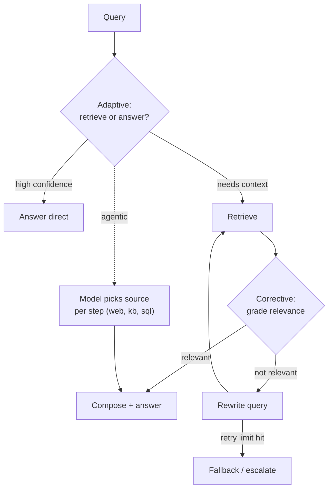

## Why it Matters

Naive RAG retrieves once and hopes; these three variants add the missing feedback loop, **grade what came back, rewrite if it is wrong, and let the model choose the source per step**. In 2026 the default has shifted from "one retrieval path" to "retrieval as a decision", which is exactly the shift interviewers probe when they ask why a RAG system gives confident wrong answers.

## Diagram



## Code

```python
from typing import Literal
from pydantic import BaseModel

## When to use / NOT

- **Use:** adaptive when query confidence varies a lot; corrective when retrieval quality is uneven; agentic when the right source differs per step (knowledge base vs web vs SQL).
- **NOT:** for a stable corpus with uniform queries — the extra decisions buy accuracy you cannot measure and cost you can.

## Trade-offs

| Variant | What it costs |
|---------|----------------|
| Adaptive | A routing decision before every query; mis-routes answer without context |
| Corrective | Extra grader calls + rewrite calls; a retry loop needs a hard budget |
| Agentic | Highest latency and token cost; hardest to evaluate, easiest to blow a budget |

## Vs

| Aspect | Naive RAG | Adaptive RAG | Corrective RAG | Agentic RAG |
|--------|-----------|--------------|-----------------|--------------|
| Decision point | None | Route before retrieve | Grade after retrieve | Per step, model-chosen |
| Cost driver | Embeddings | Router calls | Grader + rewrite | Full trace, many steps |
| Fixes | Nothing | Unnecessary retrieval | Confident wrong answers | Multi-source, multi-hop |
| When | Baseline | Mixed confidence | Uneven corpus | Mixed sources |

## Pitfalls

1. **Over-retrieval cost.** Retrieving on greetings and reasoning questions burns tokens for zero gain. Fix with adaptive routing and measure direct-answer rate.
2. **Grade-threshold tuning.** A strict grader retries everything; a loose one passes junk. Calibrate thresholds on labeled pairs before trusting the loop.
3. **Infinite retry loops.** Rewrite → retrieve → fail → rewrite can spin forever. Hard-cap retries at 1–2, log rewrites, fall back to abstain.

## Interview Q&A

- **Q:** How is adaptive RAG different from corrective RAG? **A:** Adaptive decides *before* retrieval whether to retrieve at all; corrective decides *after* retrieval whether the results are good enough and retries.
- **Q:** Why cap corrective retries? **A:** Each retry costs a full retrieval + LLM rewrite. Past 2 retries the rewrite is usually guessing, better to abstain or escalate than loop.
- **Q:** When does agentic RAG beat a fixed pipeline? **A:** When the source is not known upfront, the agent routes per step across PDF, web, and DB instead of one corpus.

## Flashcards (Spaced Repetition)

#flashcard
**Q:** What is the trigger keyword for Agentic Adaptive Corrective RAG? :: **A:** [trigger keywords] #flashcard

#flashcard
**Q:** Key hyperparameter for Agentic Adaptive Corrective RAG? :: **A:** [hyperparameter + typical range] #flashcard

#flashcard
**Q:** When do you NOT use Agentic Adaptive Corrective RAG? :: **A:** [anti-pattern scenarios] #flashcard

#flashcard
**Q:** Cost order of magnitude for Agentic Adaptive Corrective RAG? :: **A:** [GPU hours / $ per 1M tokens] #flashcard

## Practice Tasks (Tasks Plugin)
- [ ] Restate the intent from memory 📅 2026-09-30
- [ ] Code the config without looking 📅 2026-10-02
- [ ] Answer all Interview Q&A aloud 📅 2026-10-06
- [ ] Review flashcards (Spaced Repetition) 📅 2026-09-30

```tasks
not done
path includes 02_RAG-Engineering
sort by due
limit 10
```

## Related
- [[README|AI MOC]]
- [[02_RAG-Engineering/README|02_RAG-Engineering Folder]]

---

*Category: AI/02_RAG-Engineering • Part of [[README|AI MOC]]*