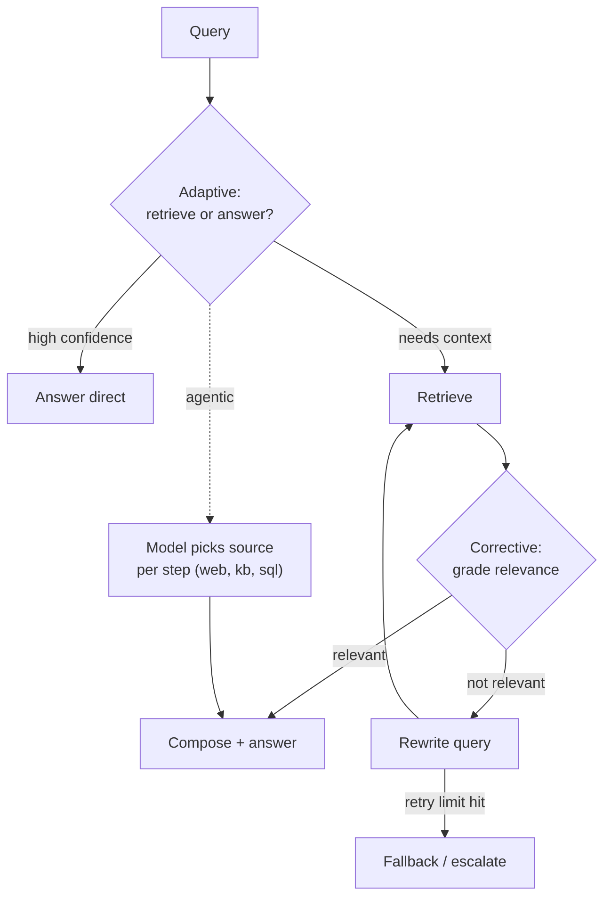

## Why it Matters

Naive RAG retrieves once and hopes; these three variants add the missing feedback loop, **grade what came back, rewrite if it is wrong, and let the model choose the source per step**. In 2026 the default has shifted from "one retrieval path" to "retrieval as a decision", which is exactly the shift interviewers probe when they ask why a RAG system gives confident wrong answers.

## Diagram



## Code

```python
from typing import Literal
from pydantic import BaseModel

## When to use / NOT

- **Use:** adaptive when query confidence varies a lot; corrective when retrieval quality is uneven; agentic when the right source differs per step (knowledge base vs web vs SQL).
- **NOT:** for a stable corpus with uniform queries — the extra decisions buy accuracy you cannot measure and cost you can.

## Trade-offs

| Variant | What it costs |
|---------|----------------|
| Adaptive | A routing decision before every query; mis-routes answer without context |
| Corrective | Extra grader calls + rewrite calls; a retry loop needs a hard budget |
| Agentic | Highest latency and token cost; hardest to evaluate, easiest to blow a budget |

## Vs

| Aspect | Naive RAG | Adaptive RAG | Corrective RAG | Agentic RAG |
|--------|-----------|--------------|-----------------|--------------|
| Decision point | None | Route before retrieve | Grade after retrieve | Per step, model-chosen |
| Cost driver | Embeddings | Router calls | Grader + rewrite | Full trace, many steps |
| Fixes | Nothing | Unnecessary retrieval | Confident wrong answers | Multi-source, multi-hop |
| When | Baseline | Mixed confidence | Uneven corpus | Mixed sources |

## Pitfalls

1. **Over-retrieval cost.** Retrieving on greetings and reasoning questions burns tokens for zero gain. Fix with adaptive routing and measure direct-answer rate.
2. **Grade-threshold tuning.** A strict grader retries everything; a loose one passes junk. Calibrate thresholds on labeled pairs before trusting the loop.
3. **Infinite retry loops.** Rewrite → retrieve → fail → rewrite can spin forever. Hard-cap retries at 1–2, log rewrites, fall back to abstain.

## Interview Q&A

- **Q:** How is adaptive RAG different from corrective RAG? **A:** Adaptive decides *before* retrieval whether to retrieve at all; corrective decides *after* retrieval whether the results are good enough and retries.
- **Q:** Why cap corrective retries? **A:** Each retry costs a full retrieval + LLM rewrite. Past 2 retries the rewrite is usually guessing, better to abstain or escalate than loop.
- **Q:** When does agentic RAG beat a fixed pipeline? **A:** When the source is not known upfront, the agent routes per step across PDF, web, and DB instead of one corpus.

## Related

- [[RAG Variants and Retrieval Strategies|RAG Variants]] • [[Enterprise Document Search]] • [[AI/03_Agentic-AI/Multi-Agent Patterns|Multi-Agent Patterns]] • [[AI/07_Cross-Cutting/02_AI Evaluation|AI Evaluation]]

---
*Category: rag*

# Agentic adaptive corrective RAG

> Part of [[README|02_RAG-Engineering]] • `rag` • Weeks 8–9
> Watch: [IBM Technology — What is Agentic RAG?](https://www.youtube.com/watch?v=0z9_MhcYvcY)

Naive RAG retrieves on every query. That is wasteful and brittle. These three patterns fix different halves of that problem: **adaptive RAG** skips retrieval when it adds nothing, **corrective RAG** repairs bad retrieval instead of answering from it, **agentic RAG** lets the model choose where to look step by step.

## Adaptive RAG: retrieve or answer direct

A small **router** classifies the query before any retrieval happens. Factual, time-sensitive, or domain-specific queries take the retrieve path. Greetings, chit-chat, math, and anything the model already knows take the direct path.

The router can be a tiny classifier (DistilBERT fine-tune), a few-shot LLM call, or even a rules-first hybrid. Keep it cheap, if the router costs as much as retrieval, you gained nothing.

```
mermaidflowchart TD Q[User query] --> R{Router: needs retrieval?}
 R -- No: greet / reason / known fact --> D[Answer direct, no retrieval]
 R -- Yes: factual / fresh / domain --> RET[Retrieve: pgvector HNSW + RRF hybrid, top-20]
 RET --> RR[Rerank cross-encoder top-20 to 5]
 RR --> G[Generate with citations]
```

Default stack stays the same: chunk 512 tokens / 50 overlap, hybrid BM25 + vector with RRF, cross-encoder rerank top-20→5.

## Corrective RAG: Grade, then Rewrite and Retry

Retrieval fails silently in naive RAG, wrong chunks become confident wrong answers. **Corrective RAG** inserts a grading step between retrieval and generation. Each chunk is scored as relevant, ambiguous, or irrelevant. Irrelevant sets trigger a rewrite-and-retry loop with a hard retry cap.

- **Relevant:** proceed to generation.
- **Ambiguous:** keep, but rewrite the query to disambiguate and retrieve once more.
- **Irrelevant:** discard, rewrite the query, retry with a different strategy (broaden, add keywords, switch to web).
```
pythonMAX_RETRIES = 2

def answer(query: str) -> str:
 for attempt in range(MAX_RETRIES + 1):
 docs = retrieve(query, top_k=20) # pgvector HNSW + BM25, RRF fusion
 grades = [grade(query, d) for d in docs] # -> "relevant" | "ambiguous" | "irrelevant"
 good = [d for d, g in zip(docs, grades) if g in ("relevant", "ambiguous")]
 if good or attempt == MAX_RETRIES:
 top = rerank(query, good or docs)[:5] # cross-encoder top-20 -> 5
 return generate(query, top)
 query = rewrite_query(query, grades) # LLM rewrite using failed grades as signal
 raise AssertionError("unreachable")
```

The rewrite matters more than the grader. Log every rewrite, it is the fastest way to find systematic retrieval gaps (bad chunking, missing synonyms, stale index).

## Agentic RAG: model picks the source per step

In **agentic RAG** there is no fixed pipeline. The agent loops over thought → tool call → observation until it has enough to answer. At each step it picks the retriever: vector store for owned docs, web search for fresh facts, SQL for structured data.

```
pythonTOOLS = {"pdf_search": pdf_search, "web_search": web_search, "db_query": db_query}
def agentic_answer(query: str, max_steps: int = 5) -> str:
 context: list[str] = []
 for _ in range(max_steps):
 action = plan(query, context) # LLM returns {"tool": ..., "args": {...}} or {"done": True}
 if action.get("done"):
 break
 context.append(TOOLS[action["tool"]](**action["args"]))
 return generate(query, context)
```

Multi-source build sketch: one index per source behind one tool interface. PDFs go through the standard ingest (512/50 chunks, pgvector HNSW). Web goes through a search API with recency bias. DB goes through Text-to-SQL with a read-only role and a row limit. The agent never sees raw credentials, each tool enforces its own auth and cutoff labels.

## When to use Which

| Pattern | Query type | Cost | Use when |
|---------|-----------|------|----------|
| Naive | Single known corpus, stable facts | Low | Baseline, evals, low-stakes internal tools |
| Adaptive | Mixed chit-chat + factual | Lowest at scale | Most traffic needs no retrieval; skip it |
| Corrective | Noisy corpus, ambiguous queries | Medium | Wrong answers cost more than a second retrieval |
| Agentic | Multi-hop, multi-source | High | Answer needs PDF + web + DB joined together |

Rule of thumb: start naive, add adaptive routing when retrieval bills hurt, add corrective grading when wrong answers hurt, go agentic only when single-source retrieval cannot answer the question.

## Evaluation

- **Retrieval:** precision@k, MRR as before, plus **grade pass rate**, share of queries where top-5 contains at least one relevant-graded chunk.
- **Answer:** RAGAS faithfulness and answer_relevancy, citation accuracy, hallucination rate.
- Feed the grader labels back into the existing RAGAS harness as a custom metric (`retrieval_grade_pass`), so routing and rewrite changes show up in the same dashboard as answer quality. Full harness: [[AI/07_Cross-Cutting/02_AI Evaluation|AI Evaluation]].
- Track per-path latency and cost: direct-answer vs retrieve vs retry vs agentic steps.

# Corrective RAG: the Grader is a Structured Decision, not a Vibe Check

class RetrievalGrade(BaseModel):
 verdict: Literal["relevant", "irrelevant"]
 reason: str

# Adaptive RAG: Route before Spending a Retrieval Call

class QueryRoute(BaseModel):
 path: Literal["answer_direct", "retrieve"]
 confidence: float

MAX_RETRIES = 2

def corrective_plan(grades: list[RetrievalGrade], attempts: int) -> str:
 """Return the next action for a corrective loop with a budget."""
 if any(g.verdict == "relevant" for g in grades):
 return "compose_and_answer"
 if attempts < MAX_RETRIES:
 return "rewrite_query_and_retry"
 return "fallback" # never loop forever
```