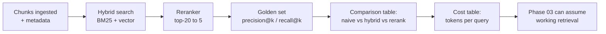

## Why it Matters

Phase 02 is where the platform either becomes trustworthy or stays a demo, and the difference is entirely measurement. This checklist exists so that "we improved retrieval" is a claim backed by a before/after table rather than an impression, the evaluation habit it installs is what Phase 04's eval gate inherits.

## Diagram



## Code

```python

## When to use / NOT

- **Use:** as the Phase 02 exit gate; the comparison table is the artifact the rest of the plan quotes.
- **NOT:** as a one-time exercise — the same harness becomes the regression gate in Phase 04.

## Trade-offs

| Choice | Cost |
|--------|------|
| Require a measurement per variant | Slower to ship a retrieval change |
| Golden set built by hand | Small, and it encodes your own blind spots |
| Cost per query recorded | Extra bookkeeping, and it changes with pricing |

## Vs

| Exit criterion | This checklist | Alternative |
|---------------|---------------|------------|
| Evidence | precision@k / recall@k / tokens per query | "Search feels better" |
| Reusable | Becomes the Phase 04 eval gate | None |
| Failure signal | Variant with no row is not done | Invisible |

## Pitfalls

- Shipping a hybrid/reranker variant with no measured row — the most common Phase 02 failure.
- A golden set of ten easy queries; it flatters every variant equally and detects nothing.
- Comparing variants run on different chunking or embedding settings; the comparison is invalid.
- Recording accuracy but never tokens per query, then being surprised by the bill in Phase 04.

## Interview Q&A

- **Q:** How do you justify a reranker to a sceptical stakeholder? **A:** With the row from this checklist — precision@k before and after, next to the added latency and tokens per query. If the gain does not survive the table, it does not ship.
- **Q:** What makes a golden set useful rather than flattering? **A:** Hard queries. A set of ten questions any variant answers tells you nothing; include ambiguous, multi-hop and out-of-scope questions so the variants actually separate.
- **Q:** Why measure cost alongside accuracy? **A:** Because a retrieval upgrade is an architecture decision only when both are known — accuracy without cost is a demo, cost without accuracy is a budget problem.

## Related

- [[AI/02_RAG-Engineering/RAG Variants and Retrieval Strategies|RAG Variants and Retrieval Strategies]] • [[AI/02_RAG-Engineering/02_Design LLM Architectures|02_Design LLM Architectures]] • [[AI/07_Cross-Cutting/02_AI Evaluation|02_AI Evaluation]]

# Phase 02 — RAG Engineering Checklist

```
dataviewTABLE WITHOUT ID item as "Done"FROM "AI/02_RAG-Engineering/Checklist.md"
WHERE file.name = "Checklist.md"
SORT item ASC
```

- pgvector extension installed + HNSW index built
- Hybrid search (BM25 + vector) returns top-5
- Citations are grounded (each answer claim traced to a chunk)
- RAG variant A/B table built (naive vs hybrid vs reranker)
- Cost comparison table (tokens per query, with/without reranker)

# The Phase 02 Deliverable is the Table, not the Feature

def precision_at_k(retrieved: list[str], relevant: set[str], k: int) -> float:
 hits = sum(1 for doc in retrieved[:k] if doc in relevant)
 return hits / k

def recall_at_k(retrieved: list[str], relevant: set[str], k: int) -> float:
 if not relevant: return 0.0
 return len(set(retrieved[:k]) & relevant) / len(relevant)

# Deliverable: for Each Variant in {Naive, Hybrid, Hybrid+rerank} Fill one row

# Variant | Precision@5 | Recall@5 | Tokens/query | p95 Latency

# Only a Filled row Counts as "Done", an Unmeasured Variant is not an Upgrade.
```