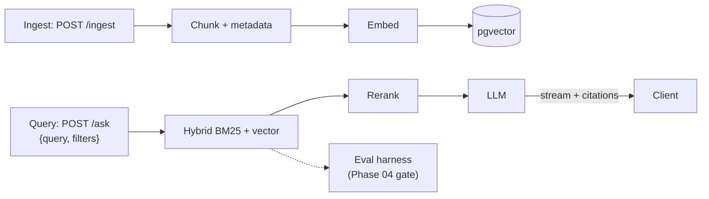

## Why it Matters

Enterprise-grade semantic search that **replaces** the generic "build a semantic search engine" course exercise, aligned to C1/C2, production-minded.

## Diagram



## Code

```python
from fastapi import FastAPI
from pydantic import BaseModel, Field

app = FastAPI(title="Enterprise Document Search")

class SearchRequest(BaseModel):
 query: str
 filters: dict[str, str] = Field(default_factory=dict)
 top_k: int = 5

class SearchHit(BaseModel):
 doc_id: str
 snippet: str
 score: float

@app.post("/ask")
async def ask(req: SearchRequest) -> list[SearchHit]:
 # hybrid: BM25 + vector, merged with RRF, then reranked (see variants note)
 raise NotImplementedError # retrieval + rerank + LLM compose

@app.post("/ingest")
async def ingest(documents: list[dict]) -> dict:
 # chunk with metadata (dept, acl), embed, upsert into pgvector
 return {"ingested": len(documents)}

@app.get("/health")
async def health() -> dict[str, str]:
 return {"status": "ok"}
```

## When to use / not

- **Use:** as the Phase 02 centerpiece, one search service that Phase 03 sees as a tool and Phase 04 sees as a microservice.
- **NOT:** as a replacement for the transactional search estate; this is the AI retrieval layer over documents the enterprise already owns.

## Trade-offs

- Hybrid search measurably beats naive on eval set; citations verifiable; streaming <300ms TTFB.

## Vs

| Aspect | This service | Existing enterprise search (ES/Solr) | Vector-only demo |
|--------|-------------|----------------------------------------|------------------|
| Strength | Semantic + keyword + rerank, citations | Mature ops, proven at scale | Semantic similarity |
| Filters/ACL | First-class (dept, acl metadata) | Mature | Usually missing |
| Eval | Golden set, CI gate | Rarely measured | None |

## Pitfalls

- Ignoring document permissions in the retrieval layer, the search returns what the ranking model liked, not what the user may see.
- Chunking without metadata; filters and ACLs are retrofitted painfully.
- Returning citations the LLM did not actually use; citation and context must come from the same retrieved set.
- No version on the embedding model, re-embedding an old index alongside a new one silently splits relevance.

## Interview q&a

- **Q:** How do you handle document-level permissions in a RAG service? **A:** Filters are part of the retrieval query, not a post-filter after ranking. Metadata like department and ACL travels with the chunk, so a ranking model never promotes a document the user cannot read.
- **Q:** Why hybrid BM25 plus vector instead of vector alone? **A:** Because enterprise queries are mixed, identifiers, codes and exact names are keyword-shaped, intent questions are semantic. Hybrid with RRF handles both; either alone loses one class of query.
- **Q:** What happens when the search is wrong? **A:** It tells you, citations are returned with every answer, so a wrong answer traces to a retrieval failure you can inspect, rather than a model confidence you cannot.

## Related

- [[01_LLM Engineering with RAG]] • [[02_Design LLM Architectures]] • [[AI/03_Agentic-AI/Enterprise AI Operations Platform|Next: AI Operations Platform]]

---
*Category: rag*

# Enterprise Document Search, Project (Weeks 5–10)

> Part of [[README|02_RAG-Engineering]] • `project` • The RAG evolution of [[AI/01_Fundamentals/AI Backend Template|AI Backend Template]]
> Watch: [RAG at 10 Million Documents, System Design](https://www.youtube.com/watch?v=NQZqET-jjws)

## Features

- [ ] Ingest pipeline: PDF/MD → chunk (512/50 overlap) → embed → pgvector (HNSW)
- [ ] **Hybrid search:** BM25 + vector via RRF
- [ ] **Metadata filtering:** department, date, confidentiality
- [ ] **Citations:** answer → `[1][2]` grounded in retrieved chunks
- [ ] **Streaming responses** (SSE) with partial citations
- [ ] Evaluation harness: precision@k, faithfulness, latency

## Week 7+ Enhancements (from c2)

- RAG variants A/B (naive → hybrid → reranker)
- Context compression (target 30–50% token saving)
- Retrieval strategy comparison table
- **Cost comparison:** managed embeddings vs self-hosted, with/without reranker

## API Sketch

```
POST /search {query, filters, top_k} → {results: [{content, score, metadata, citation_id}]}
POST /ask {query, filters} → stream {token, citations[]}
POST /ingest {documents[]} → {ingested, chunks}
```