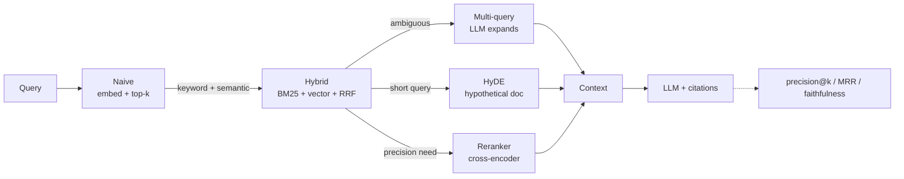

## Why it Matters

The variants are not a menu of features, they are a ladder of cost, and the interview question is always "why did you stop where you stopped". This note gives the reasoning for each rung plus the evaluation harness that decides which rung a query actually needs, so the choice is data rather than fashion.

## Diagram



## Code

```python

## When to use / NOT

- **Use:** multi-query when the query is ambiguous; HyDE for short low-signal queries; reranking when precision@k must be high; compression when context cost dominates.
- **NOT:** all of them at once — every variant adds latency and eval surface; adopt the rung your golden set says you need.

## Trade-offs

| Variant | What it costs |
|---------|----------------|
| Hybrid (RRF) | Two indexes to keep in sync |
| Multi-query | N extra LLM calls per query |
| HyDE | A generated doc can mislead retrieval |
| Reranking | Cross-encoder latency on every query |
| Compression | An extra model decision, possible information loss |

## Vs

| Axis | Naive top-k | Hybrid (BM25 + vector) | Reranking on top | Long-context / "stuff everything" |
|------|-------------|------------------------|------------------|----------------------------------|
| Precision@k on keyword-heavy queries | Low — exact terms missed | High — lexical match retained | Highest — cross-encoder reorders | Depends on where the answer sits in the window |
| Query-time cost | 1 embed + 1 LLM | 2 indexes, 1 LLM | Adds a cross-encoder pass per query | Many embeds, one very large LLM call |
| Latency p95 | Lowest | Low | Highest of the retrieval-only rungs | Context length sets the floor |
| Failure mode | Semantic drift on rare terms | Indexes drift apart | Precision gain too small to justify the ms | Lost in the middle; stale context after every doc edit |
| Why you stop here | Baseline to beat | When keyword + semantic both matter | Only when the measured precision gap clears the latency budget | Only while context fits one window |

## Pitfalls

- Stacking variants without re-running the eval — cost grows, accuracy may not.
- Tuning `k` in RRF by feel; it is a hyperparameter, measure it.
- HyDE on factual lookups — a hypothetical document is noise when an exact match exists.
- Reranking 100 candidates and blaming the model for latency; cap the candidate window.

## Interview Q&A

- **Q:** Why rerank? **A:** Bi-encoder (fast, recall) retrieves; cross-encoder (slow, precise) prefers — best of both.

## Related

- [[02_Design LLM Architectures]] • [[AI/07_Cross-Cutting/02_AI Evaluation|Evaluation]]

---
*Category: rag*

# RAG Variants and Retrieval Strategies

> Part of [[README|02_RAG-Engineering]] • `rag` • Weeks 8–9
> Watch: [Dave Ebbelaar — Complete Guide to Hybrid Search (BM25 + Embeddings + Reranker)](https://www.youtube.com/watch?v=XvKiTfd6Xvo)

## Variants

| Variant | Idea | When |
|---------|------|------|
| Naive | Embed query → top-k | Baseline |
| Hybrid | BM25 + vector (RRF) | Keyword + semantic queries |
| Multi-query | LLM expands query → 3 variants | Ambiguous queries |
| HyDE | Generate hypothetical doc → embed | Short queries |
| Reranking | Cross-encoder rescores top-20→5 | High precision need |
| Context compression | Compress retrieved context | Cost/token limits |

## Evaluation

- **Retrieval:** precision@k, recall@k, MRR.
- **Answer:** faithfulness (LLM-as-judge), citation accuracy, hallucination rate.
- Keep a comparison table in [[Enterprise Document Search]] — that's your C2 deliverable.

# Reciprocal Rank Fusion — how hybrid search is actually merged

def rrf(rankings: list[list[str]], k: int = 60) -> list[str]:
 """Merge multiple ranked lists; k is the rank-dampening constant."""
 scores: dict[str, float] = {}
 for ranked in rankings:
 for rank, doc_id in enumerate(ranked):
 scores[doc_id] = scores.get(doc_id, 0.0) + 1.0 / (k + rank)
 return sorted(scores, key=scores.get, reverse=True)

# Reranker is a different animal: a cross-encoder scores (query, doc) pairs

# directly — slower and more accurate than the bi-encoder that retrieved them.

# ranked = rff([bm25_ranked, vector_ranked])

# final = cross_encoder.rerank(query, ranked[:20])[:5]

```