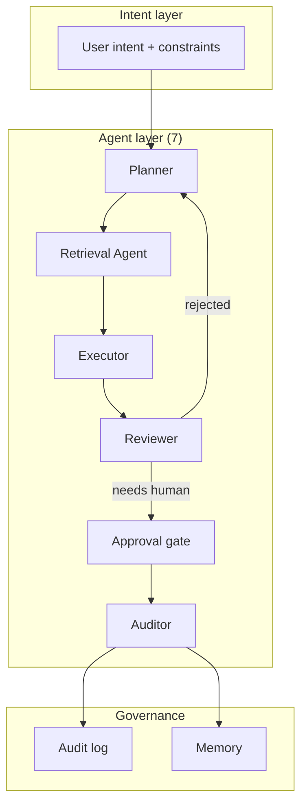

## Why it Matters

Graduate-level intensive for engineers who want to **lead** multi-agent system design, logical/physical architecture, trade-offs, deployment.

## Diagram



## Code

```python
from typing import Literal
from pydantic import BaseModel

## When to use / NOT

- **Use:** for multi-step work with real consequences — operations platforms, document processing, anything that writes to a system of record.
- **NOT:** for single-shot Q&A or retrieval; wrapping a prompt in an agent adds cost and failure modes with no gained capability.

## Trade-offs

| Choice | Cost |
|--------|------|
| Multiple specialised agents | Coordination overhead; more failure modes to reason about |
| Human approval gates | Throughput drops; gate fatigue trains people to rubber-stamp |
| Typed inter-agent contracts | More upfront design; changes require touching every role |

## Vs

| Aspect | Single agent + tools | Multi-agent (this) | Workflow/orchestrated |
|--------|---------------------|--------------------|----------------------|
| Control | Implicit, in the prompt | Explicit per-role contracts | Fixed steps |
| Failure isolation | One context, one failure | Per-agent retry and budget | Per step |
| Cost | Lowest | Highest | Predictable |

## Pitfalls

- Agents with overlapping capabilities — they argue in loops and burn a budget nobody is watching.
- A reviewer that can only approve; escalation must exist or the loop never ends.
- Long-lived agent memory that never decays; stale context dominates the context window.
- Skipping the audit log; without it you cannot explain a decision after the fact.

## Interview Q&A

- **Q:** When is a second agent the right answer rather than more tools on one? **A:** When the concerns are separable and independently retryable — a reviewer with its own budget and context can reject without poisoning the executor's context. If the only difference is a prompt, one agent is correct.
- **Q:** How do you keep multi-agent systems from looping forever? **A:** Every cycle needs an explicit terminal and an escalation branch — a rejection routes back to the planner with a reason, and a hard step budget converts a stuck loop into a monitored failure.
- **Q:** Where does human approval actually belong? **A:** Only on irreversible or externally-visible actions. Gating reads and drafts trains people to click approve, which weakens the gate for the action that actually needed it.

## Related

- [[Enterprise AI Operations Platform]] • [[Multi-Agent Patterns]] • [[AI/00_Overview/Certification Guide|Certification Guide]]

---
*Category: agentic*

# Architecting Agentic AI Solutions — NUS-ISS

> Part of [[README|03_Agentic-AI]] • `agentic` • Weeks 11–16

## Ideal For

AI Solution Architects, Senior SWEs / Tech Leads, Enterprise Architects with solid backend + AI fundamentals.

## Structure

- **Duration:** 4 days (~32h), part of Graduate Certificate in Architecting AI Systems.
- **Process:** Select & optimize foundation models → implement RAG pipelines → design agent collaboration → deploy via microservices/containers/serverless.

## Key Topics

1. **Core Architecture:** Logical/physical design for full-stack agent systems; qualities: autonomy, scalability, security, fault tolerance, explainability.
2. **Multi-Agent Collaboration:** Strategies for agents to communicate, delegate, and achieve complex goals.
3. **Agent Frameworks:** Hands-on with **LangChain / LangGraph**, **AutoGen**, OpenAI/Claude Assistants APIs — trade-offs.
4. **Integration & Deployment:** Microservices, containers, serverless + API gateways, service meshes, monitoring.
5. **Development Process:** Structured workflow from model selection to RAG to agent orchestration.

## Target Audience Prereqs

Solid software development + foundational AI (you have it by W11 per roadmap).

## Vs Coursera Specialization

| Aspect | NUS-ISS | Coursera C1–C7 |
|--------|---------|----------------|
| Focus | *What* to build — ecosystem design, autonomy | *How* to build — resilient production systems |
| Credential | Grad Cert module | 7-course specialization |
| Best for | Leading architecture | Engineering excellence |

# Architecting agents: the contract between roles is typed, not implied

class Plan(BaseModel):
 steps: list[str]
 requires_approval: bool

class ReviewVerdict(BaseModel):
 verdict: Literal["approve", "reject", "escalate"]
 reason: str

def next_action(v: ReviewVerdict, has_human_gate: bool) -> str:
 """Every agent graph needs an explicit terminal + escalation branch."""
 if v.verdict == "approve": return "execute"
 if v.verdict == "escalate" and has_human_gate: return "await_human"
 return "replan" # reject → back to planner, not an infinite loop
```