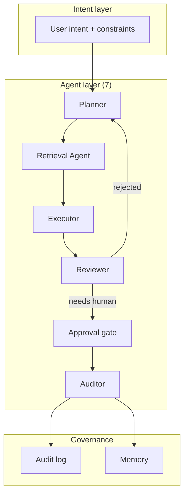

## Why it Matters

Graduate-level intensive for engineers who want to **lead** multi-agent system design, logical/physical architecture, trade-offs, deployment.

## Diagram



## Code

## When to use / NOT

- **Use:** for multi-step work with real consequences — operations platforms, document processing, anything that writes to a system of record.
- **NOT:** for single-shot Q&A or retrieval; wrapping a prompt in an agent adds cost and failure modes with no gained capability.

## Trade-offs

| Choice | Cost |
|--------|------|
| Multiple specialised agents | Coordination overhead; more failure modes to reason about |
| Human approval gates | Throughput drops; gate fatigue trains people to rubber-stamp |
| Typed inter-agent contracts | More upfront design; changes require touching every role |

## Vs

| Aspect | Single agent + tools | Multi-agent (this) | Workflow/orchestrated |
|--------|---------------------|--------------------|----------------------|
| Control | Implicit, in the prompt | Explicit per-role contracts | Fixed steps |
| Failure isolation | One context, one failure | Per-agent retry and budget | Per step |
| Cost | Lowest | Highest | Predictable |

## Pitfalls

- Agents with overlapping capabilities — they argue in loops and burn a budget nobody is watching.
- A reviewer that can only approve; escalation must exist or the loop never ends.
- Long-lived agent memory that never decays; stale context dominates the context window.
- Skipping the audit log; without it you cannot explain a decision after the fact.

## Interview Q&A

- **Q:** When is a second agent the right answer rather than more tools on one? **A:** When the concerns are separable and independently retryable — a reviewer with its own budget and context can reject without poisoning the executor's context. If the only difference is a prompt, one agent is correct.
- **Q:** How do you keep multi-agent systems from looping forever? **A:** Every cycle needs an explicit terminal and an escalation branch — a rejection routes back to the planner with a reason, and a hard step budget converts a stuck loop into a monitored failure.
- **Q:** Where does human approval actually belong? **A:** Only on irreversible or externally-visible actions. Gating reads and drafts trains people to click approve, which weakens the gate for the action that actually needed it.

## Flashcards (Spaced Repetition)

#flashcard
**Q:** What architectural signal justifies adding another agent? :: **A:** A separable concern that benefits from an independent context, budget, retry boundary, or ownership.

#flashcard
**Q:** What prevents a multi-agent loop from running forever? :: **A:** Explicit terminal states, step/time/token budgets, and an escalation path.

#flashcard
**Q:** Where should human approval normally sit? :: **A:** At irreversible, high-impact, or externally visible actions rather than routine reads or drafts.

#flashcard
**Q:** What is the main architectural cost of multi-agent systems? :: **A:** Coordination complexity: more contexts, contracts, failure modes, observability, and token/latency overhead.

## Practice Tasks (Tasks Plugin)
- [ ] Restate the intent from memory 📅 2026-09-30
- [ ] Code the config without looking 📅 2026-10-02
- [ ] Answer all Interview Q&A aloud 📅 2026-10-06
- [ ] Review flashcards (Spaced Repetition) 📅 2026-09-30

```tasks
not done
path includes 03_Agentic-AI
sort by due
limit 10
```

## Related
- [[README|AI MOC]]
- [[03_Agentic-AI/README|03_Agentic-AI Folder]]
- [[Architect/13_AI-Architecture/04 - Agent Architecture|Architect: Agent Architecture]]
- [[Architect/13_AI-Architecture/07 - Evaluation Architecture|Architect: Evaluation Architecture]]

---

*Category: AI/03_Agentic-AI • Part of [[README|AI MOC]]*