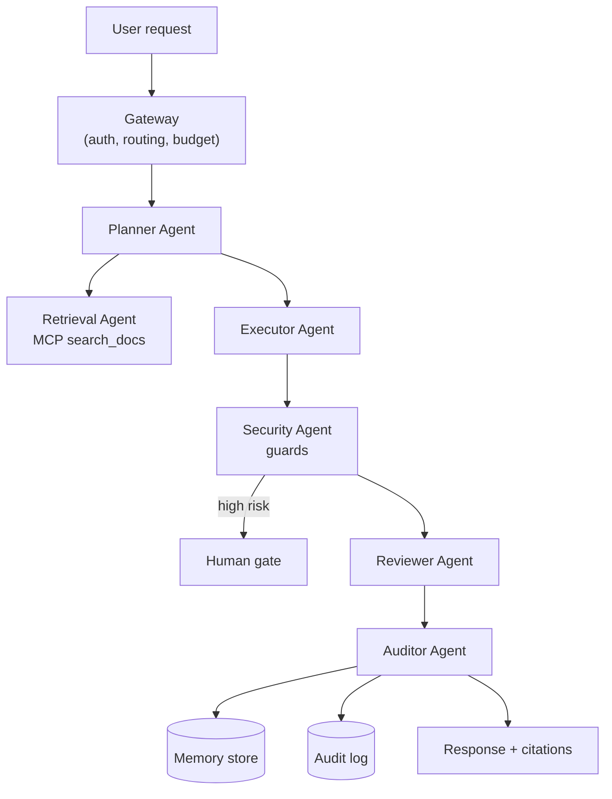

## Why it Matters

Evolve [[AI/02_RAG-Engineering/Enterprise Document Search|Enterprise Document Search]] into a 7-agent platform with orchestration, memory, human approval, monitoring, and audit logs. This is your NUS-ISS capstone.

## Diagram



## Code

```python
from typing import Literal
from pydantic import BaseModel

class Action(BaseModel):
 name: str
 params: dict
 risk: Literal["low", "medium", "high"]

POLICY = {"high": "require_human", "medium": "require_review", "low": "auto"}

def gate_for(action: Action) -> str:
 """Risk decides the gate before the action runs, not after."""
 return POLICY[action.risk]

## When to use / NOT

- **Use:** when the same operations work needs planning, retrieval, execution and review as separable, auditable steps — the Phase 03 deliverable.
- **NOT:** for request/response features with no side effects; the agent layer is pure overhead there.

## Trade-offs

- Multi-step goal ("research + query DB + draft code + review") completes with HITL gate and auditable trace.

## Vs

| Aspect | 7 specialised agents | One general agent | Non-agent pipeline |
|--------|------------------------|-------------------|---------------------|
| Failure isolation | Per agent | Whole context | Per stage |
| Audit story | Per action, per agent | One opaque trace | Clean but rigid |
| Cost | Highest | Medium | Lowest |

## Pitfalls

- Agents sharing one context window until it costs more than the work.
- A security agent that only logs; without a gate it is observability, not a control.
- Memory written for every run and never summarised or decayed.
- Budgets defined per request but never enforced in code — a loop is a bill.

## Interview Q&A

- **Q:** Why seven agents instead of one with all the tools? **A:** Separation of concern, failure isolation and auditability. A security agent with its own budget can veto an executor without sharing a context window, and every action has a named owner in the audit trail.
- **Q:** How is risk actually enforced? **A:** As a policy mapping applied before execution — high risk requires a human, medium requires review, low is automatic. The enforcement is in code, not in a prompt hoping the model asks permission.
- **Q:** What is the failure mode you worry about most? **A:** A silently growing budget. A stuck retry loop in an agent with tool access is both an incident and a large invoice, which is why per-run step and token budgets are enforced, not monitored.

## Flashcards (Spaced Repetition)

#flashcard
**Q:** What is the trigger keyword for Enterprise AI Operations Platform? :: **A:** [trigger keywords] #flashcard

#flashcard
**Q:** Key hyperparameter for Enterprise AI Operations Platform? :: **A:** [hyperparameter + typical range] #flashcard

#flashcard
**Q:** When do you NOT use Enterprise AI Operations Platform? :: **A:** [anti-pattern scenarios] #flashcard

#flashcard
**Q:** Cost order of magnitude for Enterprise AI Operations Platform? :: **A:** [GPU hours / $ per 1M tokens] #flashcard

## Practice Tasks (Tasks Plugin)
- [ ] Restate the intent from memory 📅 2026-09-30
- [ ] Code the config without looking 📅 2026-10-02
- [ ] Answer all Interview Q&A aloud 📅 2026-10-06
- [ ] Review flashcards (Spaced Repetition) 📅 2026-09-30

```tasks
not done
path includes 03_Agentic-AI
sort by due
limit 10
```

## Related
- [[README|AI MOC]]
- [[03_Agentic-AI/README|03_Agentic-AI Folder]]

---

*Category: AI/03_Agentic-AI • Part of [[README|AI MOC]]*