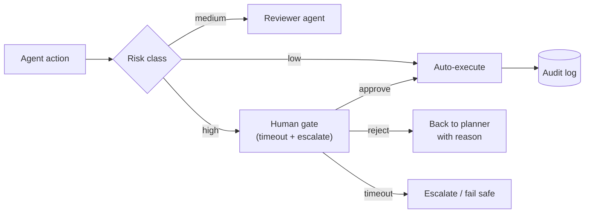
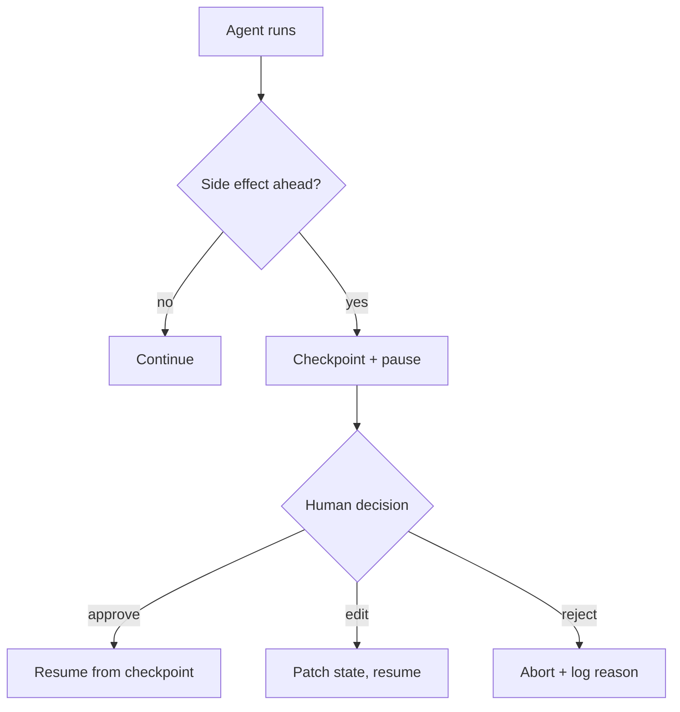

## Why it Matters

Pause the agent before anything irreversible, let a human approve, edit, or reject, then resume from exactly where it stopped. Gates belong before side effects: DB writes, deploys, external sends, money movement. Everything else runs free.

## Diagram



## Code

```python
import asyncio
from typing import Callable, Awaitable

async def with_human_gate(approve: Callable[[], Awaitable[bool]],
 timeout_s: float = 3600) -> str:
 '''High-risk actions wait for a human; timeout fails safe, not silent.'''
 try:
 ok = await asyncio.wait_for(approve(), timeout=timeout_s)
 except asyncio.TimeoutError:
 return "escalated"
 return "executed" if ok else "rejected_with_reason"

```

## When to use / not

- **Use:** for irreversible, externally visible or high-financial-cost actions; anything where an error cannot be rolled back.
- **NOT:** for reads, drafts or internal reasoning, gating those trains people to approve without reading, which destroys the gate for real risks.

## Trade-offs

| Choice | Cost |
|--------|------|
| Gate only high risk | Trust is concentrated in the risk classifier |
| Timeout → escalate | Latency variance; escalations need a human on call |
| Rejection routes to planner | Extra cycles; without a reason attached it loops pointlessly |

## Vs

| Gate style | Human gate | Reviewer agent | Auto + audit |
|-----------|-----------|----------------|-------------|
| Latency | Highest | Medium | Lowest |
| Catches | Judgement calls, policy edge cases | Schema/policy violations | Nothing live |
| Risk | Approval fatigue | Shared model blind spots | Damage already done |

## Pitfalls

- **Approval fatigue.** Gate everything and humans stop reading. Gate only irreversible actions and keep the queue near zero.
- **No expiry.** A checkpoint approved three weeks later resumes against a world that changed. Timestamp checkpoints, expire aggressively.
- **Unaudited edits.** If a human can edit state mid-run, log the before/after. Silent edits make incidents undebuggable.

## Interview q&a

- **Q:** How is HITL different from a manual step in a pipeline? **A:** The agent decides when to stop based on what it is about to do, and resume continues from persisted state. A manual pipeline step always stops, even when there is nothing to review.
- **Q:** What breaks on resume after a long pause? **A:** Stale state. The world moved while the human thought. Re-validate preconditions (prices, inventory, branch state) on resume, or timestamp the checkpoint and expire it.
- **Q:** Who is accountable when an approved action goes wrong? **A:** Say it plainly: the approver owns the outcome, so the review UI must show the full diff and context, not a bare approve button. Rubber-stamp UIs transfer blame without transferring understanding.

## Related

- [[Multi-Agent Patterns]] • [[LangGraph-Fundamentals]] • [[Enterprise AI Operations Platform]] • [[AI/07_Cross-Cutting/04_AI Security|AI Security]]

---
*Category: agentic*

# Human in the Loop

> Part of [[README|03_Agentic-AI]] • `agentic` • Week 15
> Watch: [LangChain, LangGraph interrupt (HITL agents)](https://www.youtube.com/watch?v=6t7YJcEFUIY)

## Flow


The checkpoint is the whole trick. Without persisted state, "pause" means "lose everything and restart." With it, resume is one call.

## Code Sketch

```python
from langgraph.graph import StateGraph

graph = StateGraph(state_schema=AgentState)
graph.add_node("planner", planner_node)
graph.add_node("executor", executor_node) # side effects live here
graph.add_edge("planner", "executor")

# Pause before the executor, not after. Review the plan while state is frozen.

app = graph.compile(
 checkpointer=postgres_checkpointer,
 interrupt_before=["executor"],
)

config = {"configurable": {"thread_id": "deploy-421"}}
result = app.invoke({"goal": "roll out v2"}, config=config)

# ... human reviews result in the admin console ...

app.invoke(None, config=config) # approve: resumes at executor
```
Admin review build: a queue of paused threads (thread_id, plan summary, diff preview, requested-by) with approve/edit/reject buttons. Each decision writes an audit row: who, what changed, when. That log is your incident trail and your EU AI Act evidence in one.

## When to Gate

| Gate | Why |
|------|-----|
| External sends (email, Slack, webhooks) | No undo button |
| DB writes / migrations | Blast radius |
| Deploys / infra changes | Customer impact |
| Spend (ads, API bulk jobs) | Real money |

Skip gates for reads, drafts, and internal reasoning. Gating those just trains people to click approve blindly.
