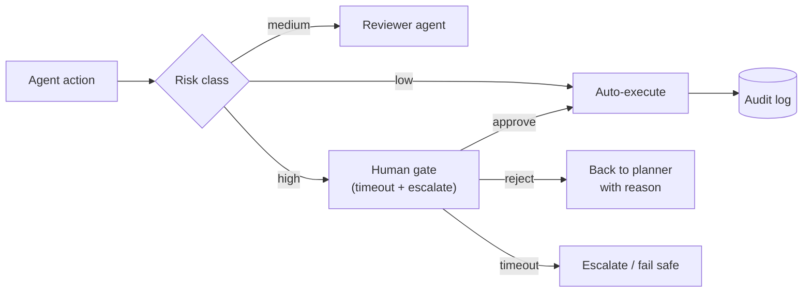

## Why it Matters

Pause the agent before anything irreversible, let a human approve, edit, or reject, then resume from exactly where it stopped. Gates belong before side effects: DB writes, deploys, external sends, money movement. Everything else runs free.

## Diagram



## Code

```python
import asyncio
from typing import Callable, Awaitable

async def with_human_gate(approve: Callable[[], Awaitable[bool]],
 timeout_s: float = 3600) -> str:
 '''High-risk actions wait for a human; timeout fails safe, not silent.'''
 try:
 ok = await asyncio.wait_for(approve(), timeout=timeout_s)
 except asyncio.TimeoutError:
 return "escalated"
 return "executed" if ok else "rejected_with_reason"

```

## When to use / not

- **Use:** for irreversible, externally visible or high-financial-cost actions; anything where an error cannot be rolled back.
- **NOT:** for reads, drafts or internal reasoning, gating those trains people to approve without reading, which destroys the gate for real risks.

## Trade-offs

| Choice | Cost |
|--------|------|
| Gate only high risk | Trust is concentrated in the risk classifier |
| Timeout → escalate | Latency variance; escalations need a human on call |
| Rejection routes to planner | Extra cycles; without a reason attached it loops pointlessly |

## Vs

| Gate style | Human gate | Reviewer agent | Auto + audit |
|-----------|-----------|----------------|-------------|
| Latency | Highest | Medium | Lowest |
| Catches | Judgement calls, policy edge cases | Schema/policy violations | Nothing live |
| Risk | Approval fatigue | Shared model blind spots | Damage already done |

## Pitfalls

- **Approval fatigue.** Gate everything and humans stop reading. Gate only irreversible actions and keep the queue near zero.
- **No expiry.** A checkpoint approved three weeks later resumes against a world that changed. Timestamp checkpoints, expire aggressively.
- **Unaudited edits.** If a human can edit state mid-run, log the before/after. Silent edits make incidents undebuggable.

## Interview q&a

- **Q:** How is HITL different from a manual step in a pipeline? **A:** The agent decides when to stop based on what it is about to do, and resume continues from persisted state. A manual pipeline step always stops, even when there is nothing to review.
- **Q:** What breaks on resume after a long pause? **A:** Stale state. The world moved while the human thought. Re-validate preconditions (prices, inventory, branch state) on resume, or timestamp the checkpoint and expire it.
- **Q:** Who is accountable when an approved action goes wrong? **A:** Say it plainly: the approver owns the outcome, so the review UI must show the full diff and context, not a bare approve button. Rubber-stamp UIs transfer blame without transferring understanding.

## Flashcards (Spaced Repetition)

#flashcard
**Q:** What is the trigger keyword for Human in the Loop? :: **A:** [trigger keywords] #flashcard

#flashcard
**Q:** Key hyperparameter for Human in the Loop? :: **A:** [hyperparameter + typical range] #flashcard

#flashcard
**Q:** When do you NOT use Human in the Loop? :: **A:** [anti-pattern scenarios] #flashcard

#flashcard
**Q:** Cost order of magnitude for Human in the Loop? :: **A:** [GPU hours / $ per 1M tokens] #flashcard

## Practice Tasks (Tasks Plugin)
- [ ] Restate the intent from memory 📅 2026-09-30
- [ ] Code the config without looking 📅 2026-10-02
- [ ] Answer all Interview Q&A aloud 📅 2026-10-06
- [ ] Review flashcards (Spaced Repetition) 📅 2026-09-30

```tasks
not done
path includes 03_Agentic-AI
sort by due
limit 10
```

## Related
- [[README|AI MOC]]
- [[03_Agentic-AI/README|03_Agentic-AI Folder]]

---

*Category: AI/03_Agentic-AI • Part of [[README|AI MOC]]*