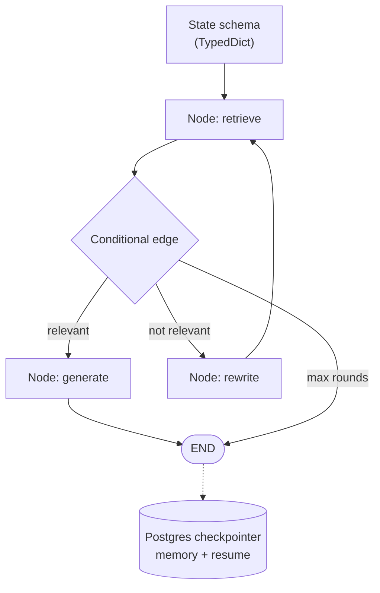

## Why it Matters

How to build stateful agent graphs in LangGraph without turning them into spaghetti. Covers state, nodes, memory, ReAct loops, streaming, and the workflow shapes you will reuse everywhere.

## Diagram



## Code

```python
from typing import TypedDict, Literal
from langgraph.graph import StateGraph, END

class State(TypedDict):
 query: str
 messages: list[dict]
 retrieved: list[str]
 rounds: int

def retrieve(state: State) -> dict: ... # hybrid search → state["retrieved"]
def generate(state: State) -> dict: ... # answer + citations
def rewrite(state: State) -> dict: ... # query rewrite for retry

def route(state: State) -> Literal["generate", "rewrite", "__end__"]:
 """Every loop needs an explicit terminal branch."""
 if state.get("retrieved"): return "generate"
 if state["rounds"] >= 2: return END
 return "rewrite"

g = StateGraph(State)
g.add_node("retrieve", retrieve); g.add_node("generate", generate); g.add_node("rewrite", rewrite)
g.set_entry_point("retrieve")
g.add_conditional_edges("retrieve", route, {"generate": "generate", "rewrite": "rewrite", END: END})
g.add_edge("rewrite", "retrieve"); g.add_edge("generate", END)

## When to use / NOT

- **Use:** for stateful, loopable, multi-step agent flows where you need visible control flow, memory and replayable state.
- **NOT:** for linear request/response; the graph ceremony is only earned when there is branching, looping or resumable state.

## Trade-offs

| Choice | Cost |
|--------|------|
| Explicit graph | Verbose; simple flows carry framework weight |
| Checkpointer memory | A store that grows unless you summarise/decay it |
| Conditional edges | Control flow is now code you debug, not prompt behaviour |

## Vs

| Aspect | LangGraph | AutoGen | Plain async code |
|--------|-----------|---------|-------------------|
| Control flow | Explicit graph, visible | Conversational, emergent | Yours to write |
| State | Typed schema + checkpointing | Message history | Manual |
| Best for | Deterministic workflows with loops | Multi-agent dialogue | Simple pipelines |

## Pitfalls

| Pitfall | What happens | Fix |
|---------|--------------|-----|
| Bloated state | Whole chat history plus blobs passed to every node, slow and costly | Store ids and summaries in state, fetch full docs only where needed |
| Missing end edge | Reviewer loop never terminates, run burns tokens until killed | Always map a terminal branch to end and add a max round guard |
| Split tool pairs | Trimming drops a tool result but keeps the call, model hallucinates | Trim at message pair boundaries, keep tool call and result together |
| No human gate | Agent writes to prod or sends mail without approval | Put a gate node before side effects, route to end until a human approves |

## Interview Q&A

- **Q:** How do you prevent infinite loops in reviewer cycles? **A:** Step cap plus a pass threshold plus an escape edge. Reviewer returns a score, the conditional edge routes to end after N rounds regardless, and low stakes loops log instead of retrying forever.
- **Q:** When do you pick LangGraph over AutoGen? **A:** LangGraph when the flow must be repeatable and auditable, with explicit state and checkpoints. AutoGen when the value is in open ended agent discussion and strict ordering would get in the way.
- **Q:** When should you not orchestrate at all? **A:** Single model call answers it, latency budget is tight, or failure cost is low. Orchestration adds latency, cost, and failure points, so a chain of three agents for a one paragraph summary is waste.
- **Q:** What does checkpointing buy beyond crash recovery? **A:** Resume from any step, replay a failed run for debugging, time travel to compare planner outputs, and a free audit log of who decided what. Pair with Postgres and thread ids map to sessions.

## Flashcards (Spaced Repetition)

#flashcard
**Q:** What is the trigger keyword for LangGraph Fundamentals? :: **A:** [trigger keywords] #flashcard

#flashcard
**Q:** Key hyperparameter for LangGraph Fundamentals? :: **A:** [hyperparameter + typical range] #flashcard

#flashcard
**Q:** When do you NOT use LangGraph Fundamentals? :: **A:** [anti-pattern scenarios] #flashcard

#flashcard
**Q:** Cost order of magnitude for LangGraph Fundamentals? :: **A:** [GPU hours / $ per 1M tokens] #flashcard

## Practice Tasks (Tasks Plugin)
- [ ] Restate the intent from memory 📅 2026-09-30
- [ ] Code the config without looking 📅 2026-10-02
- [ ] Answer all Interview Q&A aloud 📅 2026-10-06
- [ ] Review flashcards (Spaced Repetition) 📅 2026-09-30

```tasks
not done
path includes 03_Agentic-AI
sort by due
limit 10
```

## Related
- [[README|AI MOC]]
- [[03_Agentic-AI/README|03_Agentic-AI Folder]]

---

*Category: AI/03_Agentic-AI • Part of [[README|AI MOC]]*