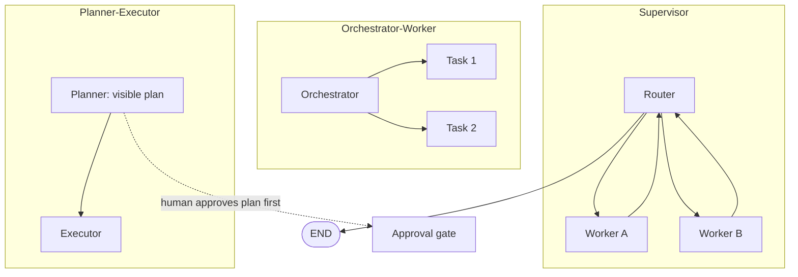

## Why it Matters

Catalog of collaboration patterns, choose based on task complexity and autonomy needs.

## Diagram



## Code

```python
from typing import Literal
from langgraph.graph import StateGraph, END

def supervisor(state) -> Literal["worker_a", "worker_b", "__end__"]:
 if not state["tasks"]: return END
 return state["tasks"].pop(0) # assign next worker

def worker_a(state) -> dict: ... # specialised, own budget
def worker_b(state) -> dict: ...

g = StateGraph(dict)
g.add_node("supervisor", supervisor)
g.add_node("worker_a", worker_a); g.add_node("worker_b", worker_b)
g.set_entry_point("supervisor")
g.add_conditional_edges("supervisor", supervisor,
 {"worker_a": "worker_a", "worker_b": "worker_b", END: END})
for w in ("worker_a", "worker_b"):
 g.add_edge(w, "supervisor") # every worker returns to the router

## When to use / NOT

- **Use:** supervisor for routing between specialised workers; orchestrator-worker for variable parallel work; planner-executor when a human should approve the plan before execution.
- **NOT:** when a single agent with tools does the job — coordination between agents is the most expensive thing in the system.

## Trade-offs

| Choice | Cost |
|--------|------|
| Supervisor routing | The router is a single point of failure and a bottleneck |
| Orchestrator-worker | Partial failure of one worker must be handled per task |
| Planner-executor | Plan staleness — the world changes between plan and execute |

## Vs

| Axis | Single agent + tools | Supervisor / orchestrator-worker | Planner-executor | Hierarchical multi-agent |
|------|----------------------|--------------------------------|------------------|--------------------------|
| Coordination cost | None — one loop, one prompt | One routing decision per step | One plan, then linear execution | Inter-agent messages on every handoff |
| Where the failure mode lives | One prompt that does everything | The router (single point of failure, bottleneck) | Plan staleness between plan and execute | Message-history management across agents |
| Partial failure | Whole run fails | Route around a failed worker | Replan from the last checkpoint | Sub-owner must surface failure to the manager |
| Determinism | High — one control loop | Moderate — routing is branchy | Low — an LLM writes the control flow | Lowest — emergent conversation |
| Use when | The task fits one context window and one tool set | Work splits into independent parallel subtasks | A human should approve the plan before anything runs | Subtasks need real specialisation and their own budgets |

## Pitfalls

- Workers without their own budgets; one worker can exhaust the run's budget.
- A supervisor that cannot terminate — always map a terminal branch plus a max-rounds guard.
- Trimming message history mid tool-call/result pair, so the model hallucinates a result.
- Pattern chosen for elegance instead of the work's shape; pick by failure mode, not by name.

## Interview Q&A

- **Q:** How to prevent agent loops? **A:** Max iterations, explicit termination tool, HITL gate.
- **Q:** LangGraph vs AutoGen? **A:** LangGraph for deterministic workflows + checkpointing; AutoGen for exploratory multi-agent chat.

## Related

- [[Architecting Agentic AI Solutions]] • [[Enterprise AI Operations Platform]] • [[AI/07_Cross-Cutting/01_MCP|MCP]]

---
*Category: agentic*

# Multi-Agent Patterns

> Part of [[README|03_Agentic-AI]] • `agentic` • Weeks 12–15
> Watch: [IBM Technology — Multi Agent Systems Explained](https://www.youtube.com/watch?v=sWH0T4Zez6I)

## Patterns

| Pattern | Flow | Use When |
|---------|------|----------|
| **Sequential** | Planner → Researcher → Coder → Reviewer | Linear pipelines |
| **Parallel fan-out** | Planner fans to 3 workers → aggregator | Independent subtasks |
| **Hierarchical** | Manager agent delegates to specialists | Complex goals with sub-ownership |
| **Debate / Review** | Coder ↔ Reviewer loop until pass | Quality-critical output |
| **Human-in-the-loop** | Gate before side effects | DB writes, deploys, external sends |

## Framework Trade-offs

| Framework | Strength | Trade-off |
|-----------|----------|-----------|
| **LangGraph** | Explicit state machines, checkpointing | More boilerplate |
| **AutoGen** | Conversational group chat, flexible | Harder to enforce determinism |
| **Assistants API** | Managed threads/tools | Less control, vendor lock |

## Code Sketch (LangGraph)

```
pythonfrom langgraph.graph import StateGraphgraph = StateGraph(state_schema=AgentState)
graph.add_node("planner", planner_node)
graph.add_node("researcher", researcher_node)
graph.add_edge("planner", "researcher")
graph.add_conditional_edges("researcher", should_review, {"yes": "reviewer", "no": "__end__"})
app = graph.compile(checkpointer=postgres_checkpointer) # memory + audit
```

# App = G.compile(checkpointer=postgres_checkpointer)
```