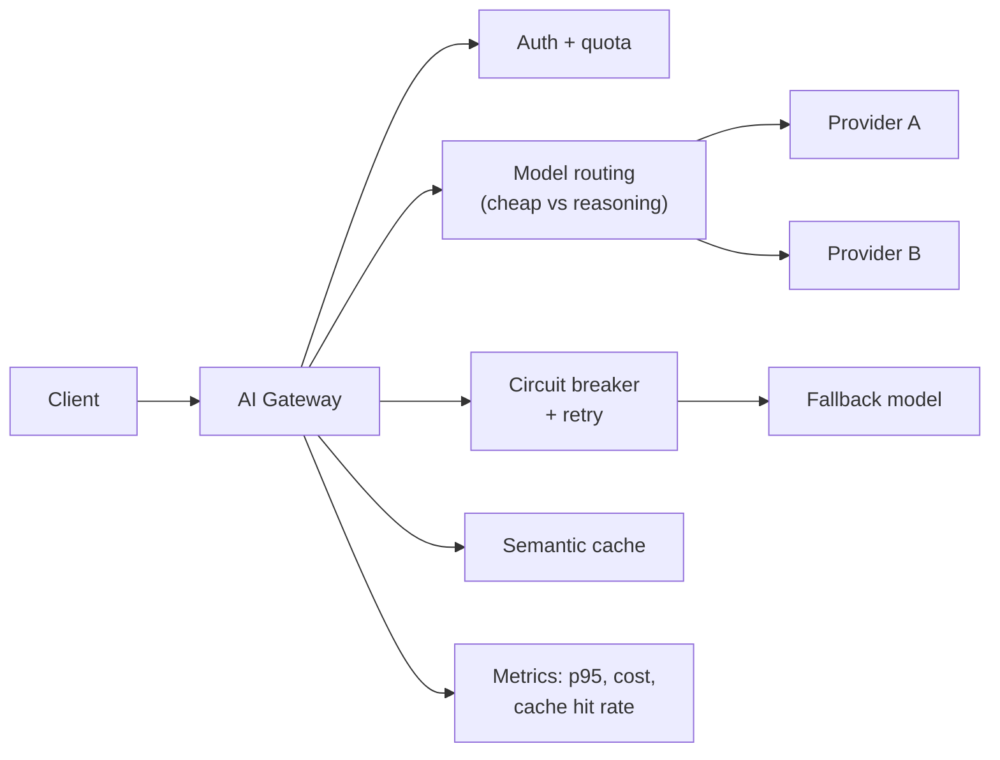

## Why it Matters

12-factor LLM gateway: config, statelessness, disposability, logs, plus fault tolerance for non-deterministic AI calls.

## Diagram



## Code

```proto
from typing import Literal

class CircuitBreaker:
 """Open after N failures, half-open after a cooldown."""
 def __init__(self, threshold: int = 5, cooldown_s: float = 30.0):
 self.threshold, self.cooldown_s = threshold, cooldown_s
 self.failures, self.opened_at = 0, None

 def is_open(self, now: float) -> bool:
 if self.opened_at is None: return False
 if now - self.opened_at > self.cooldown_s: # half-open: let one call through
 self.opened_at, self.failures = None, 0
 return False
 return True

 def record(self, success: bool, now: float) -> None:
 if success: self.failures, self.opened_at = 0, None; return
 self.failures += 1
 if self.failures >= self.threshold: self.opened_at = now

## When to use / NOT

- **Use:** once multiple services call LLM providers — the gateway is where routing, failover, quota and cost observability live as one seam.
- **NOT:** for a single service prototype; an extra hop adds latency and a new failure surface for no return.

## Trade-offs

| Choice | Cost |
|--------|------|
| Centralised gateway | One more critical service; it must itself be highly available |
| Semantic cache | Stale answers unless invalidation is tied to source version |
| Routing by policy | A wrong route is a silent quality regression |

## Vs

| Aspect | AI Gateway | Direct SDK per service | Provider-built gateway |
|--------|-----------|------------------------|------------------------|
| Failover | Policy in one place | Manual per service | Vendor's, not yours |
| Cost control | Routing + caching visible | None | Partial |
| Lock-in | Abstraction seam | Hard | Highest |

## Pitfalls

- The gateway becoming a vendor SDK proxy; without routing and caching it is latency for nothing.
- A circuit breaker that never half-opens, so a recovered provider stays dead.
- Cache keyed on the prompt only — a source document change means stale cached answers.
- No per-tenant quota; one noisy consumer starves everyone and the bill tells you later.

## Interview Q&A

- **Q:** Why circuit breaker for LLM? **A:** Provider outages cascade; breaker fails fast to fallback model.
- **Q:** Semantic cache? **A:** Embed query → if cosine > threshold, return cached answer — saves tokens. See [[AI/07_Cross-Cutting/05_Cost Optimization|Cost Optimization]].

## Related

- [[02_AI TDD and Evaluation]] • [[03_gRPC and Observability]] • [[AI/07_Cross-Cutting/05_Cost Optimization|Cost Optimization]]

---
*Category: production*

# AI Gateway — Coursera C3

> Part of [[README|04_Production-Platform]] • `production` • Weeks 17–18

## Key Topics (C3)

- 12-factor app methodology applied to LLM services.
- Fault tolerance: timeouts, retries (exponential + jitter), **circuit breakers**, **rate limiting**, **caching** (semantic cache).
- AI Gateway patterns: auth, model routing, fallback models, request hedging.

## Architecture

```
Client → AI Gateway (FastAPI/Envoy) → [Model Router → OpenAI | Claude | Gemini | open-weight] ├─ Rate limiter (Redis token bucket)
 ├─ Circuit breaker (per-provider)
 ├─ Semantic cache (Redis + vector)
 └─ Prometheus metrics + OTel traces
```

## Code Sketch
```
pythonfrom tenacity import retry, wait_exponential, stop_after_attempt
import redis.asyncio as redis

@retry(wait=wait_exponential(multiplier=0.5, max=4), stop=stop_after_attempt(3))
async def call_llm_with_gateway(model: str, messages: list):
 # gateway handles routing + fallback
 return await gateway.chat(model=model, messages=messages)

# Circuit Breaker Pseudo

if breaker.is_open("openai"):
 return await gateway.chat(model="claude-haiku", messages=messages)
```

# Gateway behaviour: open → fail over to the fallback model, not to the user.

# if breaker.is_open("openai"): return await gateway.chat(model="fallback", ...)

```