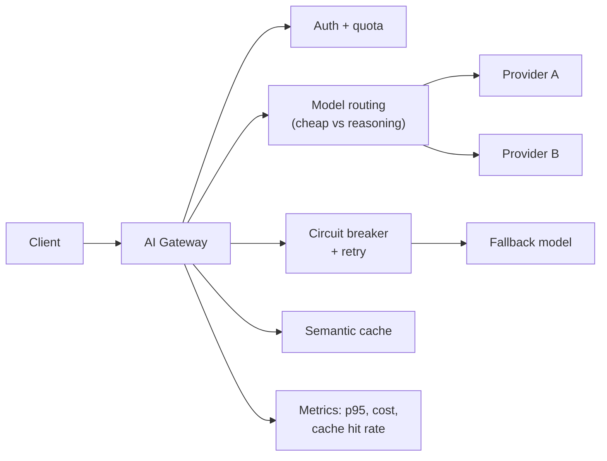

## Why it Matters

12-factor LLM gateway: config, statelessness, disposability, logs, plus fault tolerance for non-deterministic AI calls.

## Diagram



## Code

```proto
from typing import Literal

class CircuitBreaker:
 """Open after N failures, half-open after a cooldown."""
 def __init__(self, threshold: int = 5, cooldown_s: float = 30.0):
 self.threshold, self.cooldown_s = threshold, cooldown_s
 self.failures, self.opened_at = 0, None

 def is_open(self, now: float) -> bool:
 if self.opened_at is None: return False
 if now - self.opened_at > self.cooldown_s: # half-open: let one call through
 self.opened_at, self.failures = None, 0
 return False
 return True

 def record(self, success: bool, now: float) -> None:
 if success: self.failures, self.opened_at = 0, None; return
 self.failures += 1
 if self.failures >= self.threshold: self.opened_at = now

## When to use / NOT

- **Use:** once multiple services call LLM providers — the gateway is where routing, failover, quota and cost observability live as one seam.
- **NOT:** for a single service prototype; an extra hop adds latency and a new failure surface for no return.

## Trade-offs

| Choice | Cost |
|--------|------|
| Centralised gateway | One more critical service; it must itself be highly available |
| Semantic cache | Stale answers unless invalidation is tied to source version |
| Routing by policy | A wrong route is a silent quality regression |

## Vs

| Aspect | AI Gateway | Direct SDK per service | Provider-built gateway |
|--------|-----------|------------------------|------------------------|
| Failover | Policy in one place | Manual per service | Vendor's, not yours |
| Cost control | Routing + caching visible | None | Partial |
| Lock-in | Abstraction seam | Hard | Highest |

## Pitfalls

- The gateway becoming a vendor SDK proxy; without routing and caching it is latency for nothing.
- A circuit breaker that never half-opens, so a recovered provider stays dead.
- Cache keyed on the prompt only — a source document change means stale cached answers.
- No per-tenant quota; one noisy consumer starves everyone and the bill tells you later.

## Interview Q&A

- **Q:** Why circuit breaker for LLM? **A:** Provider outages cascade; breaker fails fast to fallback model.
- **Q:** Semantic cache? **A:** Embed query → if cosine > threshold, return cached answer — saves tokens. See [[AI/07_Cross-Cutting/05_Cost Optimization|Cost Optimization]].

## Flashcards (Spaced Repetition)

#flashcard
**Q:** What is the trigger keyword for AI Gateway (C3, Resilient Microservices)? :: **A:** [trigger keywords] #flashcard

#flashcard
**Q:** Key hyperparameter for AI Gateway (C3, Resilient Microservices)? :: **A:** [hyperparameter + typical range] #flashcard

#flashcard
**Q:** When do you NOT use AI Gateway (C3, Resilient Microservices)? :: **A:** [anti-pattern scenarios] #flashcard

#flashcard
**Q:** Cost order of magnitude for AI Gateway (C3, Resilient Microservices)? :: **A:** [GPU hours / $ per 1M tokens] #flashcard

## Practice Tasks (Tasks Plugin)
- [ ] Restate the intent from memory 📅 2026-09-30
- [ ] Code the config without looking 📅 2026-10-02
- [ ] Answer all Interview Q&A aloud 📅 2026-10-06
- [ ] Review flashcards (Spaced Repetition) 📅 2026-09-30

```tasks
not done
path includes 04_Production-Platform
sort by due
limit 10
```

## Related
- [[README|AI MOC]]
- [[04_Production-Platform/README|04_Production-Platform Folder]]

---

*Category: AI/04_Production-Platform • Part of [[README|AI MOC]]*