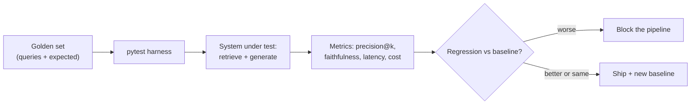

## Why it Matters

Apply TDD and systematic refactoring to **non-deterministic** LLM services, test behavior, not string equality.

## Diagram



## Code

```proto
import pytest

def precision_at_k(retrieved: list[str], relevant: set[str], k: int) -> float:
 hits = sum(1 for d in retrieved[:k] if d in relevant)
 return hits / k

GOLDEN = [ # shipped with the repo, grows every sprint
 {"q": "onboarding checklist for eng", "relevant": {"doc-42", "doc-43"}},
]

@pytest.mark.parametrize("case", GOLDEN)
def test_retrieval_regression(case, baseline: float = 0.8):
 got = search(case["q"]) # returns ranked doc ids
 assert precision_at_k(got, set(case["relevant"]), k=5) >= baseline

## When to use / NOT

- **Use:** from Phase 02 onward as the regression gate on retrieval and generation changes; it is the only thing that detects silent quality decay.
- **NOT:** for exploratory prompt iteration with no baseline; a test suite without a baseline is a number, not a gate.

## Trade-offs

| Choice | Cost |
|--------|------|
| Golden set as CI gate | Every change must justify itself with numbers |
| LLM-as-judge for faithfulness | Judge bias; needs its own spot checks |
| Fixed baseline threshold | A brittle metric blocks good changes when the golden set grows |

## Vs

| Aspect | Eval harness (TDD) | Unit tests on code | Manual review |
|--------|---------------------|-------------------|---------------|
| Catches | Retrieval/answer regression | Logic bugs in pipeline code | Obvious failures |
| Blind to | Nothing if metrics chosen well | Behavioural quality | Silent decay |
| Cost | LLM judge calls per run | Cheap | Human time |

## Pitfalls

- A golden set so easy every change passes; hard queries are the actual test.
- Threshold set once and never recalibrated as the set grows — the gate drifts.
- Testing retrieval but not cost; a change ships and the invoice is the first signal.
- LLM-as-judge with no human spot-check; judge drift looks like system improvement.

## Interview Q&A

- **Q:** How to TDD an LLM feature? **A:** Write eval (golden Q→A + metrics) first, then iterate prompt/retrieval until eval passes — eval is the "test."

## Related

- [[01_AI Gateway]] • [[AI/07_Cross-Cutting/02_AI Evaluation|AI Evaluation]] • [[AI/07_Cross-Cutting/03_LLM Observability|Observability]]

---
*Category: production*

# AI TDD and Evaluation — Coursera C4

> Part of [[README|04_Production-Platform]] • `production` • Weeks 19–20

## Key Topics (C4)

- TDD for LLM microservices: schema tests, golden-set eval, LLM-as-judge, regression testing.
- Refactoring: extract prompt templates, version schemas, isolate LLM calls behind interfaces for mocking.
- Hallucination detection, faithfulness scoring.

## What to Test

| Layer | Test Type | Tool |
|-------|-----------|------|
| Schema | `Answer.model_validate` passes | Pydantic + pytest |
| Retrieval | precision@k on golden set | [[AI/07_Cross-Cutting/02_AI Evaluation\|Evaluation]] harness |
| Answer | Faithfulness / hallucination rate | LLM-as-judge |
| Regression | Diff vs baseline on 100 queries | Snapshot tests |

## Code Sketch

```
pythondef test_structured_output(): raw = llm.generate(prompt, schema=Answer)
 parsed = Answer.model_validate_json(raw)
 assert parsed.citations # must cite

def test_retrieval_regression(golden_set):
 for q, expected_ids in golden_set:
 got = await search(q)
 assert precision_at_k(got, expected_ids, k=5) >= 0.8
```

# Faithfulness (LLM-as-judge) and Cost-per-query Belong in the Same Suite, # an Accuracy win that Triples Cost is not a Ship Decision.
```