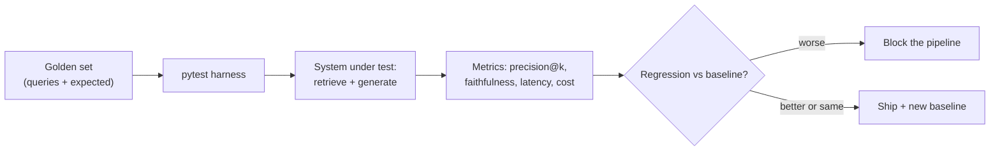

## Why it Matters

Apply TDD and systematic refactoring to **non-deterministic** LLM services, test behavior, not string equality.

## Diagram



## Code

```proto
import pytest

def precision_at_k(retrieved: list[str], relevant: set[str], k: int) -> float:
 hits = sum(1 for d in retrieved[:k] if d in relevant)
 return hits / k

GOLDEN = [ # shipped with the repo, grows every sprint
 {"q": "onboarding checklist for eng", "relevant": {"doc-42", "doc-43"}},
]

@pytest.mark.parametrize("case", GOLDEN)
def test_retrieval_regression(case, baseline: float = 0.8):
 got = search(case["q"]) # returns ranked doc ids
 assert precision_at_k(got, set(case["relevant"]), k=5) >= baseline

## When to use / NOT

- **Use:** from Phase 02 onward as the regression gate on retrieval and generation changes; it is the only thing that detects silent quality decay.
- **NOT:** for exploratory prompt iteration with no baseline; a test suite without a baseline is a number, not a gate.

## Trade-offs

| Choice | Cost |
|--------|------|
| Golden set as CI gate | Every change must justify itself with numbers |
| LLM-as-judge for faithfulness | Judge bias; needs its own spot checks |
| Fixed baseline threshold | A brittle metric blocks good changes when the golden set grows |

## Vs

| Aspect | Eval harness (TDD) | Unit tests on code | Manual review |
|--------|---------------------|-------------------|---------------|
| Catches | Retrieval/answer regression | Logic bugs in pipeline code | Obvious failures |
| Blind to | Nothing if metrics chosen well | Behavioural quality | Silent decay |
| Cost | LLM judge calls per run | Cheap | Human time |

## Pitfalls

- A golden set so easy every change passes; hard queries are the actual test.
- Threshold set once and never recalibrated as the set grows — the gate drifts.
- Testing retrieval but not cost; a change ships and the invoice is the first signal.
- LLM-as-judge with no human spot-check; judge drift looks like system improvement.

## Interview Q&A

- **Q:** How to TDD an LLM feature? **A:** Write eval (golden Q→A + metrics) first, then iterate prompt/retrieval until eval passes — eval is the "test."

## Flashcards (Spaced Repetition)

#flashcard
**Q:** What is the trigger keyword for AI TDD and Evaluation (C4, Refactor and Test)? :: **A:** [trigger keywords] #flashcard

#flashcard
**Q:** Key hyperparameter for AI TDD and Evaluation (C4, Refactor and Test)? :: **A:** [hyperparameter + typical range] #flashcard

#flashcard
**Q:** When do you NOT use AI TDD and Evaluation (C4, Refactor and Test)? :: **A:** [anti-pattern scenarios] #flashcard

#flashcard
**Q:** Cost order of magnitude for AI TDD and Evaluation (C4, Refactor and Test)? :: **A:** [GPU hours / $ per 1M tokens] #flashcard

## Practice Tasks (Tasks Plugin)
- [ ] Restate the intent from memory 📅 2026-09-30
- [ ] Code the config without looking 📅 2026-10-02
- [ ] Answer all Interview Q&A aloud 📅 2026-10-06
- [ ] Review flashcards (Spaced Repetition) 📅 2026-09-30

```tasks
not done
path includes 04_Production-Platform
sort by due
limit 10
```

## Related
- [[README|AI MOC]]
- [[04_Production-Platform/README|04_Production-Platform Folder]]

---

*Category: AI/04_Production-Platform • Part of [[README|AI MOC]]*