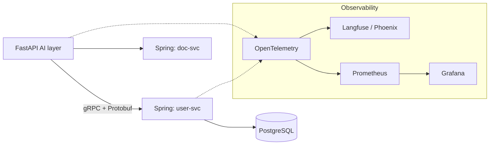

## Why it Matters

Make the platform **scalable, deployable, and observable**, Helm, K8s, gRPC, Prometheus, OpenTelemetry.

## Diagram



## Code

```proto
syntax = "proto3";

package platform.v1;

// The seam between the Python AI layer and the Java/Spring estate.
service DocumentService {
 rpc GetDocuments(DocumentQuery) returns (DocumentList);
}

message DocumentQuery {
 string query = 1;
 uint32 top_k = 2;
 string tenant = 3;
}

message Document {
 string id = 1;
 string title = 2;
 float score = 3;
}

message DocumentList {
 repeated Document documents = 1;
}
```

## When to use / not

- **Use:** for cross-language service-to-service calls between the Python AI layer and the Java/Spring estate; protobuf is the contract both sides compile against.
- **NOT:** for browser-facing APIs (keep REST/SSE there) or for internal Python-to-Python calls where a typed HTTP client is enough.

## Trade-offs

| Choice | Cost |
|--------|------|
| gRPC between layers | Schema is now a compilation step; contract changes touch both sides |
| OTel everywhere | Sampling decisions matter; 100% tracing is expensive at LLM call volume |
| Two trace backends | Correlation work to join a user request across languages |

## Vs

| Aspect | gRPC + Protobuf | REST/JSON | GraphQL |
|--------|------------------|-----------|---------|
| Contract | Compiled, both languages | OpenAPI, advisory | Schema, query-driven |
| Streaming | HTTP/2 bidi | SSE one-way | Subscriptions |
| Fit here | AI layer ↔ Spring estate | Client ↔ gateway | Not needed |

## Pitfalls

- Protobuf without a versioning convention; a field rename breaks both sides at once.
- Tracing without propagation across the gRPC boundary, the trace dies at the language seam, exactly where you need it.
- LLM traces in the same backend as infra metrics, so a token-billing query and a p95 query fight each other.
- Sampling set to 100% "to be safe" on a path that makes an LLM call per span.

## Interview q&a

- **Q:** Why gRPC between the AI layer and the Spring services? **A:** Because the boundary crosses two languages and changes often, and a compiled protobuf contract makes a breaking change a build failure rather than a runtime 500. Streaming answers also map cleanly onto HTTP/2.
- **Q:** How do you trace one user request across Python and Java? **A:** OpenTelemetry context propagation through the gRPC metadata, the trace ID crosses the boundary in headers, so Langfuse and Prometheus see the same request. Without that, the trace dies exactly where the two estates meet.
- **Q:** What is the observability signal you would not ship without? **A:** Per-request cost. Latency and error rates are standard; token cost per request is the metric that makes an AI platform a system you can reason about financially, not just operationally.

## Related

- [[01_AI Gateway]] • [[AI/05_Kubernetes-Operations/README|05_K8s-Operations]] • [[AI/07_Cross-Cutting/03_LLM Observability|LLM Observability]]

---
*Category: production*

# GRPC and Observability, Coursera C5–C7

> Part of [[README|04_Production-Platform]] • `production` • Weeks 21–24

## Key Topics

| Course | Topics | Deliverable |
|--------|--------|-------------|
| **C5** Analyze & Deploy Scalable LLM Architectures | Diagnose RAG bottlenecks, Helm on K8s, **autoscaling** (HPA), **managed rollouts** | Helm charts + HPA |
| **C6** Design Scalable AI Systems & Components | Component boundaries, platform architecture | Architecture diagrams |
| **C7** Integrate & Optimize AI Services | **gRPC + Protobuf** for prediction services, **Prometheus** monitoring | gRPC services + dashboards |

## GRPC Sketch

```protobuf
// ai_platform.proto
service PredictionService {
 rpc Predict(PredictRequest) returns (PredictResponse);
 rpc StreamPredict(PredictRequest) returns (stream Token);
}
message PredictRequest { string query = 1; map<string,string> filters = 2; }
```

## Observability Stack

- **Prometheus** — latency, throughput, error rate, token cost per endpoint.
- **OpenTelemetry** — trace: gateway → retrieval → LLM → response.
- **Grafana** dashboards + alerts (p95 latency, hallucination rate, cost spike).

## Hardening Checklist (by W24)

- [ ] gRPC services for retrieval + prediction
- [ ] Helm charts (per service)
- [ ] HPA (CPU + custom metric: queue depth)
- [ ] Prometheus + Grafana dashboards
- [ ] OTel traces across gateway → agents → LLM
- [ ] Retries / circuit breakers / rate limiting / caching / model routing (from C3)
