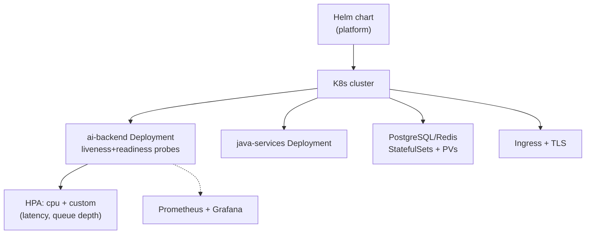

## Why it Matters

Run the entire AI platform on K8s, the deployment that validates CKAD skills and proves operational readiness.

## Diagram



## Code

```yaml

## When to use / NOT

- **Use:** for the platform's own services where you control rollout, probes and scaling — the Phase 05 deliverable.
- **NOT:** for managed serverless endpoints when traffic is bursty and unpredictable; that trade-off is decided on cost, not capability.

## Trade-offs

| Choice | Cost |
|--------|------|
| StatefulSets for PG/Redis | You operate the database's availability, not just the app |
| HPA on CPU only | CPU is a lagging signal for LLM services; latency/queue depth is better |
| Ingress + TLS | Certificate lifecycle to manage |

## Vs

| Aspect | K8s + Helm | Docker Compose | Fully managed (Cloud Run) |
|--------|------------|----------------|---------------------------|
| Control | Full, including DB | Local dev parity only | None over the platform |
| Ops cost | High — CKAD-level skill | Low | Lowest |
| Fit here | Phase 05 target estate | Dev loop | Not chosen |

## Pitfalls

- A liveness probe that kills pods mid long LLM stream; readiness gates traffic, liveness kills processes — do not conflate them.
- Deploying without resource limits; one bad pod takes the node down.
- PVs without a backup and restore story — you are one disk failure from data loss.
- HPA scaling on CPU while the real constraint is provider rate limits or queue depth.

## Interview Q&A

- **Q:** Why StatefulSet for PG? **A:** Stable identity + persistent storage; Deployments don't guarantee that.

## Related

- [[02_CKAD Preparation]] • [[AI/07_Cross-Cutting/04_AI Security|Security]]

---
*Category: kubernetes*

# Kubernetes Deployment — Weeks 25–27

> Part of [[README|05_Kubernetes-Operations]] • `kubernetes`

## Services to Deploy

| Service | Manifests | Notes |
|---------|-----------|-------|
| AI Gateway (FastAPI) | Deployment + Service + Ingress | From [[AI/04_Production-Platform/01_AI Gateway\|AI Gateway]] |
| Spring Boot (platform) | Deployment + Service | Coexists with FastAPI — your Java leverage |
| PostgreSQL + pgvector | StatefulSet + PVC | Vector extension enabled |
| Redis | Deployment + Service | Cache + rate limiting |
| Vector DB (optional Qdrant) | Helm release | For scale comparison |
| Kafka | Strimzi / Helm | Event streaming (optional) |
| Prometheus + Grafana | kube-prometheus-stack | From [[AI/04_Production-Platform/03_gRPC and Observability\|C7]] |

## Checklist

- [ ] Namespace `ai-platform`, resource quotas, network policies
- [ ] ConfigMaps / Secrets (no hardcoded keys — see [[AI/07_Cross-Cutting/04_AI Security|Security]])
- [ ] Liveness/readiness probes per service
- [ ] Persistent volumes for PG/Redis
- [ ] Ingress + TLS

# ai-backend.yaml (Helm template excerpt)

apiVersion: apps/v1
kind: Deployment
metadata:
 name: ai-backend
spec:
 replicas: 2
 selector:
 matchLabels: {app: ai-backend}
 template:
 metadata:
 labels: {app: ai-backend}
 spec:
 containers:
 - name: api
 image: "{{ .Values.image.repo }}/ai-backend:{{ .Values.image.tag }}"
 ports: [{containerPort: 8000}]
 readinessProbe: # route traffic only when /health is green
 httpGet: {path: /health, port: 8000}
 initialDelaySeconds: 5
 periodSeconds: 10
 livenessProbe:
 httpGet: {path: /health, port: 8000}
 failureThreshold: 3
 resources:
 requests: {cpu: 250m, memory: 512Mi}
 limits: {cpu: "1", memory: 1Gi}
---
apiVersion: autoscaling/v2
kind: HorizontalPodAutoscaler
metadata: {name: ai-backend}
spec:
 scaleTargetRef: {apiVersion: apps/v1, kind: Deployment, name: ai-backend}
 minReplicas: 2
 maxReplicas: 6
 metrics:
 - type: Resource
 resource: {name: cpu, target: {type: Utilization, averageUtilization: 70}}
```